## ✨Introduction
This room introduces the ffuf (Fuzz Faster U Fool) tool, a powerful fuzzing tool for fast and long-lasting web applications. When you brute-force URL paths, parameters, and virtual hosts, you can do a lot of things.

## 🎯 Goals
- Learn how to use the ffuf tool for directory and file fuzzing on web servers.
- Analyze and interpret HTTP status codes returned by fuzzers.
- Practice using wordlists with ffuf for port paths like /admin, /backup, /login, and more.
- Additional uses of ffuf, such as setting headers, such as .htaccess, and output formats.
- Understand structured fuzzing, such as fuzzing in URLs, similarly, or in form values.

# 🧠 Try HackMe - FFUF 🔍💥

🟡 **Category:** Web / Fuzzing / Content Discovery
🧩 **Difficulty:** Easy
🕵️‍♂️ **Mode:** CTF Walkthrough + Hands-on Lab
🔗 **URL:** [FFUF](https://tryhackme.com/room/ffuf)
👨‍💻 **Creator:** Thanyakorn

-

## 📚Sanban

1. ✨ [Introduction]
2. 🎯 [Our Goal]
3. 🛠️ [Steps to Implementation]
- 3.1 🔍 [Access the Target Website]
- 3.2 🧪 [Fuzz with ffuf]
- 3.3 🧱 [Deep-Dive with Wordlist for .txt Files]
- 3.4 🧾 [Check Index Extensions]
- 3.5 🧩 [Search .php and .txt Files]
- 3.6 📂 [Search the Entire Seaweed Directory]
- 3.7 🚫 [HTTP 403 Status Filter]
- 3.8 ✅ [Show Only HTTP 200]
- 3.9 🕵️‍♂️ [Comparing -fc and -fr]
4. 🧪 [Task 5 – Fuzz Parameters]
- 4.1 🌐 [Accessing the URL Database]
- 4.2 🔎 [Fuzz Finding Common Names]
- 4.3 🔢 [Fuzz Finding Reliable Values in IDs]
- 4.4 🔐 [Brute-Forcing Passwords with ffuf]
5. 🧠 [FFUFF Review Questions]

🟡 **Category:** Web / Fuzzing / Content Discovery
🧩 **Difficulty:** Easy
🕵️‍♂️ **Mode:** CTF Walkthrough + Hands-on Lab
🔗 **URL:** [FFUF](https://tryhackme.com/room/ffuf)
👨‍💻 **Created by:** Thanyakorn

-
# 🛠️Meet the tutorial

## Treatment 1. **Access the target website**
- Open the website again and enter the desired IP address (e.g., `http://10.201.120.42`)
- You will see the code shown in the image below.

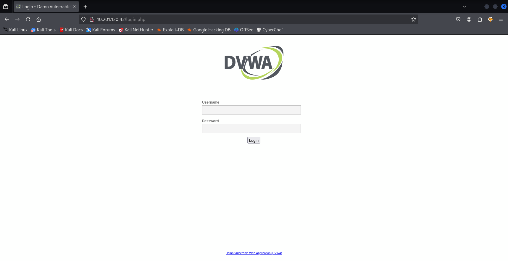

## Cage 2: **Use the ffuf command to view and collect files.** 🔍

- Use this command to fuzz filenames or server descriptions.

``` Bash
ffuf -u http://10.201.120.42/FUZZ -w /usr/share/seclists/Discovery/Web-Content/big.txt
-
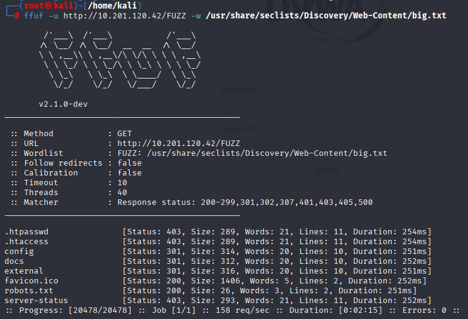

📌 Command Description:
- `-u` is the URL to be tested, where `FUZZ` is a word from the vocabulary list.
- `-w` is the vocabulary file to search for words that mention `FUZZ`.

📊 The result is a list of files or email replies that respond with HTTP status codes such as 200, 301, etc.

✅ Using the ffuf command, the first file with an HTTP status of 200 is favicon.ico

## Treatment 3: 🔍 Fuzz Searches Filenames with a Detailed Wordlist

🛠️ Commands Used

``` Bash
ffuf -u http://10.201.120.42/FUZZ -w /usr/share/seclists/Discovery/Web-Content/raft-medium-files-lowercase.txt
-


📌 Command Description:
- `-w` points to the file's wordlist, which can be used in all lowercase.
(Deep-Dive into Finding Important Files in the Basic Root Directory)

✅ The first time the ffuf command was used, the HTTP status was 200, which was favicon.ico.
If you look specifically at .txt, you'll see:

➡️ robots.txt is a known file and frequently asked questions.

## Filter 4: Trimming Index File Extensions

- 📥 The goal is to find out what extensions the index files actually have. This is used to run the ffuf command and the wordlist for web file extensions.

``` Bash
ffuf -u http://10.201.120.42/indexFUZZ -w /usr/share/seclists/Discovery/Web-Content/web-extensions.txt
-


📌 Command Description:

- `indexFUZZ` expands from a wordlist such as `.php`, `.html`, `.bak`, and others.
- Wordlist Used: `web-extensions.txt` is a list of popular file extensions commonly found in web apps.

✅ Results found:
- 🔒 `index.phps` → [Status: 403] (Access Forbidden)
- 🔁 `index.php` → [Status: 302] (Redirected to another page)

## Pure 5: Can be found with the .php and .txt file extensions.
- In this step, we'll use the ffuf command to search for files or web pages with the .php and .txt extensions.

```bash
ffuf -u http://10.201.120.42/FUZZ -w /usr/share/seclists/Discovery/Web-Content/raft-medium-files-lowercase.txt -e .php,.txt
```

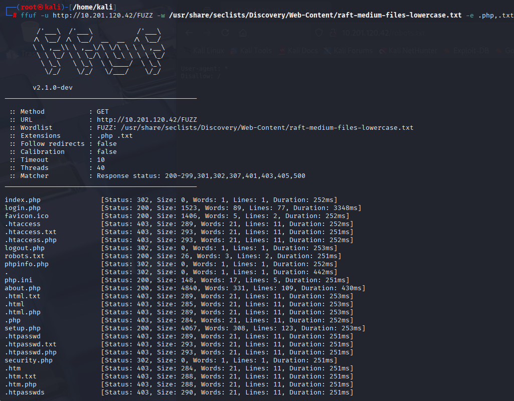

📌 Additional command description:
- `-u` specifies the URL to be tested, with FUZZ locations replaced with words from the wordlist.
- `-w` specifies the wordlist file to search for possible words.
- `-e .php,.txt` tells `ffuf` to test with the specified file extensions, `.php` and `.txt`, to search for files with these extensions.

✅ Using the ffuf command, search for files by adding the .php and .txt file found that the about.php file is 4840 bytes in size.

## Step 6: Search all existing directories

🛠️ Command used:

```bash
ffuf -u http://10.201.120.42/FUZZ -w /usr/share/seclists/Discovery/Web-Content/raft-medium-directories-lowercase.txt
```

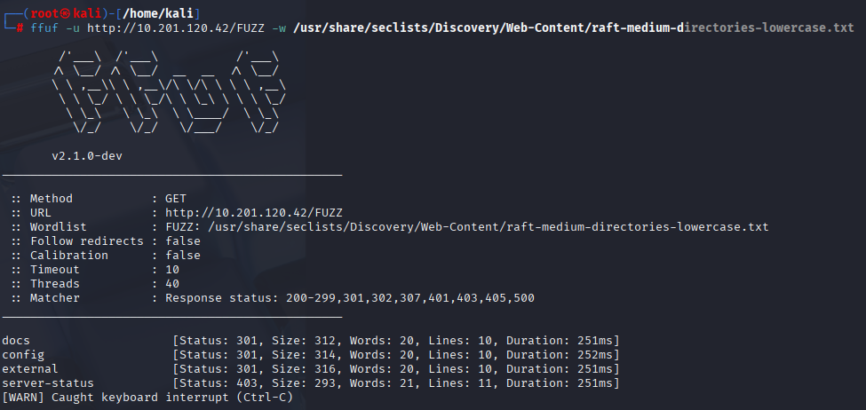

📊 Results
- All directories found:
- `docs`
- `config`
- `external`
- `server-status`

✅ The number of directories found and accessible are docs, config, external, and server-status.

## Step 7: Use a filter to remove HTTP 403 statuses.

🛠️ Command used:

```bash
ffuf -u http://10.201.120.42/FUZZ -w /usr/share/seclists/Discovery/Web-Content/raft-medium-files-lowercase.txt -fc 403
```

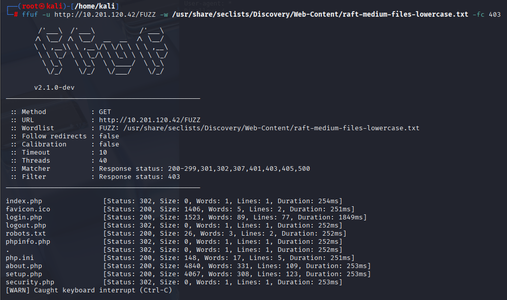

📌 Command Description:

- `-fc 403` filters out results with an HTTP 403 Forbidden status.
(This means that ffuf will not display results with a 403 response.)

🎯 Purpose:
To show only files or folders that are not blocked by permission (not 403), making searching easier.

📊 Results:
You will see responses with statuses other than 403, such as 200, 302, 301, etc.

✅ After using the 403 filter, the number of results returned is 11.

## Step 8: Use the Filter to display only pages with a status HTTP 200 only

🛠️ Command used:

```bash
ffuf -u http://10.201.120.42/FUZZ -w /usr/share/seclists/Discovery/Web-Content/raft-medium-files-lowercase.txt -mc 200
```

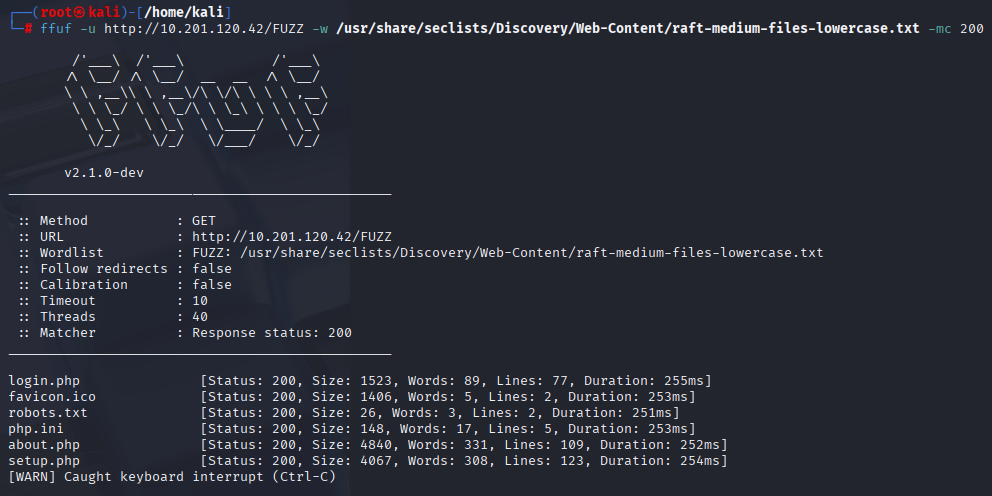

📌 Command Description:
- `-mc 200` stands for `match code`, which means it will only display entries with an HTTP 200 OK status.
- This filtering allows us to focus on pages that load successfully, excluding 302 redirects, 403 forbidden, or 404 not found.

🎯 Purpose of this step:
To determine which pages were actually accessed successfully (status 200) by brute-forcing a wordlist.

✅📊 There are six results in total, each showing the status. 200

## Step 9: Compare the results between -fc and -fr to determine which important files will be hidden.

🔍 TryHackMe Question:
> "Which valuable file would have been hidden if you used -fc 403 instead of -fr?"
> (What important file would be invisible if you used -fc 403 instead of -fr?)

🛠️ Command used:

```bash
ffuf -u http://10.201.120.42/FUZZ -w /usr/share/seclists/Discovery/Web-Content/raft-medium-files-lowercase.txt -fr '/\..*'
```

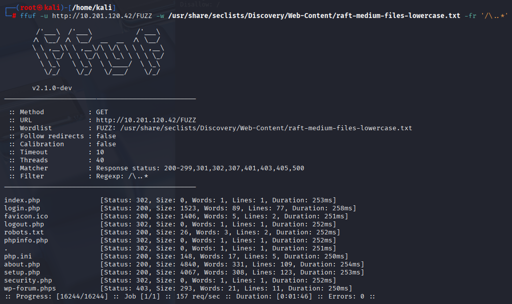

📌 Command Description:
- `-fr '/\..*'` = Filter Regex. Filters the results list starting with a period (`.`), such as `.git` or `.env` is removed from the output.
- Using `-fr` doesn't filter by status code like `-fc`, but rather by a pattern in the path we specify.
- In this case, we don't filter out 403 statuses, so we still see blocked files (e.g., 403 Forbidden).

If we use this command instead:

```bash
ffuf ... -fc 403
```

It will immediately filter out all results with a 403 status, meaning that the wp-forum.phps file will not be displayed at all.

✅ From the output, one file with a 403 status is: wp-forum.phps

🧠 Additional note (seriously technical):
The `.phps` file is often configured by servers to display PHP source code instead of executing it — so if it leaks, it opens a doorway to reveal the internal logic without actually executing it. This is a "good" hacking tool. And should be monitored.

## 🧪 Task 5 – Fuzzing Parameters
> 🔍 Base URL used: `http://10.201.92.170/sqli-labs/Less-1/`

🔧 Objectives of this task:
1. Test what parameters the `/sqli-labs/Less-1/` endpoint accepts.
2. Use ffuf to find out what parameters are in use, such as `id`, `user`, `page`, etc.
3. Prepare for the next SQLi or input validation test.

### Step 1: Try accessing the URL page first.
Open in browser:

```bash
http://10.201.92.170/sqli-labs/Less-1/
```

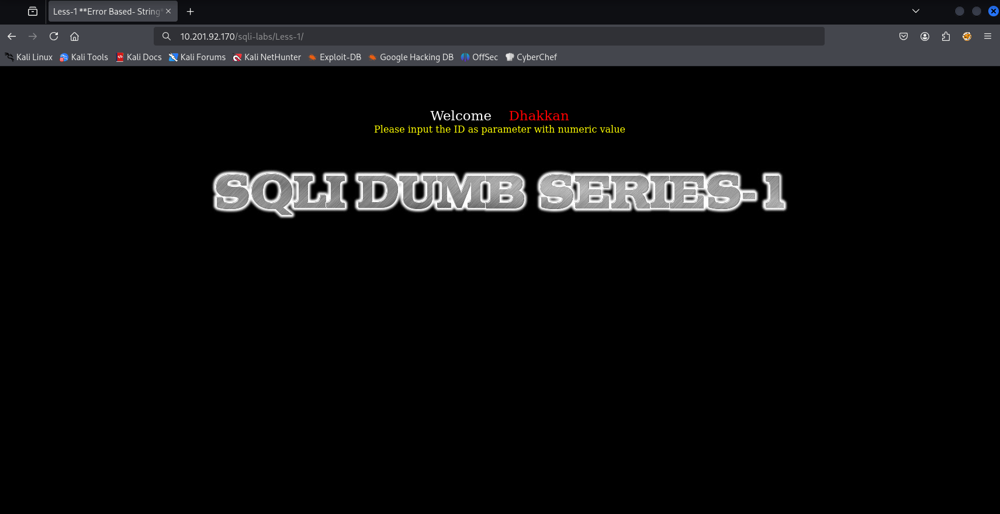

### Step 2: Fuzz to find usable parameter names

🎯 Objective
We will fuzz to find out which parameter names the server accepts via this URL:

```bash
http://10.201.92.170/sqli-labs/Less-1/
```

🛠️ Command used

```bash
ffuf -u 'http://10.201.92.170/sqli-labs/Less-1/?FUZZ=1' -c -w /usr/share/seclists/Discovery/Web-Content/burp-parameter-names.txt -fw 39
```

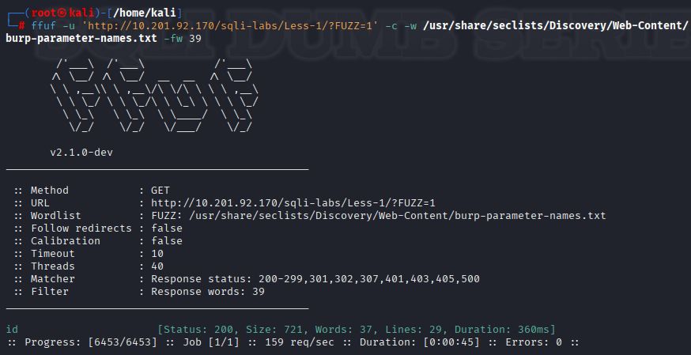

📌 Command Explanation
- `-u 'http://.../?FUZZ=1'`: The fuzzing point is the parameter name, such as `?id=1`, `?user=1`
- `-w /.../burp-parameter-names.txt`: A wordlist for parameter names, based on the Burp Suite, which compiles common parameter names.
- `-fw 39`: Filters and excludes results with a word count of 39 — which are often the same responses that don't respond to the parameter.
- `-c`: Displays results in color. Improved visibility

✅ Result

```bash
id [Status: 200, Size: 721, Words: 37, Lines: 29, Duration: 360ms]
```

💡 This means:
- The web app actually accepts the `id` parameter.
- When `?id=1` is specified, the response differs from other non-valid parameters.
- This meets the purpose of fuzzing.

### 🔢 Step 3: Fuzz to find usable numeric values in the `id` parameter.

🎯 Step Goal
- Determine which values the web app accepts in the `id` parameter.
- Use the number range (0-255) generation technique to identify values that cause the web app to change its response.
- Find values that differ from normal responses. This could mean interesting data or results.

🛠️ Commands used

```bash
for i in {0..255}; do echo $i; done | ffuf -u 'http://10.201.92.170/sqli-labs/Less-1/?id=FUZZ' -c -w - -fw 33
```

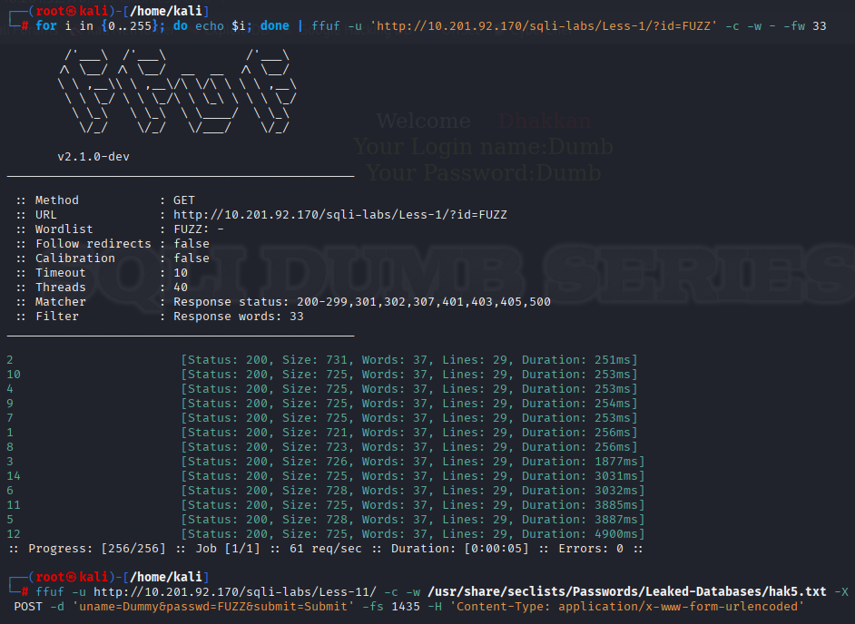

📌 Command explanation
- `for i in {0..255}; do echo $i; done`: Generates numeric values from 0 to 255 one at a time.
- `-u '...id=FUZZ'`: Fuzzes the value of the id parameter.
- `-fw 33`: Filters responses with a word count of 33, which is a normal response that doesn't display important information.
- `-c`: Enables color mode for easier viewing of results.

✅ The maximum number of results obtained from running the command is 14.

### 🔐 Step 4: Use Ffuf to Brute-force Passwords

> 🧠 Goal: Use `ffuf` to brute-force the login form by guessing passwords from a wordlist containing leaked passwords from the database.

🧪 Explanation
In this case, we want to find out: What is the dummy user password? A POST request to the website `http://10.201.92.170/sqli-labs/Less-11/` is executed using a password from a wordlist.

🛠️ Commands used

```bash
ffuf -u http://10.201.92.170/sqli-labs/Less-11/ \
-c \
-w /usr/share/seclists/Passwords/Leaked-Databases/hak5.txt \
-X POST \
-d 'uname=Dummy&passwd=FUZZ&submit=Submit' \
-fs 1435 \
-H 'Content-Type: application/x-www-form-urlencoded'
```

📌 Command explanation
- `-u` URL to be requested
- `-w` Wordlist to be used to guess passwords (`FUZZ` will be replaced with each line in the file.)
- `-X POST` specifies HTTP POST.
- `-d` sends POST data, such as `uname=Dummy&passwd=FUZZ` (guessing `passwd`).
- `-H` specifies the header to use `application/x-www-form-urlencoded` (a common web form).
- `-fs 1435` filters results with a size of 1435 bytes (meaning "invalid response" to hide them).
- `-c` displays colored text for easy reading.

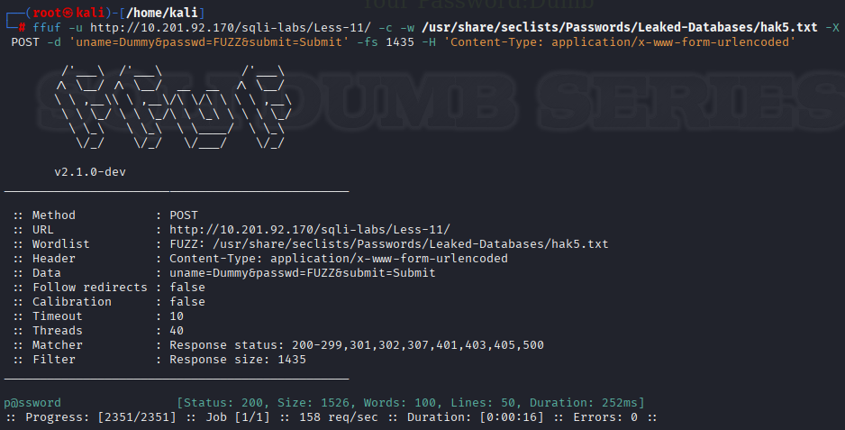

✅ Output

```bash
p@ssword [Status: 200, Size: 1526, Words: 100, Lines: 50, Duration: 252ms]
```

✅ From the results:
- The only response that wasn't filtered (size not 1435) was `p@ssword`.
- This means the website responded differently. This is often the response to a successful login.

## 📚 Sub-questions about ffuf (in Task Reviewing the options)

| ❓ Question | ✅ Correct Answer | 📌 Explanation |
|------------|------------------|---------------------------|
| **1. How do you save the output to a Markdown file (`ffuf.md`)?** | `-of md -o ffuf.md` | Use `-of md` to specify that the output be formatted in Markdown, and `-o ffuf.md` to specify the filename to save, such as `ffuf.md`. This is ideal for sending reports or saving beautiful results. |
| **2. How do you reuse a raw HTTP request file?** | `-request` | Use `-request` to load a pre-written HTTP request, such as from Burp Suite or ZAP, which is saved as a raw HTTP request (GET/POST + Header + Body). This is used for fuzzing forms or APIs. |
| **3. How do you Strip comments from a wordlist?** | `-ic` | Use `-ic` (ignore comments) to ignore lines beginning with `#` in a wordlist, allowing ffuf to use only the words that are absolutely necessary, reducing noise and avoiding errors from non-payload lines. |
| **4. How would you read a wordlist from STDIN?** | `-w -` | The `-w -` symbol means to read the wordlist from STDIN, e.g., `seq 1 100 | ffuf -w -` or `for i in {0..255}; do echo $i; done | ffuf -w -` eliminates the need to create a temporary wordlist file. |
| **5. How do you print full URLs and redirect locations?** | `-v` | Use `-v` (verbose) to display the full URL sent to the request, along with any redirects that occur, such as HTTP 302s that lead to the login page, error page, or other locations. |
| **6. What option would you use to follow? redirects?** | `-r` | Use `-r` (follow redirect) if the target has a redirection (301/302), such as a login form that redirects when a login fails/successes, or when a brute force operation redirects to an error page. |
| **7. How do you enable colorized output?** | `-c` | Use `-c` to enable colored output, such as green text for status 200, red for error, etc. This makes it easier to read and visually pattern the output when running in the terminal. |
