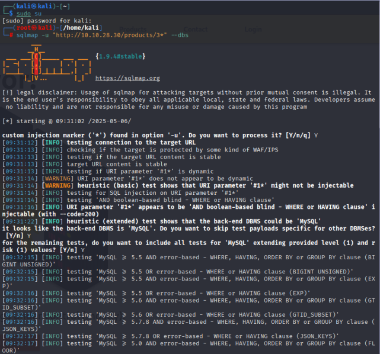
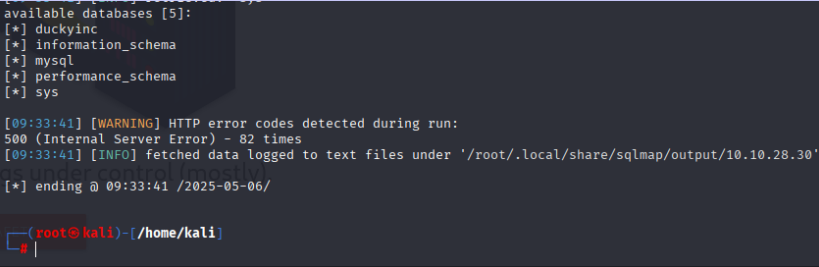
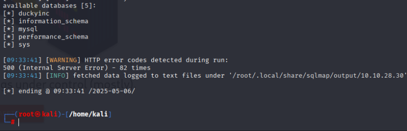
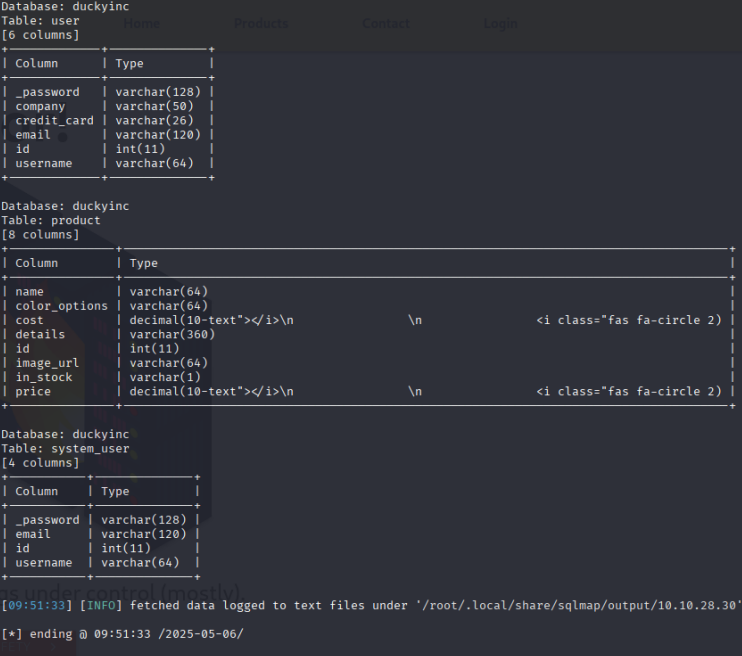

# 🧠 TryHackMe - Revenge

> 🟡 หมวด: Web / Privilege Escalation  
> 🧩 ความยาก: Medium  
> 🕵️‍♂️ โหมด: CTF แบบ Capture The Flag  
> 🧩 URL: [Revenge](https://tryhackme.com/room/revenge)  
> 👨‍💻 ผู้ทำ: Thanyakorn

---

## 📌 ข้อมูลจากโจทย์

> "What I want you to do is simple. Break into the server that's running the website and deface the front page."

💬 แปล: สิ่งที่โจทย์ต้องการคือ เจาะเข้าเว็บและแก้หน้าแรก (deface)

---

## 🛰️ 1. ข้อมูลเบื้องต้น (Target Info)

- IP เครื่องเป้าหมาย: `10.10.28.30`  
- พอร์ตที่เปิด: `22`, `80`

---

## ทดลองเข้าใช้งานเว็บไซต์

- ไปที่เมนู **Products** จะเจอชื่อสินค้า 4 รายการ  
- คลิก **LEARN MORE** ของสินค้าใดก็ได้


- ตัวอย่างสินค้า: Box of Duckies  
- จะแสดงรูปสินค้า, คำอธิบาย, ราคา, สี  
- สังเกต Path ด้านบนจะเป็น `/products/1`  
- กลับไปหน้าเดิม แล้วคลิก **LEARN MORE** ของสินค้าอื่น


- จะเห็นว่า Path เหมือนเดิมแต่ตัวเลขเปลี่ยนเป็น `/products/2`


- ลองเปลี่ยนตัวเลข 2 เป็น 3 ใน Path เพื่อดูสินค้าชิ้นที่ 3


---

## 📌 พิจารณาเบื้องต้น

- น่าจะมีการใช้ฐานข้อมูลเพื่อดึงข้อมูลสินค้าตาม ID ที่ส่งผ่าน URL  
- เมื่อลองใส่เครื่องหมาย `'` ที่ Path พบว่าเว็บแสดงข้อผิดพลาด HTTP 500 ซึ่งเป็นสัญญาณบ่งชี้ช่องโหว่ SQL Injection  
- การใส่เครื่องหมาย `'` เพื่อรบกวนการประมวลผล SQL query และดูว่ามี error message หรือข้อมูลอะไรหลุดมาหรือไม่  


---

## 🚪 2. Initial Access

### 🔸 2.1 ตรวจสอบช่องโหว่ SQL Injection ด้วย sqlmap

ใช้คำสั่ง:

```bash
sqlmap -u "http://10.10.28.30/products/3*" --dbs
```



**อธิบายคำสั่ง:**

- `sqlmap` คือเครื่องมืออัตโนมัติสำหรับตรวจสอบช่องโหว่ SQL Injection และดึงข้อมูลฐานข้อมูล  
- ตัวเลือก `-u` ใช้ระบุ URL ที่ต้องการทดสอบ โดย `"http://10.10.28.30/products/3*"` ใช้ wildcard `3*` เพื่อให้ sqlmap ลองค่าหลาย ๆ ค่าในพารามิเตอร์ id  
- ตัวเลือก `--dbs` สั่งให้ sqlmap ดึงชื่อฐานข้อมูลทั้งหมดที่เชื่อมต่อกับเว็บเป้าหมาย  



> ผลลัพธ์จะแสดงฐานข้อมูลต่าง ๆ เช่นฐานข้อมูลหลัก `duckyinc` และฐานข้อมูลระบบของ MySQL เช่น `mysql`, `information_schema` เป็นต้น
> 
> เราจะมุ่งเน้นวิเคราะห์ฐานข้อมูล `duckyinc` ต่อไป เพราะเป็นฐานข้อมูลสำคัญของเว็บนี้

**สรุป:**  
จากการใช้ sqlmap เราพบช่องโหว่ SQL Injection ที่พารามิเตอร์ id ของ URL สามารถเข้าถึงฐานข้อมูลหลักได้ ซึ่งเป็นจุดเริ่มต้นของการเจาะระบบ

### 2.2 ดึงข้อมูลโครงสร้างฐานข้อมูล (Column Enumeration)

หลังจากพบว่าฐานข้อมูลหลักคือ `duckyinc` ขั้นตอนถัดไปคือการตรวจสอบว่าในฐานข้อมูลนี้มีตารางอะไรบ้าง และแต่ละตารางมีคอลัมน์อะไรที่น่าสนใจ

ใช้คำสั่ง:

```bash
sqlmap -u "http://10.10.28.30/products/3*" -D duckyinc --columns
```


**อธิบายคำสั่ง:**

- `-D duckyinc` ระบุชื่อฐานข้อมูลที่ต้องการให้ sqlmap ทำการดึงข้อมูล
- `--columns` ให้ sqlmap ดึงชื่อคอลัมน์ทั้งหมดจากทุกตารางภายในฐานข้อมูลที่ระบุ


เมื่อรันคำสั่งแล้ว sqlmap จะถามว่าต้องการดำเนินการต่อหรือไม่ ให้ตอบ Y



จากผลลัพธ์ที่ได้ จะเห็นรายชื่อคอลัมน์ทั้งหมดภายในฐานข้อมูล duckyinc ซึ่งเป็นข้อมูลโครงสร้างที่จำเป็นสำหรับการดึงข้อมูลเป้าหมายในขั้นตอนถัดไป

### 2.3 ดึงข้อมูลจากตาราง `user` (Dump Table)

หลังจากเราทราบโครงสร้างของฐานข้อมูลแล้ว ขั้นตอนนี้จะเป็นการดึงข้อมูลภายในตาราง `user` ซึ่งอาจมีข้อมูลสำคัญ เช่น รหัสผ่าน หรือค่า Flag ที่เราต้องการ

ใช้คำสั่ง:

```bash
sqlmap -u "http://10.10.28.30/products/3*" -D duckyinc -T user --dump
```


**อธิบายคำสั่ง:**

- `-D duckyinc` ระบุชื่อฐานข้อมูลที่ต้องการให้ sqlmap ทำการดึงข้อมูล
- `-T user` ระบุตารางที่ต้องการดึงข้อมูล
- `--dump` ให้ sqlmap ดึงข้อมูลทั้งหมดจากตารางที่ระบุ


ผลลัพธ์ที่ได้จะแสดงข้อมูลในตาราง user
ให้สังเกตคอลัมน์ credit_card ของ id = 6 ซึ่งมี Flag ซ่อนอยู่ ให้นำไปใช้ตอบใน TryHackMe


