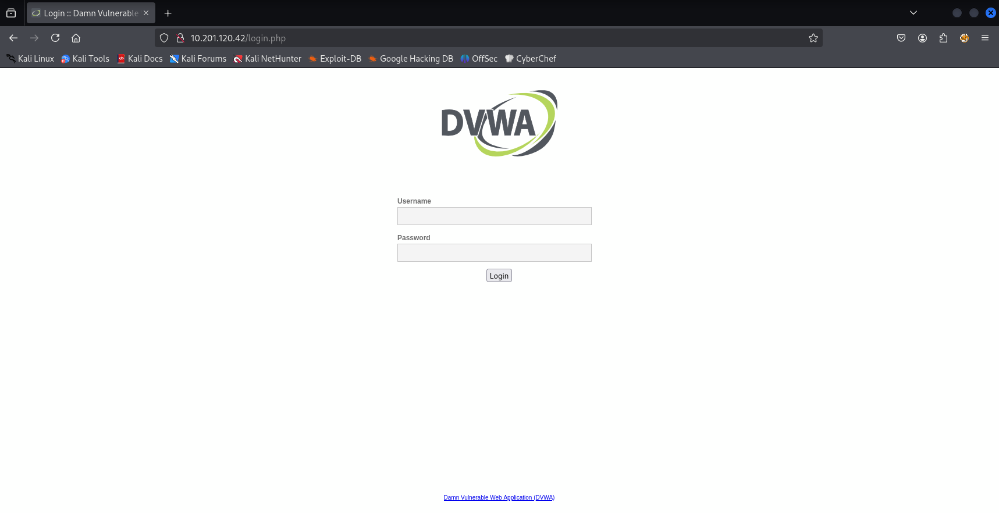

## ✨ บทนำ
ห้องนี้เป็นห้องแนะนำเครื่องมือ ffuf (Fuzz Faster U Fool) ซึ่งเป็นเครื่องมือ fuzzing สำหรับเว็บแอปพลิเคชันที่เร็วและยืดหยุ่นมาก ใช้สำหรับ brute-force URL paths, parameters, virtual hosts, และอื่น ๆ ผ่านคำสั่งที่สามารถปรับแต่งได้หลากหลาย

## 🎯 เป้าหมายของโจทย์
- เรียนรู้การใช้งานเครื่องมือ ffuf เพื่อทำ Directory และ File fuzzing บน Web Server
- วิเคราะห์และตีความค่า HTTP status code ที่ตอบกลับจากการ fuzz
- ฝึกการใช้ wordlists กับ ffuf เพื่อค้นหา paths ที่ซ่อนอยู่ เช่น /admin, /backup, /login ฯลฯ
- ใช้ฟีเจอร์เพิ่มเติมของ ffuf เช่นการตั้ง header, การเจาะพารามิเตอร์, และการปรับ output format
- เข้าใจการ fuzz แบบมีโครงสร้าง เช่น fuzz ใน URL, ในพารามิเตอร์, หรือในค่าต่าง ๆ ของฟอร์ม

# 🧠 TryHackMe - FFUF 🔍💥

🟡 **หมวด:** Web / Fuzzing / Content Discovery  
🧩 **ความยาก:** Easy
🕵️‍♂️ **โหมด:** CTF แบบ Walkthrough + Hands-on Lab  
🔗 **URL:** [FFUF](https://tryhackme.com/room/ffuf)  
👨‍💻 **ผู้ทำ:** Thanyakorn

---

# fdfd
-fds
-dsf

